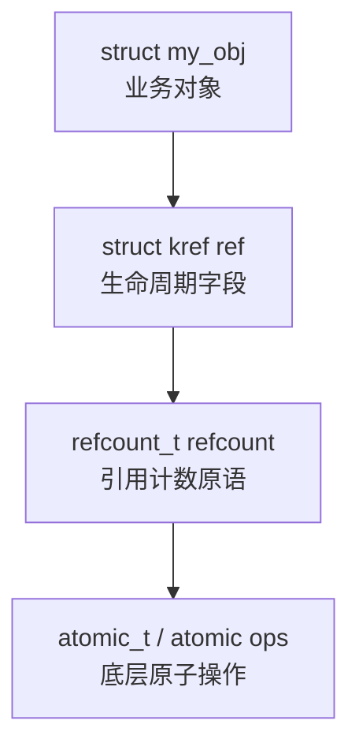
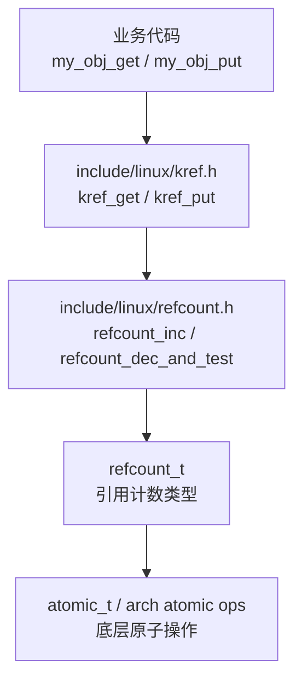
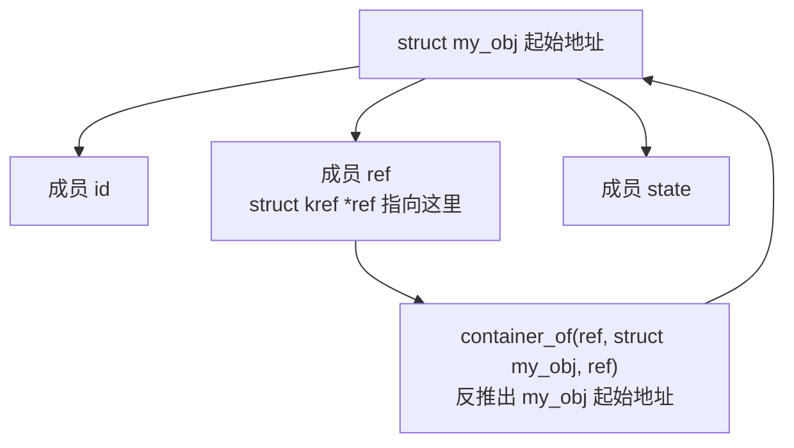
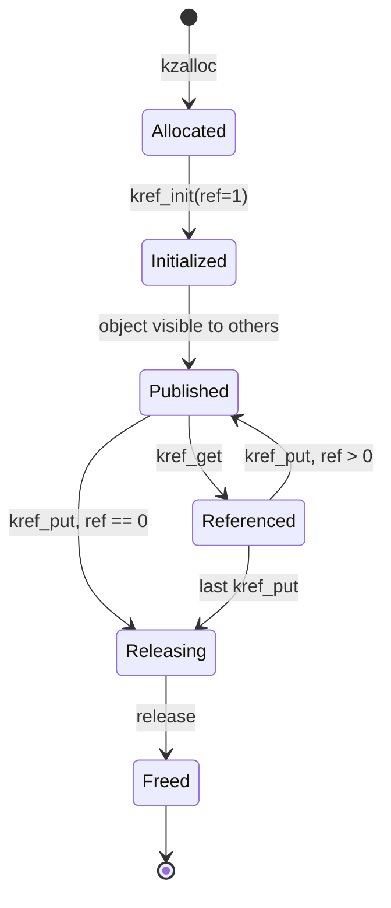

# 第 2 章：源码入口与结构定义

## 2.1 本章主线

第 1 章已经明确：

```text
kref 解决的是对象生命周期问题，不是字段并发保护问题。
```

第 2 章开始进入源码。

但这一章仍然不是急着背 API，而是先看清楚 `kref` 在源码里的位置和结构设计。

本章核心问题是：

```text
为什么 kref 要嵌入业务对象内部？
为什么 kref 内部用 refcount_t？
为什么 release 回调拿到的是 struct kref *，而不是业务对象指针？
为什么 kref 必须和 container_of() 配合？
为什么 kref 不是单独分配的生命周期管理器？
```

一句话概括本章：

```text
kref 是嵌入式生命周期字段，不是外置对象管理器。
```

------

## 2.2 源码阅读入口

Linux kernel 6.12 下，阅读 `kref` 主要从两个入口开始：

```c
include/linux/kref.h
include/linux/refcount.h
```

更底层还会涉及：

```c
include/linux/refcount_types.h
include/linux/atomic/atomic-instrumented.h
arch/*/include/asm/atomic*.h
```

但本章不深入到体系结构 atomic 实现。

当前阶段只需要建立这条层次关系：

```text
业务对象
  |
  +-- struct kref
        |
        +-- refcount_t
              |
              +-- atomic_t / 原子计数实现
```

也就是说，`kref` 不是直接操作裸 `int`，也不是直接暴露 `atomic_t`。

现代内核中的大致关系是：

```c
struct my_obj {
	struct kref ref;
	/* real object fields */
};
```

而 `struct kref` 内部包了一层 `refcount_t`：

```c
struct kref {
	refcount_t refcount;
};
```

`refcount_t` 再负责更底层的引用计数安全语义。

------

## 2.3 kref.h 的位置

`kref.h` 位于：[include/linux/kref.h](../../kernel_source/include/linux/kref.h)

这说明它是一个通用内核头文件。

它不属于某个具体子系统，比如：

```text
drivers/
fs/
mm/
net/
block/
```

而是供整个内核复用的基础工具。

从定位上看，它属于：

```text
Core API
Data structures and low-level utilities
```

这也符合它的角色：

```text
kref 不描述设备
kref 不描述文件
kref 不描述内存区
kref 不描述网络连接
kref 只描述“对象还有多少持有者”
```

所以任何内核对象只要需要引用计数，都可以把 `struct kref` 嵌进去。

------

## 2.4 struct kref 的本质

源码里 `struct kref` 非常小。

[include/linux/kref.h](../../kernel_source/include/linux/kref.h)，核心结构可以理解为：

```c
struct kref {
	refcount_t refcount;
};
```

[include/linux/refcount_types.h](../../include/linux/refcount_types.h)

```c
/**
 * typedef refcount_t - 专门用于引用计数的 atomic_t 变体
 * @refs: atomic_t 计数器字段
 *
 * 计数器会在 REFCOUNT_SATURATED 处饱和，并且一旦到达该值，
 * 就不会再发生变化。这样可以避免计数器回绕，从而导致“虚假的”
 * use-after-free 错误。
 */
typedef struct refcount_struct {
	atomic_t refs;
} refcount_t;
```

这说明 `kref` 本身没有复杂状态。

它不保存：

```text
对象类型
对象大小
对象地址
release 函数
所属子系统
锁
链表节点
状态机
```

它只保存一个东西：

```text
引用计数
```

但这里要注意：

```text
kref 简单，不代表它语义简单。
```

它的数据结构很小，但它承担的是对象生命周期协议。

也就是说：

```text
结构上只是一个 refcount_t；
语义上代表“这个对象还有多少有效持有者”。
```

------

## 2.5 为什么不是 atomic_t

早期很多代码习惯直接用：

```c
atomic_t refcnt;
```

然后写：

```c
atomic_inc(&obj->refcnt);
if (atomic_dec_and_test(&obj->refcnt))
	kfree(obj);
```

这种写法的问题是：

```text
atomic_t 只是原子整数
它不知道自己是引用计数
它不阻止溢出
它不表达生命周期语义
它容易被误用成普通计数器
```

而 `refcount_t` 是专门为引用计数设计的类型。

所以现代内核更倾向于：

```c
refcount_t refcount;
```

而 `kref` 再把它封装成：

```c
struct kref {
	refcount_t refcount;
};
```

这一层封装的意义是：

```text
refcount_t 是底层引用计数原语
kref 是对象生命周期管理接口
```

也就是说：

```text
refcount_t 偏底层
kref 偏对象生命周期模型
```

------

## 2.6 kref 和 refcount_t 的关系

可以把关系画成这样：



业务对象不直接暴露底层 atomic。

业务代码通常只操作：

```c
kref_init(&obj->ref);
kref_get(&obj->ref);
kref_put(&obj->ref, my_obj_release);
```

而不是直接操作：

```c
refcount_inc(&obj->ref.refcount);
refcount_dec_and_test(&obj->ref.refcount);
```

虽然 `kref` 内部确实调用了 `refcount_*` 接口，但业务代码最好不要绕过 `kref`。

因为一旦绕过，生命周期协议就容易混乱。

------

## 2.7 kref 为什么嵌入业务对象内部

标准写法是：

```c
struct my_obj {
	struct kref ref;
	int state;
	void *data;
};
```

而不是：

```c
struct my_obj {
	struct kref *ref;
	int state;
	void *data;
};
```

更不是：

```c
struct kref_manager {
	struct kref ref;
	struct my_obj *obj;
};
```

原因很关键：

```text
引用计数描述的是业务对象本身的生命周期。
```

对象释放时，`kref` 也一起消失。

对象存在时，`kref` 一定存在。

所以 `kref` 应该是对象的一部分。

这和 Linux 内核里很多嵌入式结构是同一种思想：

```c
struct my_obj {
	struct list_head node;
	struct rb_node rb;
	struct work_struct work;
	struct kref ref;
};
```

这些字段都不是外部分配的“管理器”。

它们都是对象参与某种机制时嵌入进去的成员。

例如：

```text
list_head 让对象挂入链表
rb_node 让对象挂入红黑树
work_struct 让对象进入 workqueue
kref 让对象拥有引用计数生命周期
```

所以 `kref` 的设计风格是典型的 Linux 内核嵌入式对象模型。

------

## 2.8 嵌入式结构的好处

把 `struct kref` 嵌入业务对象，有几个直接好处。

### 1. 不需要额外分配

对象分配一次即可：

```c
obj = kzalloc(sizeof(*obj), GFP_KERNEL);
```

不需要再分配：

```c
obj->ref = kmalloc(sizeof(struct kref), GFP_KERNEL);
```

避免了额外内存管理问题。

------

### 2. 生命周期天然一致

因为 `kref` 在对象内部，所以：

```text
对象活着，kref 一定活着
对象释放，kref 一起释放
```

如果 `kref` 是外部对象，就会产生新的生命周期问题：

```text
业务对象释放了，kref 还在？
kref 释放了，业务对象还在？
二者谁先释放？
release 怎么找回对象？
```

这些问题都没有必要制造出来。

------

### 3. release 可以通过 container_of 找回对象

因为 `kref` 是对象成员，所以 release 回调拿到 `struct kref *` 后，可以反推出外层对象：

```c
static void my_obj_release(struct kref *ref)
{
	struct my_obj *obj = container_of(ref, struct my_obj, ref);

	kfree(obj);
}
```

这就是 Linux 内核常见的嵌入式对象模式。

------

## 2.9 container_of 是理解 kref 的关键

`kref_put()` 的 release 回调类型大致是：

```c
void (*release)(struct kref *kref)
```

也就是说，release 收到的不是：

```c
struct my_obj *obj
```

而是：

```c
struct kref *ref
```

所以 release 里必须用：

```c
container_of(ref, struct my_obj, ref)
```

把外层对象找回来。

标准模板：

```c
struct my_obj {
	struct kref ref;
	int state;
};

static void my_obj_release(struct kref *ref)
{
	struct my_obj *obj;

	obj = container_of(ref, struct my_obj, ref);

	kfree(obj);
}
```

这段代码的含义是：

```text
ref 是 struct my_obj 里的成员 ref 的地址；
根据成员地址、外层类型、成员名，反推出 struct my_obj 的起始地址。
```

也就是：

```text
struct kref *  -->  struct my_obj *
```

------

## 2.10 为什么 release 不直接接收业务对象指针

可能会疑惑：

```c
static void my_obj_release(struct my_obj *obj)
{
	kfree(obj);
}
```

这样不是更直接吗？

问题是：

```text
kref 是通用机制，它不知道外层对象类型。
```

`kref_put()` 只能处理：

```c
struct kref *kref
```

它不可能知道这个 `kref` 被嵌入在：

```c
struct my_device
struct my_request
struct my_session
struct my_cache
struct my_inode_private
```

哪一种对象里。

所以 release 回调必须是通用签名：

```c
void (*release)(struct kref *kref)
```

具体业务类型由业务自己的 release 函数通过 `container_of()` 恢复。

这就是内核里“通用机制 + 嵌入式成员 + container_of”的典型组合。

------

## 2.11 kref 不是单独分配的对象

错误设计：

```c
struct my_obj {
	struct kref *ref;
	int state;
};
```

这种写法会带来额外复杂度。

例如：

```c
obj = kzalloc(sizeof(*obj), GFP_KERNEL);
obj->ref = kzalloc(sizeof(*obj->ref), GFP_KERNEL);
```

然后释放时要考虑：

```text
先释放 obj 还是先释放 obj->ref？
release 收到 struct kref * 后怎么找 obj？
obj 已经释放时 ref 是否还有效？
ref 已经释放时 obj 是否还有效？
```

这会让生命周期管理本身又多出一个生命周期问题。

正确做法是：

```c
struct my_obj {
	struct kref ref;
	int state;
};
```

然后：

```c
obj = kzalloc(sizeof(*obj), GFP_KERNEL);
kref_init(&obj->ref);
```

释放时：

```c
static void my_obj_release(struct kref *ref)
{
	struct my_obj *obj = container_of(ref, struct my_obj, ref);

	kfree(obj);
}
```

这才是 `kref` 预期使用模型。

------

## 2.12 kref_init() 的初始引用

动态对象创建后，通常这样初始化：

```c
struct my_obj *obj;

obj = kzalloc(sizeof(*obj), GFP_KERNEL);
if (!obj)
	return NULL;

kref_init(&obj->ref);
```

`kref_init()` 的语义是：

```text
初始化引用计数为 1。
```

这个初始引用不是凭空来的。

它表示：

```text
创建者当前持有这个对象。
```

所以对象创建后，创建者必须最终负责释放这个引用：

```c
kref_put(&obj->ref, my_obj_release);
```

也就是说：

```text
kref_init() 不是“设置为可用”
而是“创建了第一个持有者”
```

这个理解很重要。

如果创建者忘记 put，就会泄漏。

如果创建者提前 put，而对象还交给别人但没有 get，就会 UAF。

------

## 2.13 静态初始化：KREF_INIT(n)

除了动态初始化，还有静态初始化形式：

```c
#define KREF_INIT(n) ...
```

典型含义是：

```c
struct kref ref = KREF_INIT(1);
```

或者某个静态对象里：

```c
static struct my_obj global_obj = {
	.ref = KREF_INIT(1),
};
```

它的作用是：

```text
在编译期或静态对象初始化时设置引用计数初始值。
```

但工程上更常见的是动态对象：

```c
obj = kzalloc(...);
kref_init(&obj->ref);
```

因为需要 `kref` 的对象往往是动态生命周期对象。

静态对象也可以有引用计数，但要非常清楚：

```text
它是否真的会被释放？
release 是否真的 kfree？
静态对象是否允许 refcount 归零？
```

否则就会出现语义不一致。

------

## 2.14 kref_get() 的源码层次

`kref_get()` 的逻辑可以理解为：

```c
static inline void kref_get(struct kref *kref)
{
	refcount_inc(&kref->refcount);
}
```

也就是说：

```text
kref_get()
  -> refcount_inc()
      -> 底层原子引用计数增加
```

但使用它必须满足一个前提：

```text
调用 kref_get() 时，调用者已经确定对象是有效的。
```

这句话非常重要。

`kref_get()` 不是“从无到有抢救对象”。

它不是：

```text
我捡到一个裸指针，然后靠 kref_get() 让它复活。
```

正确语义是：

```text
我已经在某种保护下持有有效对象，现在我要增加一个长期引用。
```

例如：

```c
kref_get(&obj->ref);
pass_to_worker(obj);
```

这里调用者本来就持有 `obj` 的有效引用。

所以可以给 worker 再增加一个引用。

------

## 2.15 kref_put() 的源码层次

`kref_put()` 的逻辑可以理解为：

```c
static inline int kref_put(struct kref *kref,
			   void (*release)(struct kref *kref))
{
	if (refcount_dec_and_test(&kref->refcount)) {
		release(kref);
		return 1;
	}

	return 0;
}
```

它做两件事：

```text
1. 引用计数减一
2. 如果减到 0，调用 release
```

返回值语义是：

```text
返回 1：本次 put 释放了最后一个引用，并调用了 release
返回 0：本次 put 后仍然不是最后一个引用
```

但要注意：

```text
kref_put() 返回 0，不代表对象之后一定还活着。
```

因为其他 CPU 可能马上执行最后一个 `put`。

所以：

```c
if (!kref_put(&obj->ref, my_obj_release)) {
	/* obj 还活着？ */
}
```

不能这样理解。

`kref_put()` 后，当前路径已经不再持有引用。

因此一般原则是：

```text
put 之后不要再访问 obj。
```

除非你还有另一个明确持有的引用，或者有额外锁/协议保证。

------

## 2.16 kref_read() 为什么不能作为生命周期判断

`kref_read()` 可以读当前计数：

```c
unsigned int n = kref_read(&obj->ref);
```

但它不应该作为核心生命周期判断依据。

错误理解：

```c
if (kref_read(&obj->ref) > 0)
	obj->state = 1;
```

这不可靠。

因为：

```text
读到 >0 的瞬间，对象可能还活着；
但下一瞬间，别的 CPU 可能 put 到 0 并 release。
```

所以 `kref_read()` 更适合：

```text
debug
trace
统计
诊断
警告信息
```

而不适合：

```text
用来决定对象是否可以安全访问
```

安全访问对象的依据应该是：

```text
当前路径是否持有有效引用
lookup + get 是否在锁/RCU 保护下完成
业务状态是否在锁保护下检查
```

------

## 2.17 kref 源码关系总览

可以用下面这张图理解：



业务代码通常只接触最上层：

```c
kref_get(&obj->ref);
kref_put(&obj->ref, my_obj_release);
```

`kref` 内部再调用 `refcount`。

这样分层的好处是：

```text
业务对象生命周期语义集中在 kref
引用计数安全语义集中在 refcount_t
底层原子操作由 atomic/arch 实现
```

------

## 2.18 标准业务对象模板

一个最小对象模板如下：

```c
#include <linux/kref.h>
#include <linux/slab.h>

struct my_obj {
	struct kref ref;
	int state;
};

static void my_obj_release(struct kref *ref)
{
	struct my_obj *obj;

	obj = container_of(ref, struct my_obj, ref);

	kfree(obj);
}

static struct my_obj *my_obj_alloc(void)
{
	struct my_obj *obj;

	obj = kzalloc(sizeof(*obj), GFP_KERNEL);
	if (!obj)
		return NULL;

	kref_init(&obj->ref);
	obj->state = 0;

	return obj;
}

static struct my_obj *my_obj_get(struct my_obj *obj)
{
	kref_get(&obj->ref);
	return obj;
}

static void my_obj_put(struct my_obj *obj)
{
	kref_put(&obj->ref, my_obj_release);
}
```

这个模板里有几个关键点。

### 1. `struct kref ref` 嵌入对象内部

```c
struct my_obj {
	struct kref ref;
	int state;
};
```

这说明引用计数属于对象生命周期。

------

### 2. alloc 后立即 kref_init

```c
kref_init(&obj->ref);
```

这表示创建者获得初始引用。

------

### 3. release 用 container_of 找回对象

```c
obj = container_of(ref, struct my_obj, ref);
```

因为 release 收到的是 `struct kref *`。

------

### 4. release 是最终销毁点

```c
kfree(obj);
```

只有最后一个引用释放时，才会进入这里。

------

### 5. 对外最好封装 get/put

```c
static struct my_obj *my_obj_get(struct my_obj *obj)
{
	kref_get(&obj->ref);
	return obj;
}

static void my_obj_put(struct my_obj *obj)
{
	kref_put(&obj->ref, my_obj_release);
}
```

这样可以把生命周期规则收敛到对象自己的接口里。

------

## 2.19 为什么建议封装 my_obj_get/my_obj_put

虽然可以直接写：

```c
kref_get(&obj->ref);
kref_put(&obj->ref, my_obj_release);
```

但工程上更推荐封装：

```c
my_obj_get(obj);
my_obj_put(obj);
```

原因是：

```text
隐藏 release 函数
统一对象生命周期出口
方便后续加 WARN_ON
方便后续加 trace
方便后续处理 NULL
方便后续加调试统计
减少调用点传错 release 的风险
```

例如：

```c
static void my_obj_put(struct my_obj *obj)
{
	if (!obj)
		return;

	kref_put(&obj->ref, my_obj_release);
}
```

或者：

```c
static struct my_obj *my_obj_get(struct my_obj *obj)
{
	WARN_ON(!obj);

	kref_get(&obj->ref);
	return obj;
}
```

这样比到处裸写 `kref_put()` 更容易维护。

------

## 2.20 kref 和业务对象内存布局

假设对象定义为：

```c
struct my_obj {
	int id;
	struct kref ref;
	int state;
};
```

内存布局可以抽象成：

```text
+-----------------------------+
| struct my_obj               |
+-----------------------------+
| id                          |
+-----------------------------+
| ref                         |
|   +---------------------+   |
|   | refcount_t refcount |   |
|   +---------------------+   |
+-----------------------------+
| state                       |
+-----------------------------+
```

当 release 收到：

```c
struct kref *ref
```

它拿到的是中间这个成员的地址。

`container_of()` 根据：

```text
外层类型：struct my_obj
成员名：ref
成员地址：ref
```

反推出整个对象起始地址。

图示：



所以 `container_of()` 不是魔法。

它依赖的是：

```text
struct kref 是业务对象的内嵌成员
```

如果 `kref` 是单独分配的，这种模式就不成立。

------

## 2.21 kref 和 list_head/rb_node 的相似性

`kref` 的嵌入方式和 `list_head`、`rb_node` 很像。

例如链表对象：

```c
struct my_obj {
	struct list_head node;
	int id;
};
```

链表遍历时拿到的是：

```c
struct list_head *node
```

然后通过：

```c
container_of(node, struct my_obj, node)
```

找回外层对象。

红黑树对象：

```c
struct my_obj {
	struct rb_node rb;
	int key;
};
```

红黑树节点拿到的是：

```c
struct rb_node *rb
```

然后通过：

```c
container_of(rb, struct my_obj, rb)
```

找回外层对象。

`kref` 也是类似：

```c
struct my_obj {
	struct kref ref;
};
```

release 拿到：

```c
struct kref *ref
```

然后通过：

```c
container_of(ref, struct my_obj, ref)
```

找回外层对象。

所以 Linux 内核的通用机制通常不是面向“对象基类”的，而是面向“嵌入式成员”的。

------

## 2.22 kref 不是 C++ shared_ptr

容易把 `kref` 类比成 C++ 的 `shared_ptr`，但二者差别很大。

`shared_ptr` 通常是：

```text
外部控制块 + 指针包装对象
```

而 `kref` 是：

```text
对象内部嵌入引用计数字段
```

`shared_ptr` 的使用者拿到的是智能指针对象。

`kref` 的使用者拿到的仍然是普通 C 指针：

```c
struct my_obj *obj;
```

所以 `kref` 不会自动帮你：

```text
离开作用域自动 put
拷贝时自动 get
赋值时自动处理旧引用
异常路径自动释放
```

内核 C 代码必须手工保证：

```text
每一个 get 都有对应 put
每一个 handoff 都有明确边界
每一个 error path 都正确释放
```

所以 `kref` 比 `shared_ptr` 更轻量，但也更依赖代码纪律。

------

## 2.23 kref 不保存 release 函数

还要注意一点：

```text
struct kref 里面不保存 release 回调。
```

也就是说，`release` 不是在 `kref_init()` 时绑定进去的。

而是在每次 `kref_put()` 时传入：

```c
kref_put(&obj->ref, my_obj_release);
```

这意味着同一个对象的所有 `put` 路径必须传入同一个 release 语义。

如果不同调用点传了不同 release 函数，那就是严重设计错误。

所以工程上更推荐封装：

```c
static void my_obj_put(struct my_obj *obj)
{
	kref_put(&obj->ref, my_obj_release);
}
```

让外部代码不要直接传 release。

否则容易出现：

```c
kref_put(&obj->ref, wrong_release);
```

这种 bug 编译可能能过，但生命周期语义已经错了。

------

## 2.24 kref_put 不能直接传 kfree

错误写法：

```c
kref_put(&obj->ref, kfree);
```

这个模型不成立。

原因有两个。

第一，函数签名不匹配。

`kref_put()` 需要的是：

```c
void (*release)(struct kref *kref)
```

而 `kfree()` 接收的是：

```c
void *ptr
```

第二，即使强转，也会释放错地址。

因为 `kref_put()` 传给 release 的是：

```c
&obj->ref
```

不是：

```c
obj
```

如果直接把 `struct kref *` 当成对象起始地址释放，释放的就不是对象起始地址。

正确做法必须是：

```c
static void my_obj_release(struct kref *ref)
{
	struct my_obj *obj = container_of(ref, struct my_obj, ref);

	kfree(obj);
}
```

release 的职责就是：

```text
从 kref 成员找回外层对象，然后释放真正的对象。
```

------

## 2.25 kref 字段位置没有固定要求

`struct kref` 不一定必须放在结构体第一个成员。

可以这样：

```c
struct my_obj {
	struct kref ref;
	int state;
};
```

也可以这样：

```c
struct my_obj {
	int id;
	struct kref ref;
	int state;
};
```

还可以这样：

```c
struct my_obj {
	int id;
	int state;
	struct kref ref;
};
```

只要 release 里 `container_of()` 的成员名正确：

```c
container_of(ref, struct my_obj, ref)
```

都可以找回外层对象。

但是工程上通常建议：

```text
生命周期字段放在结构体靠前位置
锁、状态、链表节点组织清楚
```

例如：

```c
struct my_obj {
	struct kref ref;
	struct mutex lock;
	struct list_head node;

	int state;
	void *data;
};
```

这样读代码时更容易看出：

```text
这个对象有引用计数
这个对象有自己的锁
这个对象会挂入链表
```

------

## 2.26 一个对象可以有多个嵌入式机制

实际内核对象经常同时嵌入多个基础结构：

```c
struct my_obj {
	struct kref ref;
	struct mutex lock;
	struct list_head node;
	struct rb_node rb;
	struct work_struct work;

	int id;
	int state;
};
```

每个字段负责不同机制：

| 字段                      | 作用             |
| ------------------------- | ---------------- |
| `struct kref ref`         | 生命周期引用计数 |
| `struct mutex lock`       | 对象字段互斥     |
| `struct list_head node`   | 挂入链表         |
| `struct rb_node rb`       | 挂入红黑树       |
| `struct work_struct work` | 投递到 workqueue |
| `state`                   | 业务状态         |

不要把这些职责混在一起。

特别是：

```text
list_head 只说明对象在链表里
rb_node 只说明对象在树里
work_struct 只说明对象可被异步执行
kref 只说明对象生命周期由引用计数保护
mutex 只说明字段访问需要互斥
```

这些机制组合起来，才构成完整对象模型。

------

## 2.27 kref 和对象创建流程

标准创建流程可以拆成几个阶段：

```text
1. 分配内存
2. 初始化普通字段
3. 初始化锁
4. 初始化链表节点
5. 初始化 kref
6. 发布对象
```

例如：

```c
static struct my_obj *my_obj_create(int id)
{
	struct my_obj *obj;

	obj = kzalloc(sizeof(*obj), GFP_KERNEL);
	if (!obj)
		return NULL;

	kref_init(&obj->ref);
	mutex_init(&obj->lock);
	INIT_LIST_HEAD(&obj->node);

	obj->id = id;
	obj->state = MY_OBJ_INIT;

	return obj;
}
```

注意顺序上的原则：

```text
对象发布给其他执行路径之前，kref 必须已经初始化。
```

错误模型：

```c
obj = kzalloc(sizeof(*obj), GFP_KERNEL);
global_obj = obj;
kref_init(&obj->ref);
```

这里如果 `global_obj` 一发布，别的 CPU 就可能拿到对象，而此时 `kref` 还没初始化。

正确方向：

```c
obj = kzalloc(sizeof(*obj), GFP_KERNEL);
kref_init(&obj->ref);
mutex_init(&obj->lock);
obj->state = MY_OBJ_INIT;

global_obj = obj;
```

发布前必须完成对象基础初始化。

------

## 2.28 kref 和对象发布

“发布对象”是生命周期设计里的重要节点。

发布意味着：

```text
对象可以被其他执行路径找到。
```

例如：

```text
加入全局链表
插入 hash 表
放入 xarray
绑定到 file->private_data
注册到设备模型
提交给 workqueue
交给 timer
传给另一个线程
```

发布之前：

```text
通常只有创建者持有对象
```

发布之后：

```text
其他执行路径可能拿到对象
```

所以发布动作通常需要配合引用规则。

例如放入全局链表：

```c
mutex_lock(&obj_list_lock);
list_add(&obj->node, &obj_list);
mutex_unlock(&obj_list_lock);
```

这时要设计清楚：

```text
链表本身是否持有一个引用？
还是链表只是可查找索引，不单独持有引用？
```

这不是 `kref` 自动决定的。

这是对象生命周期协议的一部分。

------

## 2.29 容器是否持有引用

这是很多内核对象设计中的关键点。

假设对象挂在全局链表：

```c
struct my_obj {
	struct kref ref;
	struct list_head node;
	int id;
};
```

有两种设计。

### 设计 A：容器持有引用

对象加入链表时，链表拥有一个引用。

```c
kref_get(&obj->ref);

mutex_lock(&obj_list_lock);
list_add(&obj->node, &obj_list);
mutex_unlock(&obj_list_lock);
```

对象从链表删除时，释放链表引用：

```c
mutex_lock(&obj_list_lock);
list_del(&obj->node);
mutex_unlock(&obj_list_lock);

kref_put(&obj->ref, my_obj_release);
```

这个模型的特点是：

```text
只要对象还在链表中，链表引用保证对象不会释放。
```

------

### 设计 B：容器不持有引用

链表只是索引，不单独持有引用。

```c
mutex_lock(&obj_list_lock);
list_add(&obj->node, &obj_list);
mutex_unlock(&obj_list_lock);
```

这种模型要求更严格：

```text
对象释放前必须先从链表删除
lookup + get 必须在锁保护下完成
```

否则链表里可能留下悬挂指针。

两种设计都可以，但必须明确。

不能模糊成：

```text
好像链表持有对象
好像调用者持有对象
好像 release 会处理
```

这种“好像”就是生命周期 bug 的来源。

------

## 2.30 kref 和 release 的关系

`kref_put()` 归零时调用 release。

release 是对象销毁点。

典型 release：

```c
static void my_obj_release(struct kref *ref)
{
	struct my_obj *obj = container_of(ref, struct my_obj, ref);

	kfree(obj);
}
```

但真实对象往往需要更多清理：

```c
static void my_obj_release(struct kref *ref)
{
	struct my_obj *obj = container_of(ref, struct my_obj, ref);

	cancel_work_sync(&obj->work);
	kfree(obj->buffer);
	kfree(obj);
}
```

或者：

```c
static void my_obj_release(struct kref *ref)
{
	struct my_obj *obj = container_of(ref, struct my_obj, ref);

	WARN_ON(!list_empty(&obj->node));
	kfree(obj);
}
```

release 要表达的是：

```text
最后一个引用已经消失，可以销毁对象本体和子资源。
```

但 release 里到底能做什么，要看对象设计。

特别是：

```text
如果对象还在全局容器里，release 里必须处理脱链，或者 release 前必须保证已经脱链。
如果对象有 RCU 读者，release 不能直接 kfree，需要 kfree_rcu 或 synchronize_rcu。
如果对象有 work/timer，必须保证异步路径不再访问。
```

这些内容后面章节会展开。

------

## 2.31 kref 不知道对象是否在容器中

`struct kref` 不记录对象是否挂在链表里。

它不知道：

```text
对象是否在 list 中
对象是否在 hash 中
对象是否在 xarray 中
对象是否被 RCU 读者看到
对象是否被 workqueue 持有
```

所以 release 不可能自动完成所有动作。

这些都要由业务对象自己设计。

例如：

```c
struct my_obj {
	struct kref ref;
	struct mutex lock;
	struct list_head node;
	bool in_list;
};
```

这里 `in_list` 是业务状态。

`kref` 不会帮你判断。

所以对象销毁流程通常需要明确：

```text
先禁止新引用
再从全局结构删除
再等待已有路径退出
最后 put 到 release
```

或者使用其他约定。

------

## 2.32 kref 的初始化不能重复做

对象创建时调用一次：

```c
kref_init(&obj->ref);
```

这表示创建初始引用。

不应该在对象生命周期中途重新调用：

```c
kref_init(&obj->ref);
```

错误模型：

```c
void reset_obj(struct my_obj *obj)
{
	kref_init(&obj->ref);
}
```

这会破坏已有引用关系。

如果此时还有其他持有者，那么重新初始化计数会导致：

```text
已有引用被覆盖
后续 put 数量和计数不匹配
可能泄漏
可能提前释放
```

所以 `kref_init()` 只应该出现在：

```text
对象刚分配，还没有发布，还没有被其他路径持有
```

这个阶段。

不能把它当成普通 reset 函数。

------

## 2.33 kref 对象的基本状态

虽然源码里没有显式状态机，但从语义上可以画成：



这张图里有几个重点：

```text
kref_init 之后 refcount = 1
kref_get 增加持有者
kref_put 减少持有者
最后一个 put 进入 release
release 之后对象不可再访问
```

源码里只有计数，但工程上必须按状态机理解。

------

## 2.34 kref 字段本身不能脱离对象访问

因为 `struct kref` 是对象内部字段，所以：

```c
&obj->ref
```

这个地址只有在 `obj` 仍然有效时才有效。

这意味着：

```text
你不能在对象可能已经释放的情况下访问 obj->ref。
```

错误模型：

```c
obj = lookup_without_lock(id);
kref_get(&obj->ref);
```

如果 `lookup_without_lock()` 返回的是已经释放对象的悬挂指针，那么：

```c
&obj->ref
```

也是悬挂地址。

所以不是说：

```text
只要我调用 kref_get，就安全。
```

而是：

```text
你必须先保证 obj->ref 所在内存还是有效的，然后才能 get。
```

这就是后面 lookup 章节的核心问题。

------

## 2.35 kref 的源码接口很小，但约束很多

`kref.h` 的接口并不复杂：

```c
KREF_INIT(n)
kref_init()
kref_read()
kref_get()
kref_put()
kref_get_unless_zero()
kref_put_mutex()
kref_put_lock()
```

但每个接口背后都有使用前提。

例如：

| API                      | 表面作用                       | 关键前提                     |
| ------------------------ | ------------------------------ | ---------------------------- |
| `kref_init()`            | 初始化为 1                     | 对象尚未发布，不能重复初始化 |
| `kref_get()`             | 引用加 1                       | 当前已经有有效对象/有效引用  |
| `kref_put()`             | 引用减 1                       | 当前路径确实持有一个引用     |
| `kref_read()`            | 读取计数                       | 不能作为并发生命周期判断     |
| `kref_get_unless_zero()` | 非 0 时加引用                  | 查找路径仍需锁/RCU保护       |
| `kref_put_mutex()`       | put 到 0 时持 mutex release    | release 必须处理锁语义       |
| `kref_put_lock()`        | put 到 0 时持 spinlock release | release 必须处理锁语义       |

所以 kref 简单，但不能随便用。

------

## 2.36 本章核心模板

以后看到一个内核对象，如果它使用 `kref`，优先找这几个位置。

### 1. 对象定义

```c
struct my_obj {
	struct kref ref;
	/* other fields */
};
```

看 `kref` 嵌在哪里。

------

### 2. 初始化位置

```c
kref_init(&obj->ref);
```

看对象什么时候获得初始引用。

------

### 3. get 封装

```c
static struct my_obj *my_obj_get(struct my_obj *obj)
{
	kref_get(&obj->ref);
	return obj;
}
```

看哪些路径会增加引用。

------

### 4. put 封装

```c
static void my_obj_put(struct my_obj *obj)
{
	kref_put(&obj->ref, my_obj_release);
}
```

看哪些路径会释放引用。

------

### 5. release 函数

```c
static void my_obj_release(struct kref *ref)
{
	struct my_obj *obj = container_of(ref, struct my_obj, ref);

	kfree(obj);
}
```

看最后引用释放时对象如何销毁。

------

### 6. lookup 路径

```c
obj = lookup(id);
my_obj_get(obj);
```

重点检查 lookup 是否有锁/RCU 保护。

------

### 7. handoff 路径

```c
queue_work(...);
```

重点检查交给异步路径之前是否已经有引用，或者是否明确转移当前引用。

------

## 2.37 阅读源码时的检查清单

看一个 `kref` 对象时，不要只看 `kref_get()` 和 `kref_put()` 数量。

要按下面顺序检查：

```text
1. struct kref 嵌入在哪个对象里？
2. 对象在哪里分配？
3. kref_init 在哪里调用？
4. 初始引用属于谁？
5. 对象在哪里发布给其他路径？
6. 哪些路径会 kref_get？
7. 哪些路径会 kref_put？
8. put 后是否继续访问对象？
9. release 里是否 container_of 找回对象？
10. release 是否释放了完整资源？
11. 对象如果在全局结构中，释放前是否脱链？
12. lookup + get 是否受锁/RCU保护？
13. 异步 work/timer/callback 是否持有引用？
14. error path 是否 put 掉已获得的引用？
```

这套检查清单比单纯看 API 更重要。

------

## 2.38 本章小结

本章建立了 `kref` 的源码入口和结构模型：

```text
include/linux/kref.h
include/linux/refcount.h
```

核心结构是：

```c
struct kref {
	refcount_t refcount;
};
```

但不要被它的简单结构迷惑。

它的真正含义是：

```text
对象内部嵌入一个生命周期引用计数字段。
```

几个关键结论：

```text
1. kref 是业务对象的一部分，不是外部分配的管理器。
2. kref 内部使用 refcount_t，不是裸 atomic_t。
3. kref_init() 初始化为 1，表示创建者持有初始引用。
4. kref_get() 增加引用，但前提是对象当前有效。
5. kref_put() 释放引用，归零时调用 release。
6. release 收到的是 struct kref *，必须用 container_of() 找回业务对象。
7. kref 不知道对象是否在链表、hash、xarray、RCU 容器中。
8. kref 不保护对象字段，也不保护 lookup 路径。
```

本章最重要的一句话：

```text
struct kref 只是一个字段，但它必须被当成对象生命周期协议的入口。
```

下一章进入：

```text
第 3 章：kref 生命周期状态机
```

重点会从源码结构转向完整生命周期：

```text
allocated
  -> kref_init(ref=1)
  -> kref_get/refcount++
  -> kref_put/refcount--
  -> last put
  -> release
  -> free
```