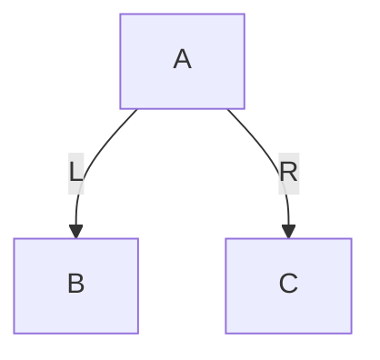
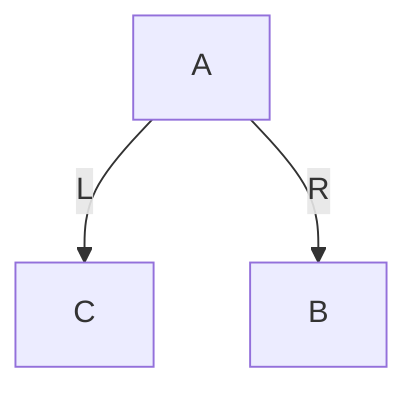
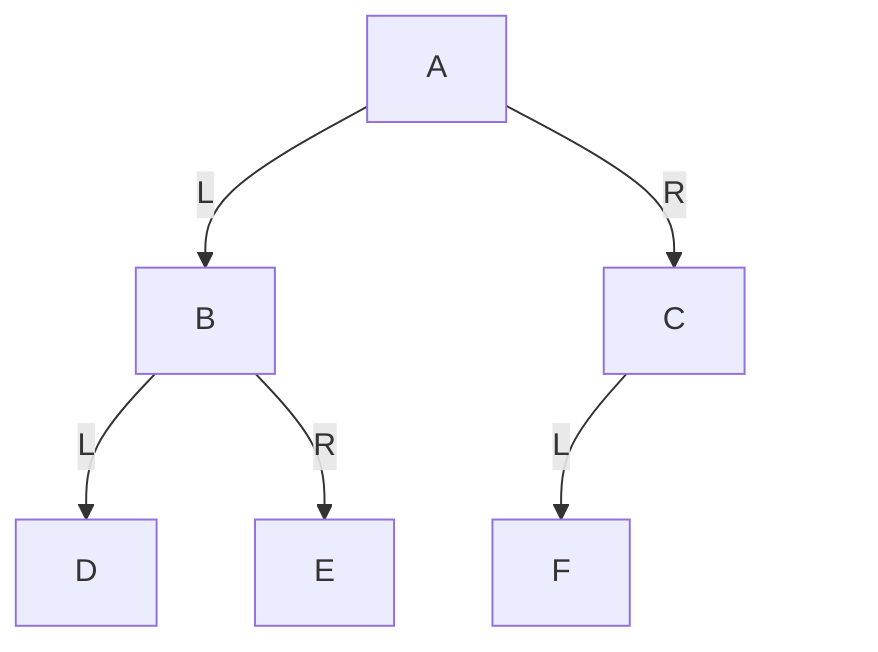
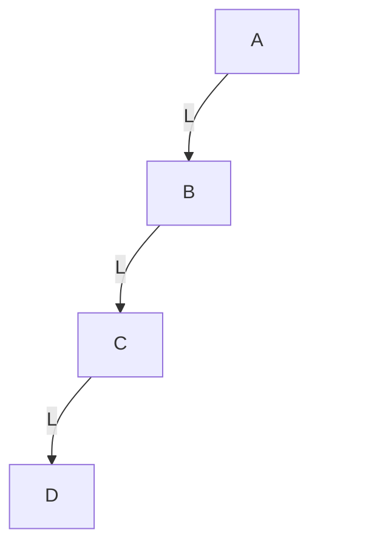
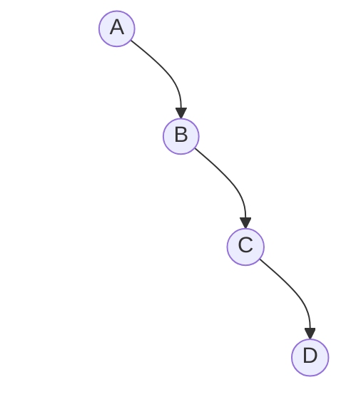
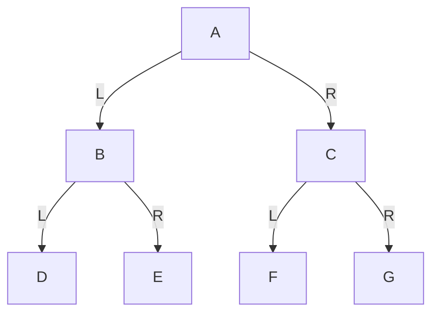
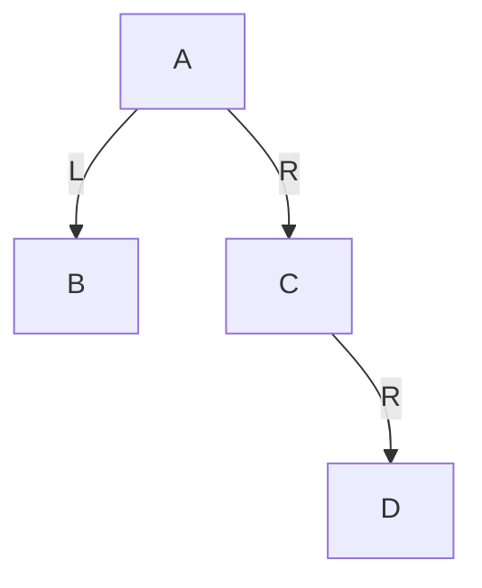
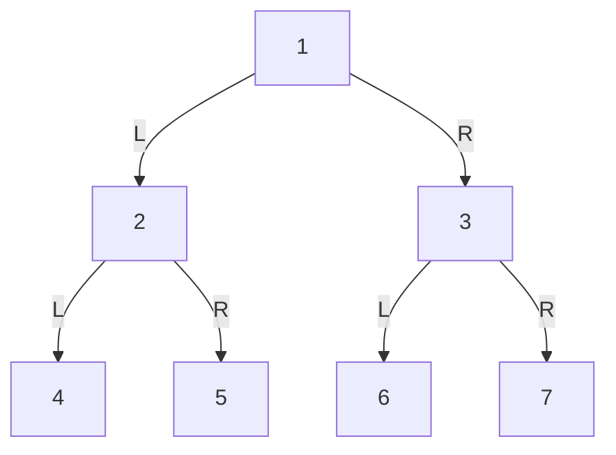
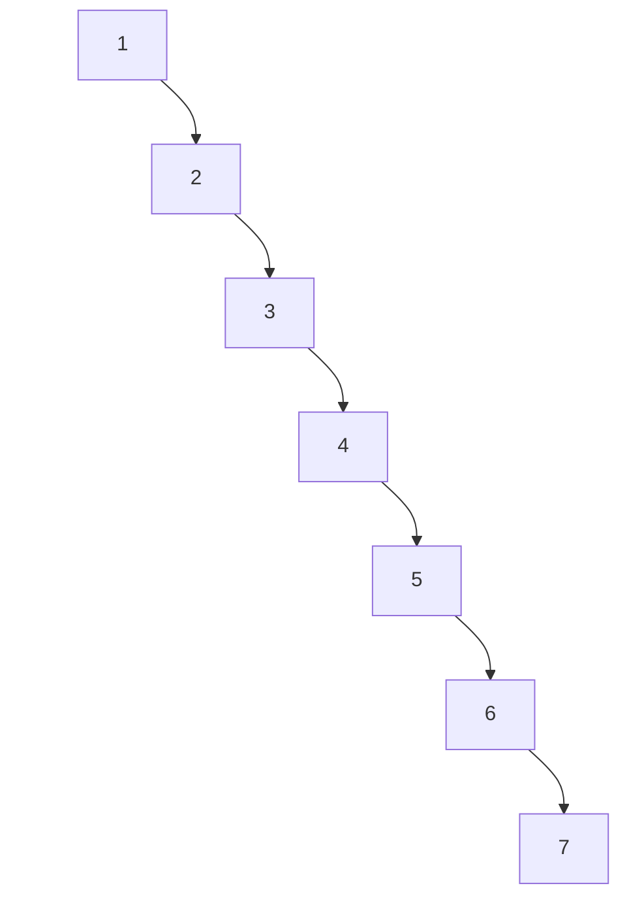
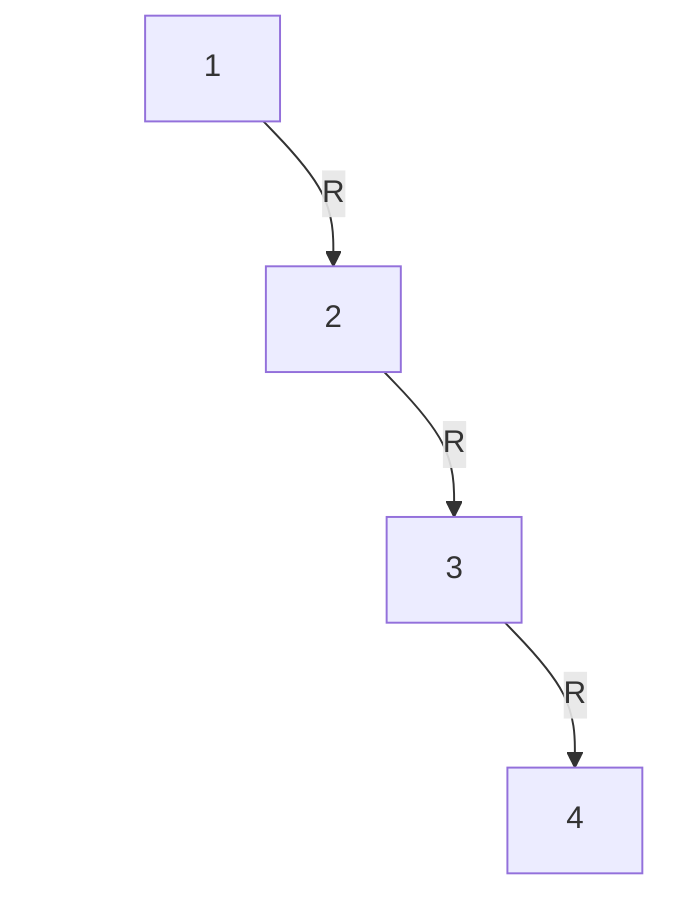

# 第2章 二叉树

## 章节内容说明

第1章完成后，你已经建立了“树”的一般概念。
从这一章开始，学习范围要进一步收缩到 **二叉树**。

这一步非常关键，因为后续你要学习的：

- 二叉搜索树 BST
- 旋转
- 红黑树
- Linux 内核 `rbtree`

都不再建立在“普通树”的宽泛结构上，而是建立在：

> **每个节点最多两个孩子，并且左右方向有明确语义的二叉结构上。**

所以本章的目标不是泛泛地再讲一遍树，而是要把下面几个问题建立清楚：

1. 什么是二叉树
2. 二叉树与普通树的本质区别是什么
3. 左子树与右子树为什么不能随意交换理解
4. 二叉树有哪些典型形态
5. 二叉树遍历为什么会成为后续 BST 与红黑树学习的基础

------

## 2.1 二叉树的定义与结构

### 2.1.1 二叉树的定义

二叉树（Binary Tree）是树的一种特殊形式。它满足的核心约束是：

> **每个节点最多只有两个子节点，并且这两个子节点有明确区分：左子节点与右子节点。**

这里有三个点必须准确理解。

第一，**最多两个**。
不是“必须两个”，而是“最大不超过两个”。

第二，**左右有区分**。
左子节点与右子节点不是一个无序集合中的两个元素，而是两个有固定语义的位置。

第三，**二叉树仍然属于树**。
它依然满足树的基本条件：

- 连通
- 无环
- 除根节点外每个节点恰有一个父节点

所以二叉树不是脱离树的另一种结构，而是树的一种特化形式。

------

### 2.1.2 二叉树节点的标准结构视角

普通树中，一个节点的孩子数不固定，所以表示方式比较宽泛。
二叉树因为最多只有两个孩子，因此它的节点结构可以固定下来。

最基础的二叉树节点通常写成：

```c
struct binary_node {
	int value;
	struct binary_node *left;
	struct binary_node *right;
};
```

如果后续需要向上回溯，也常加入父指针：

```c
struct binary_node {
	int value;
	struct binary_node *parent;
	struct binary_node *left;
	struct binary_node *right;
};
```

这些字段的含义必须固定理解：

- `left`：左子树入口
- `right`：右子树入口
- `parent`：父节点入口

这正是后续各类二叉树扩展结构的基础模板：

- BST：在此基础上增加大小关系约束
- AVL：在此基础上增加平衡约束
- 红黑树：在此基础上增加颜色与修复规则

也就是说，你现在看到的不是一个普通结构体，而是后面整条路线的公共骨架。

------

### 2.1.3 左子树与右子树的有序性

这是二叉树最关键的结构特征之一。

在普通树中，一个节点的多个孩子通常只是“孩子集合”。
但在二叉树中，两个孩子不是无序的，而是严格区分为：

- 左子树
- 右子树

这意味着：

> **左右位置本身就是结构信息。**

看下面这两棵树。

#### 图 2-1 左右位置不同的两棵二叉树

第一棵：



第二棵：



如果是普通树，你可以把它们都理解为：“`A` 有两个孩子，分别是 `B` 和 `C`”。
但如果是二叉树，这两棵树不是同一个结构，因为：

- 第一棵：`B` 在左，`C` 在右
- 第二棵：`C` 在左，`B` 在右

这件事后面会直接影响：

- 遍历结果
- BST 的大小关系
- 左旋与右旋
- 红黑树修复中的内侧 / 外侧判断

所以从二叉树开始，你必须建立一个新习惯：

> **不是只看“下面有几个孩子”，而是看“哪个在左，哪个在右”。**

------

### 2.1.4 二叉树与普通树的区别

下面把普通树与二叉树明确对比。

| 比较项       | 普通树           | 二叉树                 |
| ------------ | ---------------- | ---------------------- |
| 子节点个数   | 不固定           | 最多 2 个              |
| 子节点顺序   | 通常是孩子集合   | 明确区分左、右         |
| 节点表示     | 常需动态孩子集合 | 可用固定字段表示       |
| 后续扩展方向 | 多叉树体系       | BST / AVL / 红黑树体系 |

所以，二叉树的重要性不只是“孩子数更少”，而在于：

> **它把不定长孩子集合压缩成了固定槽位结构。**

有了固定槽位，后面很多事情才有了精确定义：

- 左子树 / 右子树
- 比较后走左还是走右
- 局部旋转
- 平衡修复

------

### 2.1.5 二叉树的递归定义

和普通树一样，二叉树也具有递归定义，但形式更具体：

> **二叉树由一个根节点、一棵左子树和一棵右子树组成；其中左子树和右子树本身也分别是二叉树。**

这里有三个直接结论。

第一，左子树和右子树都可以为空。
所以叶子节点的左、右子树都为空。

第二，任何局部节点以下的部分，都仍可作为一棵二叉树分析。
这为后续递归遍历和递归求高度提供了前提。

第三，很多算法都可以自然写成：

- 处理当前节点
- 递归处理左子树
- 递归处理右子树

例如后面马上要讲的：

- 前序遍历
- 中序遍历
- 后序遍历

都直接建立在这个定义之上。

------

### 2.1.6 示例：一个最基本的二叉树

下面给出一棵最基础的二叉树。

#### 图 2-2 一个基本二叉树示意图



从这张图里，你应当准确读出：

- `A` 是根节点
- `B` 是 `A` 的左孩子
- `C` 是 `A` 的右孩子
- `D` 是 `B` 的左孩子
- `E` 是 `B` 的右孩子
- `F` 是 `C` 的左孩子
- `C` 的右孩子为空

这张图里专门给 `C` 补了一个**透明右占位节点**，目的就是让你看到：

> `C` 不是“只有一个模糊的孩子”，而是“左槽位有孩子、右槽位为空”。

这个视觉习惯，对后面理解：

- 单左孩子
- 单右孩子
- BST 查找路径
- 旋转前后结构

都非常重要。

------

## 2.2 二叉树的基本形态

虽然二叉树都遵守“最多两个孩子”的结构约束，但具体形态差异很大。
这些形态差异会直接影响：

- 高度
- 存储方式
- 遍历结果
- 操作复杂度

所以学习二叉树时，不能只知道“有左右孩子”，还要会识别它的典型形态。

------

### 2.2.1 斜树

斜树是最不平衡的一类二叉树。它的特征是：

- 大多数节点都只有一个孩子
- 整棵树持续向某一个方向延伸

如果一直向左延伸，称为左斜树；一直向右延伸，称为右斜树。

#### 图 2-3 左斜树



这张图强调的是：

- `A` 只有左孩子 `B`
- `B` 只有左孩子 `C`
- `C` 只有左孩子 `D`

每一层右侧都用透明占位补齐，因此你看到的是明确的“只有左，不是右”。

------

#### 图 2-4 右斜树



这张图强调的是：

- `A` 只有右孩子 `B`
- `B` 只有右孩子 `C`
- `C` 只有右孩子 `D`

左侧全部用透明占位补齐，因此你能明确看出它是“单右链”。

斜树的意义在于说明：

> **二叉树并不天然平衡。**

这会在后面 BST 一章中变成核心问题：
如果树长成斜树，查找效率就会明显变差。

------

### 2.2.2 满二叉树

满二叉树（Full Binary Tree）指的是：

> **除叶子节点外，每个节点都有两个子节点，并且所有叶子节点都在同一层。**

#### 图 2-5 满二叉树



这棵树满足：

- `A`、`B`、`C` 都各有两个孩子
- `D`、`E`、`F`、`G` 都是叶子节点
- 所有叶子位于同一层

满二叉树是二叉树中最规整的一种理想形态。

如果树高为 `h`（根节点高度按边数算），那么节点总数为：

```text
2^(h + 1) - 1
```

例如图中高度为 2，则节点数为：

```text
2^3 - 1 = 7
```

满二叉树的重要性在于，它提供了一个“结构最规整”的参考模型。

------

### 2.2.3 完全二叉树

完全二叉树（Complete Binary Tree）比满二叉树更宽松。它的定义是：

> **除最后一层外，其余各层都满；最后一层的节点必须从左到右连续排列，中间不能出现空洞。**

#### 图 2-6 完全二叉树


这棵树是完全二叉树，因为：

- 前两层已经满
- 最后一层节点按从左到右连续出现
- 没有“左边空着、右边先有节点”的情况

------

#### 图 2-7 非完全二叉树示意

下面给一个不是完全二叉树的结构。



这棵树不是完全二叉树，因为：

- `C` 的左槽位为空
- 但右槽位却先出现了 `D`

也就是说，最后一层没有按从左到右连续填充。

完全二叉树之所以重要，是因为它特别适合：

- 顺序存储
- 堆结构
- 数组表达的二叉树

------

### 2.2.4 二叉树高度与节点数量关系

这一节的目标，是让你建立一个很重要的判断：

> **二叉树的效率，不只由节点数量决定，更由高度决定。**

#### 一、同样节点数，高度可能差很多

例如同样是 7 个节点。

##### 图 2-8 7 个节点构成的规整二叉树



这棵树高度为 2。

------

##### 图 2-9 7 个节点构成的右斜树



这棵树高度为 6。

你看到的是：

- 节点数相同
- 但高度差异极大

因此，节点数只描述规模；真正决定很多操作路径长度的，是高度。

#### 二、为什么这件事重要

因为后面在 BST 中：

- 查找一个值，不会扫描所有节点
- 而是沿一条根到目标位置的路径向下走

所以时间复杂度通常与高度更接近，而不是直接与节点总数相同。

这也是为什么后面会自然引出：

- BST 为什么会退化
- 为什么需要旋转
- 为什么要控制树高
- 红黑树究竟在控制什么

所以从这一节开始，你必须建立这个意识：

> **树的形状会影响效率，而高度是这种影响最关键的量化指标。**

------

## 2.3 二叉树的遍历

遍历是二叉树学习中的核心内容。
因为你后面几乎所有操作都会涉及“按某种顺序访问整棵树或局部子树”。

二叉树遍历之所以比普通树更规范，是因为：

- 只有左右两个方向
- 左右顺序本身有语义
- 因此访问顺序可以被严格定义

最基本的遍历有四种：

- 前序遍历
- 中序遍历
- 后序遍历
- 层序遍历

本节先把遍历规则和结果讲清楚。

为了统一说明，下面四种遍历都使用同一棵树。

#### 图 2-10 遍历说明用例树


------

### 2.3.1 前序遍历

前序遍历（Preorder Traversal）的规则是：

> **根 -> 左子树 -> 右子树**

也就是：

1. 先访问当前节点
2. 再遍历左子树
3. 最后遍历右子树

对图 2-10 进行前序遍历，结果是：

```text
A B D E C F G
```

原因如下：

- 先访问根 `A`
- 进入左子树根 `B`
- 先访问 `B`
- 再访问 `D`
- 再访问 `E`
- 左子树结束后，回到右子树根 `C`
- 访问 `C`
- 再访问 `F`
- 再访问 `G`

前序遍历的特点是：

> **当前节点总在其子树之前被访问。**

这类遍历适合“先处理当前节点，再处理子树”的场景。

------

### 2.3.2 中序遍历

中序遍历（Inorder Traversal）的规则是：

> **左子树 -> 根 -> 右子树**

也就是：

1. 先遍历左子树
2. 再访问当前节点
3. 最后遍历右子树

对图 2-10 进行中序遍历，结果是：

```text
D B E A F C G
```

中序遍历在后续会变得极其重要，因为：

> **对于二叉搜索树 BST，中序遍历结果是有序序列。**

所以中序遍历不是一个普通遍历规则，而是后面“查找树有序性”的关键桥梁。

你现在必须先记住：

- 前序：根在前
- 中序：根在中
- 后面 BST 会高度依赖中序

------

### 2.3.3 后序遍历

后序遍历（Postorder Traversal）的规则是：

> **左子树 -> 右子树 -> 根**

也就是：

1. 先遍历左子树
2. 再遍历右子树
3. 最后访问当前节点

对图 2-10 进行后序遍历，结果是：

```text
D E B F G C A
```

后序遍历的特点是：

> **当前节点总在其全部子树之后才被访问。**

因此它常用于：

- 先处理子结构，再处理整体
- 释放整棵树内存
- 先子后父的操作流程

------

### 2.3.4 层序遍历

层序遍历（Level-order Traversal）的规则是：

> **按层从上到下、从左到右访问节点**

对图 2-10 进行层序遍历，结果是：

```text
A B C D E F G
```

层序遍历与前三种不同，它不是依赖“根左右”的递归顺序，而是依赖节点所处的层次。

层序遍历通常需要借助**队列**实现，因为：

- 访问当前节点后
- 要把它的左孩子、右孩子依次加入等待访问的序列

层序遍历的重要性在于：

- 它直接反映树的层次结构
- 它与完全二叉树、顺序存储、堆结构关系密切
- 它常用于判断树的外形特征

------

### 2.3.5 为什么遍历顺序必须严格区分

很多初学者会把前序、中序、后序理解成：

> “反正就是把节点走一遍。”

这是不准确的。

对于同一棵树，四种遍历结果完全不同：

| 遍历方式 | 结果            |
| -------- | --------------- |
| 前序     | `A B D E C F G` |
| 中序     | `D B E A F C G` |
| 后序     | `D E B F G C A` |
| 层序     | `A B C D E F G` |

也就是说：

- 节点集合相同
- 访问顺序不同
- 提取出的结构信息也不同

所以遍历不是简单“走一遍树”，而是：

> **你把当前节点放在左递归和右递归的哪个位置处理，会决定你得到的结构序列。**

这会在后续章节里直接体现在：

- 前序常用于先根处理
- 中序常用于 BST 有序性分析
- 后序常用于先子后父处理
- 层序常用于按层分析树结构

------

### 2.3.6 示例：递归版前序、中序、后序遍历

下面给出最基础的递归遍历代码。
这里的目标不是做泛型封装，而是让你看到：

> **遍历规则在代码里，实际上就是“当前节点处理语句写在什么位置”的差异。**

```c
#include <stdio.h>

struct binary_node {
	int value;
	struct binary_node *left;
	struct binary_node *right;
};

static void preorder_traverse(struct binary_node *node)
{
	if (!node)
		return;

	printf("%d ", node->value);
	preorder_traverse(node->left);
	preorder_traverse(node->right);
}

static void inorder_traverse(struct binary_node *node)
{
	if (!node)
		return;

	inorder_traverse(node->left);
	printf("%d ", node->value);
	inorder_traverse(node->right);
}

static void postorder_traverse(struct binary_node *node)
{
	if (!node)
		return;

	postorder_traverse(node->left);
	postorder_traverse(node->right);
	printf("%d ", node->value);
}
```

你要特别注意的是三者的唯一区别：

- 前序：`printf` 在两次递归之前
- 中序：`printf` 在中间
- 后序：`printf` 在两次递归之后

这三种写法看起来很像，但语义完全不同。

所以遍历规则本质上可以这样理解：

> **根节点的处理动作，放在左递归和右递归的前、中、后不同位置，就对应了前序、中序、后序。**

------

## 本批小结

本批完成了第2章的前三个部分：

- 2.1 二叉树的定义与结构
- 2.2 二叉树的基本形态
- 2.3 二叉树的遍历

你现在应当建立以下几个关键认识。

第一，二叉树不是普通树的随意简化，而是一个有严格左右槽位约束的树结构。

第二，左子树和右子树本身就是结构信息，这会直接影响遍历、BST、旋转和红黑树修复。

第三，二叉树并不天然平衡。斜树说明：即使节点数不多，高度仍可能很大。

第四，满二叉树和完全二叉树是两种重要的规则形态，后续会关系到顺序存储和堆结构。

第五，遍历不是简单“走一遍树”，而是按不同顺序提取不同结构信息。其中中序遍历将在 BST 一章中变得非常关键。


下面的重点，不再是“二叉树长什么样”，而是开始回答两个更接近开发的问题：

1. 为什么二叉树遍历天然适合递归实现
2. 如果不用递归，为什么通常要借助栈或队列
3. 学二叉树时，最基本、最常见的几个问题应该如何分析与实现

你后面进入 BST、旋转、红黑树时，会反复依赖这一批建立起来的思维方式。因为从本质上说：

- BST 只是“带有序约束的二叉树”
- 红黑树只是“带平衡约束的二叉树”

所以二叉树层面的遍历、求高度、求节点数、查找节点，这些能力不是旁枝末节，而是后续全部内容的直接基础。

------

## 2.4 二叉树遍历的实现思想

### 2.4.1 递归实现

二叉树遍历之所以最常先用递归讲，不是因为递归“更高级”，而是因为：

> **二叉树本身就是递归定义的数据结构。**

二叉树的递归定义是：

- 一棵二叉树由一个根节点、左子树、右子树组成
- 左子树和右子树本身仍然是二叉树

因此，遍历某个节点 `node` 时，天然可以写成：

1. 先决定当前节点什么时候处理
2. 再递归遍历左子树
3. 再递归遍历右子树

这正好对应前序、中序、后序三种深度优先遍历。

------

#### 一、递归版前序遍历

前序遍历规则：

> 根 -> 左 -> 右

代码如下：

```c
#include <stdio.h>

struct binary_node {
	int value;
	struct binary_node *left;
	struct binary_node *right;
};

static void preorder_traverse(struct binary_node *node)
{
	if (!node)
		return;

	printf("%d ", node->value);
	preorder_traverse(node->left);
	preorder_traverse(node->right);
}
```

这里的关键不是函数名，而是顺序：

- 先处理当前节点
- 再进左子树
- 再进右子树

------

#### 二、递归版中序遍历

中序遍历规则：

> 左 -> 根 -> 右

代码如下：

```c
static void inorder_traverse(struct binary_node *node)
{
	if (!node)
		return;

	inorder_traverse(node->left);
	printf("%d ", node->value);
	inorder_traverse(node->right);
}
```

中序遍历的关键特征是：

- 当前节点的处理动作位于左递归和右递归之间

这在后续 BST 中会非常重要，因为：

> **BST 的中序遍历结果是从小到大的有序序列。**

------

#### 三、递归版后序遍历

后序遍历规则：

> 左 -> 右 -> 根

代码如下：

```c
static void postorder_traverse(struct binary_node *node)
{
	if (!node)
		return;

	postorder_traverse(node->left);
	postorder_traverse(node->right);
	printf("%d ", node->value);
}
```

后序遍历的关键特征是：

- 当前节点最后处理
- 子树先处理完，根再处理

所以它很适合：

- 释放整棵树
- 先处理子结构、再处理整体的场景

------

#### 四、为什么递归写法自然

递归遍历之所以自然，是因为每一次调用都只做三件事：

1. 判断当前节点是否为空
2. 处理当前节点
3. 把相同问题交给左右子树

也就是说，递归并不是在“玩技巧”，而是在直接照着二叉树的定义写代码。

从结构上说，递归遍历本质上是：

> **函数调用栈替你记录了“当前处理到哪一层、从哪一层返回”的上下文。**

这一点非常关键，因为它会自然引出下一节：
如果不用递归，那么这些“返回路径信息”就必须由程序员自己保存。

------

### 2.4.2 非递归实现的基本思路

递归实现虽然自然，但它并不是唯一方式。
非递归遍历的核心问题只有一个：

> **递归调用栈帮你保存的状态，如果不用递归，你准备放到哪里？**

答案通常是：

- 深度优先遍历：放到**栈**
- 层序遍历：放到**队列**

------

#### 一、为什么前序、中序、后序通常要用栈

前序、中序、后序都属于**深度优先遍历**。
所谓深度优先，意思是：

- 先沿着某条分支尽可能往下走
- 走不下去后，再回退到上层
- 然后切换到另一条分支

这个“往下走—回退—再切换”的过程，本质上就是：

> **后进先出**

因为最后进入的那个节点，最先需要被弹出回退。
这正好对应**栈（Stack）**的行为。

------

#### 二、以前序遍历为例看非递归思路

前序规则是：

> 根 -> 左 -> 右

非递归时，最常见思路是：

1. 根节点入栈
2. 弹出栈顶并访问
3. 先压右孩子，再压左孩子
4. 重复直到栈空

为什么要“先压右，再压左”？

因为栈是后进先出。
你希望访问顺序是“左先于右”，就必须让左孩子后入栈、先弹出。

------

#### 三、以中序遍历为例看非递归思路

中序规则是：

> 左 -> 根 -> 右

这里不能像前序那样简单地“弹出就访问”，因为必须先把整条左链走到底。

典型思路是：

1. 当前节点不断向左入栈
2. 走到空后，弹出栈顶并访问
3. 转向该节点的右子树
4. 对右子树重复相同步骤

所以中序非递归的关键不是“遍历”，而是：

> **用栈把尚未处理、但未来要回来的父节点先保存起来。**

------

#### 四、以后序遍历为例看非递归思路

后序规则是：

> 左 -> 右 -> 根

后序是三种深度优先遍历里最难非递归化的一种。
原因在于：

- 当前节点不能太早访问
- 左右子树都处理完之后，当前节点才能访问

所以非递归后序通常有两种常见思路：

1. 使用两个栈
2. 使用一个栈 + 最近一次访问节点指针

这说明一个事实：

> **越依赖“回退时机”的遍历，非递归实现就越需要显式保存更多状态。**

------

### 2.4.3 栈与队列在遍历中的作用

这一节把“为什么用栈、为什么用队列”统一收束一下。

#### 一、栈服务于深度优先

前序、中序、后序遍历都属于深度优先。
它们的共同点是：

- 优先沿一条路径深入
- 到底后再回退
- 再切换分支

这类过程天然符合：

> **先深入的那条路径，最后才会完全退出。**

因此，使用栈来模拟函数调用栈最自然。

------

#### 二、队列服务于层序遍历

层序遍历的规则是：

> 按层从上到下、从左到右访问

它的访问顺序本质上是：

- 先进入的一层节点，先被处理
- 后进入的下一层节点，后被处理

这正好是：

> **先进先出**

因此，层序遍历天然对应**队列（Queue）**。

------

#### 三、示例：层序遍历为何必须用队列

看下面这棵二叉树。

#### 图 2-11 层序遍历示意图


层序访问顺序是：

```text
A B C D E F
```

访问过程可以理解为：

1. 先把 `A` 放入队列
2. 取出 `A`，访问它，并把 `B`、`C` 入队
3. 取出 `B`，访问它，并把 `D`、`E` 入队
4. 取出 `C`，访问它，并把 `F` 入队
5. 再依次取出 `D`、`E`、`F`

这里你会看到：

- 新发现的节点不会立刻深入处理
- 而是排到当前层节点之后等待

这就是典型的先进先出行为。

------

#### 四、这一节真正要记住的结论

不是“非递归要用容器”这么简单，而是：

- 递归遍历依赖**函数调用栈**
- 非递归深度优先遍历依赖**显式栈**
- 层序遍历依赖**队列**

也就是说，数据结构不是随便选的，而是由遍历访问模式决定的。

------

## 2.5 二叉树的典型问题

这一节讲你学习二叉树时最应先掌握的几个基础问题。
这些问题看起来朴素，但后面几乎都会反复出现。

------

### 2.5.1 求高度

树的高度，是后续所有“效率”和“平衡性”讨论的基础。

对于二叉树，某节点的高度定义为：

> 从该节点到最远叶子节点的最长路径边数

整棵树的高度，就是根节点的高度。

------

#### 一、递归求高度的思路

根据二叉树的递归定义，求高度的逻辑非常自然：

1. 空树高度记为 `-1`
2. 非空节点的高度
   = `max(左子树高度, 右子树高度) + 1`

代码如下：

```c
static int binary_tree_height(struct binary_node *node)
{
	int left_h;
	int right_h;

	if (!node)
		return -1;

	left_h = binary_tree_height(node->left);
	right_h = binary_tree_height(node->right);

	return (left_h > right_h ? left_h : right_h) + 1;
}
```

这里把空树高度记为 `-1`，则：

- 叶子节点左右都为空
- 叶子节点高度 = `max(-1, -1) + 1 = 0`

这个定义在代码里是非常方便的。

------

#### 二、右斜树的高度示例

为了说明“高度为何受形状影响”，看下面这棵右斜树。

#### 图 2-12 右斜树高度示意图



这棵树中：

- `D` 高度为 0
- `C` 高度为 1
- `B` 高度为 2
- `A` 高度为 3

你可以直接看出：

> 节点数并不算多，但高度已经很大。

这正是后面 BST 会出现退化问题的根源。

------

### 2.5.2 求节点数

统计节点总数是最基本的问题之一。
它能帮助你建立“树由根和子树组成”的递归直觉。

#### 一、递归思路

对任意节点 `node`：

- 如果为空，节点数为 0
- 如果非空，节点数
  = 左子树节点数 + 右子树节点数 + 1

代码如下：

```c
static int binary_tree_count_nodes(struct binary_node *node)
{
	if (!node)
		return 0;

	return binary_tree_count_nodes(node->left) +
	       binary_tree_count_nodes(node->right) + 1;
}
```

这段代码很短，但它体现了一个核心思想：

> **整棵树的问题 = 左子树问题 + 右子树问题 + 当前节点自身。**

这也是后面很多树算法的共同骨架。

------

#### 二、为什么“求节点数”值得单独学

因为它能帮助你真正适应：

- 不是从数组下标线性推进
- 而是从一个节点分裂成左右两个递归子问题

如果这个问题你都写不稳，后面 BST 和红黑树的递归分析会很吃力。

------

### 2.5.3 判断空树与叶子节点

这一节看起来简单，但其实是所有树递归代码的基本边界处理。

#### 一、空树判断

空树通常表示为：

```c
root == NULL
```

这意味着：

- 当前没有任何节点
- 遍历应立即结束
- 求节点数应返回 0
- 求高度应返回约定值

因此，“空树判断”通常是所有递归函数的第一个分支。

------

#### 二、叶子节点判断

叶子节点表示：

- 当前节点非空
- 左孩子为空
- 右孩子为空

代码如下：

```c
static int binary_tree_is_leaf(struct binary_node *node)
{
	if (!node)
		return 0;

	return !node->left && !node->right;
}
```

叶子节点判断在很多场景中都很重要，例如：

- 某些遍历只统计叶子
- 删除操作要区分叶子节点
- 求路径问题常以叶子为终点
- 红黑树教材中常会引入 NIL 叶子概念

------

#### 三、为什么边界判断必须稳

树代码很容易出错的一个根源就是：

> **边界判断不稳。**

常见错误包括：

- 对空指针继续解引用
- 把单孩子节点误判成叶子
- 高度定义混乱
- 空树返回值与叶子返回值不一致

所以学树时，空树和叶子节点的判断不是小事，而是后续全部代码正确性的底层前提。

------

### 2.5.4 查找指定节点

查找指定节点，是从“遍历整棵树”走向“带目标搜索”的第一步。
在普通二叉树中，因为还没有 BST 的大小关系约束，所以查找通常只能依赖：

- 当前节点是否匹配
- 不匹配就去左子树找
- 左子树没找到再去右子树找

------

#### 一、递归查找思路

代码如下：

```c
static struct binary_node *
binary_tree_find(struct binary_node *node, int target)
{
	struct binary_node *found;

	if (!node)
		return NULL;

	if (node->value == target)
		return node;

	found = binary_tree_find(node->left, target);
	if (found)
		return found;

	return binary_tree_find(node->right, target);
}
```

这段代码体现的逻辑是：

1. 当前节点为空，返回空
2. 当前节点命中，直接返回
3. 左子树先查
4. 左边没找到，再查右边

------

#### 二、普通二叉树查找与 BST 查找的区别

这一点你现在就要先建立概念。

在普通二叉树中：

- 左右只是结构位置
- 没有大小关系语义
- 因此查找常常要遍历整棵树的大部分节点

在 BST 中：

- 左子树都比根小
- 右子树都比根大
- 因此查找可以根据比较结果只走一边

也就是说：

> **普通二叉树查找是“遍历式查找”，BST 查找是“决策式查找”。**

这一点会在下一章成为核心分水岭。

------

## 2.6 本章小结

### 2.6.1 二叉树是红黑树的直接结构基础

本章最重要的收获，不只是“认识了二叉树”，而是建立了这样一个明确结论：

> **红黑树首先是一棵二叉树。**

因此，红黑树中后续你会看到的所有结构与动作，例如：

- 左子树 / 右子树
- 父节点 / 子节点
- 左旋 / 右旋
- 插入到某个空槽位
- 删除后重新挂接子树

都建立在本章内容之上。

如果你对下面这些概念还不稳：

- 左右槽位的结构意义
- 递归定义
- 高度
- 前序 / 中序 / 后序
- 左右子树的局部分析

那么后面一进入 BST 和红黑树，就会感觉术语很多、图很多、case 很乱。

所以本章真正完成的，是后续整条路线的“二叉结构地基”。

------

### 2.6.2 中序遍历对后续 BST 的重要性

本章虽然还没有进入 BST，但有一个知识点必须提前锁定：

> **中序遍历将成为 BST 一章的核心桥梁。**

原因在于：

- 普通二叉树的中序遍历，只是一种访问顺序
- BST 的中序遍历，则会直接变成“有序输出”

也就是说，从下一章开始：

- 左子树不再只是“左边那棵子树”
- 而会带上“值更小”的语义
- 右子树也会带上“值更大”的语义

于是，中序遍历的意义就会从“遍历规则”升级为：

> **验证 BST 有序性的直接工具。**

所以你可以把本章与下一章的关系理解为：

- 本章建立“二叉结构”
- 下一章在这个结构上增加“大小关系”
- 再后面红黑树，则是在 BST 的基础上继续增加“平衡控制”

------

## 本章结束说明

到这里，第2章全部完成。
你现在应当已经具备进入下一章的前提：

- 理解二叉树是什么
- 理解左右槽位不能混淆
- 理解不同二叉树形态对高度的影响
- 理解前序、中序、后序、层序遍历
- 理解递归、栈、队列在遍历中的角色
- 能分析最基础的二叉树问题：高度、节点数、叶子判断、普通查找


