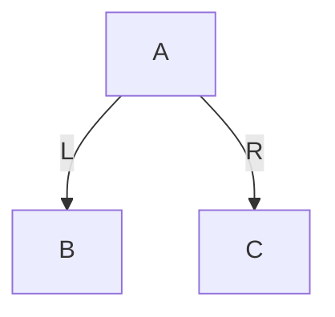
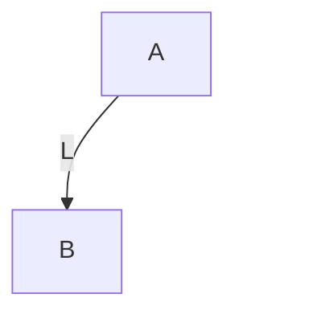
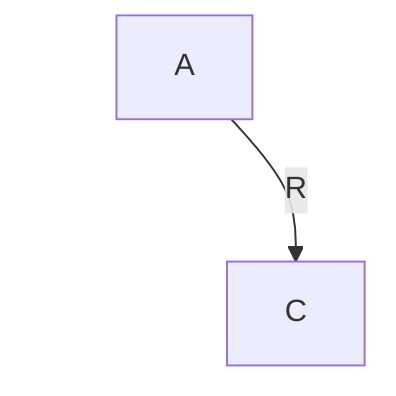

1. 我是 **GPT-5.4 Thinking**。

   下面给你一份**按学习路径组织的红黑树专题大纲**。
   这份大纲不是“只讲红黑树本身”，而是把你要补的前置内容一起纳入进来，形成一条完整路径：

   ------

   # 红黑树学习路线大纲

   ## 第1章 树的基本概念

   ### 1.1 什么是树

   #### 1.1.1 树的定义

   #### 1.1.2 树与数组、链表的结构差异

   #### 1.1.3 树适合解决什么类型的问题

   ### 1.2 树的基本术语

   #### 1.2.1 根节点、父节点、子节点、兄弟节点

   #### 1.2.2 叶子节点、内部节点

   #### 1.2.3 节点的度、树的度

   #### 1.2.4 路径、路径长度

   #### 1.2.5 节点深度、高度、层次

   #### 1.2.6 子树与森林

   ### 1.3 树的基本性质

   #### 1.3.1 树为什么是非线性结构

   #### 1.3.2 树的递归定义

   #### 1.3.3 树结构中的层级关系与分支关系

   ### 1.4 树的存储与表示

   #### 1.4.1 顺序存储与链式存储

   #### 1.4.2 孩子表示法

   #### 1.4.3 双亲表示法

   #### 1.4.4 孩子兄弟表示法

   ### 1.5 本章小结

   #### 1.5.1 为什么红黑树学习不能绕开树

   #### 1.5.2 后续学习与二叉树的关系

   ------

   ## 第2章 二叉树

   ### 2.1 二叉树的定义与结构

   #### 2.1.1 二叉树的定义

   #### 2.1.2 左子树与右子树的有序性

   #### 2.1.3 二叉树与普通树的区别

   ### 2.2 二叉树的基本形态

   #### 2.2.1 斜树

   #### 2.2.2 满二叉树

   #### 2.2.3 完全二叉树

   #### 2.2.4 二叉树高度与节点数量关系

   ### 2.3 二叉树的遍历

   #### 2.3.1 前序遍历

   #### 2.3.2 中序遍历

   #### 2.3.3 后序遍历

   #### 2.3.4 层序遍历

   ### 2.4 二叉树遍历的实现思想

   #### 2.4.1 递归实现

   #### 2.4.2 非递归实现的基本思路

   #### 2.4.3 栈与队列在遍历中的作用

   ### 2.5 二叉树的典型问题

   #### 2.5.1 求高度

   #### 2.5.2 求节点数

   #### 2.5.3 判断空树与叶子节点

   #### 2.5.4 查找指定节点

   ### 2.6 本章小结

   #### 2.6.1 二叉树是红黑树的直接结构基础

   #### 2.6.2 中序遍历对后续 BST 的重要性

   ------

   ## 第3章 二叉搜索树 BST

   ### 3.1 二叉搜索树的定义

   #### 3.1.1 BST 的有序性约束

   #### 3.1.2 左子树、右子树与比较规则

   #### 3.1.3 BST 与普通二叉树的区别

   ### 3.2 BST 的查找

   #### 3.2.1 查找过程的决策路径

   #### 3.2.2 时间复杂度与树高的关系

   #### 3.2.3 最优与最坏情况分析

   ### 3.3 BST 的插入

   #### 3.3.1 插入位置的搜索

   #### 3.3.2 新节点的挂接方式

   #### 3.3.3 插入后为什么仍保持 BST 性质

   ### 3.4 BST 的删除

   #### 3.4.1 删除叶子节点

   #### 3.4.2 删除只有一个孩子的节点

   #### 3.4.3 删除有两个孩子的节点

   #### 3.4.4 前驱与后继替换思想

   ### 3.5 BST 的优点与局限

   #### 3.5.1 为什么 BST 查找通常较快

   #### 3.5.2 为什么 BST 不保证平衡

   #### 3.5.3 为何后续需要平衡树

   ### 3.6 本章小结

   #### 3.6.1 红黑树首先是一棵 BST

   #### 3.6.2 红黑树的所有旋转都不能破坏 BST 有序性

   ------

   ## 第4章 为什么 BST 会退化

   ### 4.1 退化问题的提出

   #### 4.1.1 顺序插入导致的单边增长

   #### 4.1.2 树退化为链表的结构现象

   #### 4.1.3 查找效率从对数级退化到线性级

   ### 4.2 退化的本质原因

   #### 4.2.1 BST 只约束大小关系，不约束形状

   #### 4.2.2 插入顺序对树形态的直接影响

   #### 4.2.3 删除操作也可能进一步破坏形态

   ### 4.3 为什么需要平衡

   #### 4.3.1 平衡的目标不是绝对对称

   #### 4.3.2 控制树高才是核心目标

   #### 4.3.3 平衡树解决的本质问题

   ### 4.4 常见平衡思想概览

   #### 4.4.1 严格平衡与弱平衡

   #### 4.4.2 AVL 与红黑树的思路差异

   #### 4.4.3 多路平衡树与二叉平衡树的分化方向

   ### 4.5 本章小结

   #### 4.5.1 红黑树出现的动机

   #### 4.5.2 后续为什么先学旋转而不是直接学红黑性质

   ------

   ## 第5章 旋转的作用与局部重排

   ### 5.1 旋转为什么存在

   #### 5.1.1 不改变中序有序性

   #### 5.1.2 通过局部重排改变树形

   #### 5.1.3 旋转是平衡树修复的机械基础

   ### 5.2 左旋

   #### 5.2.1 左旋前后的局部结构

   #### 5.2.2 左旋时父子关系如何变化

   #### 5.2.3 左旋为什么不破坏 BST 性质

   ### 5.3 右旋

   #### 5.3.1 右旋前后的局部结构

   #### 5.3.2 右旋时父子关系如何变化

   #### 5.3.3 右旋为什么不破坏 BST 性质

   ### 5.4 双旋与组合旋转

   #### 5.4.1 先左后右

   #### 5.4.2 先右后左

   #### 5.4.3 为什么有时单旋不够

   ### 5.5 旋转中的指针维护问题

   #### 5.5.1 父指针更新

   #### 5.5.2 子指针更新

   #### 5.5.3 根节点变化

   #### 5.5.4 空子树挂接问题

   ### 5.6 本章小结

   #### 5.6.1 旋转是红黑树插入删除修复的核心动作

   #### 5.6.2 后续所有 case 都要回到旋转本身理解

   ------

   ## 第6章 2-3-4 树：多路平衡搜索树的直觉

   ### 6.1 为什么要引入 2-3-4 树

   #### 6.1.1 它不是红黑树前置代码基础

   #### 6.1.2 它是红黑树前置结构理解基础

   #### 6.1.3 它帮助理解“逻辑节点合并”的思想

   ### 6.2 2-3-4 树的节点类型

   #### 6.2.1 2-node

   #### 6.2.2 3-node

   #### 6.2.3 4-node

   ### 6.3 2-3-4 树的查找

   #### 6.3.1 单节点内多关键字比较

   #### 6.3.2 多分支决策路径

   #### 6.3.3 为什么树高更低

   ### 6.4 2-3-4 树的插入

   #### 6.4.1 叶子插入的目标位置

   #### 6.4.2 4-node 分裂

   #### 6.4.3 分裂向上传播

   ### 6.5 2-3-4 树的删除

   #### 6.5.1 删除的基本情形

   #### 6.5.2 借位与合并

   #### 6.5.3 为什么删除比插入复杂

   ### 6.6 2-3-4 树的平衡本质

   #### 6.6.1 所有叶子位于同一层

   #### 6.6.2 节点扩张与分裂维持平衡

   #### 6.6.3 它与红黑树之间的桥梁作用

   ### 6.7 本章小结

   #### 6.7.1 红黑树不是凭空出现的规则集合

   #### 6.7.2 红黑树可以视为 2-3-4 树的二叉表示

   ------

   ## 第7章 红黑树：把 2-3-4 树映射成二叉表示

   ### 7.1 红黑树的定义

   #### 7.1.1 节点颜色信息

   #### 7.1.2 红黑树首先是一棵 BST

   #### 7.1.3 红黑树是弱平衡树

   ### 7.2 红黑树的五条性质

   #### 7.2.1 节点非红即黑

   #### 7.2.2 根节点为黑

   #### 7.2.3 NIL 叶子为黑

   #### 7.2.4 红节点不能有红孩子

   #### 7.2.5 任一路径黑高一致

   ### 7.3 红黑树的核心概念

   #### 7.3.1 黑高

   #### 7.3.2 红红冲突

   #### 7.3.3 黑高失衡

   ### 7.4 2-3-4 树与红黑树的映射关系

   #### 7.4.1 2-node 对应关系

   #### 7.4.2 3-node 对应关系

   #### 7.4.3 4-node 对应关系

   #### 7.4.4 为什么红链接可以看成逻辑合并

   ### 7.5 红黑树为什么能控制树高

   #### 7.5.1 红节点不能连续的意义

   #### 7.5.2 黑高一致的意义

   #### 7.5.3 树高上界的直观理解

   ### 7.6 本章小结

   #### 7.6.1 红黑树的“颜色”本质上是结构控制信息

   #### 7.6.2 后续插入删除修复都围绕红红冲突与黑高失衡展开

   ------

   ## 第8章 红黑树插入修复

   ### 8.1 红黑树插入的基本流程

   #### 8.1.1 先按 BST 规则插入

   #### 8.1.2 为什么新节点通常先染成红色

   #### 8.1.3 插入后可能破坏哪些性质

   ### 8.2 插入修复的分析框架

   #### 8.2.1 当前节点、父节点、祖父节点、叔叔节点

   #### 8.2.2 修复时为什么要看叔叔颜色

   #### 8.2.3 修复动作只有染色与旋转

   ### 8.3 插入修复的典型情况

   #### 8.3.1 父黑：无需修复

   #### 8.3.2 父红叔红：染色上推

   #### 8.3.3 父红叔黑：旋转加染色

   #### 8.3.4 内侧插入与外侧插入

   ### 8.4 插入修复与 2-3-4 树分裂的关系

   #### 8.4.1 染色对应逻辑分裂

   #### 8.4.2 旋转对应二叉表示整理

   #### 8.4.3 为什么插入修复比删除修复更容易掌握

   ### 8.5 插入操作的复杂度与稳定性

   #### 8.5.1 查找路径复杂度

   #### 8.5.2 修复高度界限

   #### 8.5.3 工程实现中的常见边界问题

   ### 8.6 本章小结

   #### 8.6.1 插入修复的本质是解决红红冲突

   #### 8.6.2 插入修复的核心不是背 case，而是理解结构变化

   ------

   ## 第9章 红黑树删除修复

   ### 9.1 红黑树删除的基本流程

   #### 9.1.1 先按 BST 删除逻辑定位目标

   #### 9.1.2 两孩子节点的替换问题

   #### 9.1.3 实际删除节点与逻辑删除节点的区别

   ### 9.2 删除为什么比插入更难

   #### 9.2.1 删除红节点通常较简单

   #### 9.2.2 删除黑节点会破坏黑高

   #### 9.2.3 所谓“双重黑”问题的提出

   ### 9.3 删除修复的分析框架

   #### 9.3.1 当前节点与兄弟节点

   #### 9.3.2 父节点与侄子节点

   #### 9.3.3 修复动作中的旋转与染色传播

   ### 9.4 删除修复的典型情况

   #### 9.4.1 兄弟为红

   #### 9.4.2 兄弟为黑且两个孩子都黑

   #### 9.4.3 兄弟为黑且近侄红远侄黑

   #### 9.4.4 兄弟为黑且远侄红

   ### 9.5 删除修复与 2-3-4 树借位/合并的关系

   #### 9.5.1 借位的对应理解

   #### 9.5.2 合并的对应理解

   #### 9.5.3 为什么某些修复会向上继续传播

   ### 9.6 删除实现中的常见问题

   #### 9.6.1 NIL 节点的处理

   #### 9.6.2 根节点变化

   #### 9.6.3 替换节点颜色继承

   #### 9.6.4 边界 case 的统一化处理

   ### 9.7 本章小结

   #### 9.7.1 删除修复的本质是恢复黑高一致性

   #### 9.7.2 删除难点在于“少了一个黑色”如何传播与消除

   ------

   ## 第10章 Linux 内核 rbtree 工程实现

   ### 10.1 为什么内核要用红黑树

   #### 10.1.1 查找、插入、删除复杂度稳定

   #### 10.1.2 适合内核中的有序对象管理

   #### 10.1.3 与链表、哈希表的适用场景差异

   ### 10.2 Linux rbtree 的基本设计

   #### 10.2.1 `struct rb_node`

   #### 10.2.2 `struct rb_root`

   #### 10.2.3 节点嵌入式设计

   #### 10.2.4 `container_of` 与对象还原

   ### 10.3 内核 rbtree 的使用方式

   #### 10.3.1 为什么比较逻辑由用户代码自己写

   #### 10.3.2 查找流程如何组织

   #### 10.3.3 插入时如何挂接新节点

   #### 10.3.4 `rb_link_node` 与 `rb_insert_color`

   #### 10.3.5 删除时如何调用 `rb_erase`

   ### 10.4 内核实现与教材实现的区别

   #### 10.4.1 不直接提供泛型比较函数

   #### 10.4.2 更强调性能与内联

   #### 10.4.3 颜色位与父指针的组织方式

   #### 10.4.4 为什么内核实现看起来更“裸”

   ### 10.5 内核 rbtree 的典型应用场景

   #### 10.5.1 定时器

   #### 10.5.2 虚拟内存区域管理

   #### 10.5.3 各类有序对象索引结构

   ### 10.6 调试与验证思路

   #### 10.6.1 如何验证 BST 性质

   #### 10.6.2 如何验证红黑性质

   #### 10.6.3 如何排查旋转或颜色修复错误

   ### 10.7 本章小结

   #### 10.7.1 理论红黑树与工程红黑树的连接

   #### 10.7.2 为什么内核学习必须理解其嵌入式实现方式

   ------

   ## 第11章 再扩展到 B 树 / B+ 树

   ### 11.1 为什么在红黑树之后学习 B 树 / B+ 树

   #### 11.1.1 红黑树解决内存中的二叉平衡问题

   #### 11.1.2 B 树解决多路平衡与外存访问问题

   #### 11.1.3 两者属于同一家族但关注点不同

   ### 11.2 B 树

   #### 11.2.1 多路搜索树的基本结构

   #### 11.2.2 节点中多个 key 的组织方式

   #### 11.2.3 插入分裂与删除合并

   #### 11.2.4 为什么 B 树适合页式存储

   ### 11.3 B+ 树

   #### 11.3.1 叶子节点存储数据

   #### 11.3.2 内部节点只存索引

   #### 11.3.3 范围查询与顺序访问优势

   #### 11.3.4 B+ 树与数据库索引的关系

   ### 11.4 红黑树、2-3-4 树、B 树、B+ 树的关系图谱

   #### 11.4.1 二叉平衡树与多路平衡树

   #### 11.4.2 内存结构与外存结构

   #### 11.4.3 工程场景选择依据

   ### 11.5 本章小结

   #### 11.5.1 从红黑树扩展到查找树家族

   #### 11.5.2 为后续数据库、文件系统、索引结构学习做铺垫

   ------

   # 附录：建议的学习推进顺序

   ## A. 第一阶段：树基础

   ### A.1 树的术语

   ### A.2 二叉树结构

   ### A.3 遍历与递归

   ## B. 第二阶段：查找树基础

   ### B.1 BST 查找

   ### B.2 BST 插入

   ### B.3 BST 删除

   ### B.4 BST 退化问题

   ## C. 第三阶段：平衡思想

   ### C.1 旋转

   ### C.2 2-3-4 树

   ### C.3 红黑树性质

   ## D. 第四阶段：红黑树核心

   ### D.1 插入修复

   ### D.2 删除修复

   ### D.3 复杂度与边界条件

   ## E. 第五阶段：工程落地

   ### E.1 Linux 内核 rbtree

   ### E.2 与 B 树 / B+ 树对比

   ### E.3 建立完整查找树知识地图

   ------

   这份大纲的核心特点是：

   - 不是孤立讲红黑树
   - 把你真正需要补的前置内容串起来
   - 中间明确加入 **2-3-4 树** 作为结构理解桥梁
   - 最后落到 **Linux 内核 rbtree**，再扩展到 **B 树 / B+ 树**

树结构的表示：

------

## 你现在这类“二叉树 / 红黑树”笔记，我建议直接用这个模板

### 双孩子

### 单左孩子

### 单右孩子

这套写法对你后面画：

- 二叉树
- BST
- 左旋 / 右旋
- 红黑树插入删除 case

都很实用。

下一条我可以直接给你一份**“适合你后续整本笔记使用的 Mermaid 二叉树/红黑树绘图模板规范”**，把左孩子、右孩子、NIL、旋转前后图统一成一套格式。