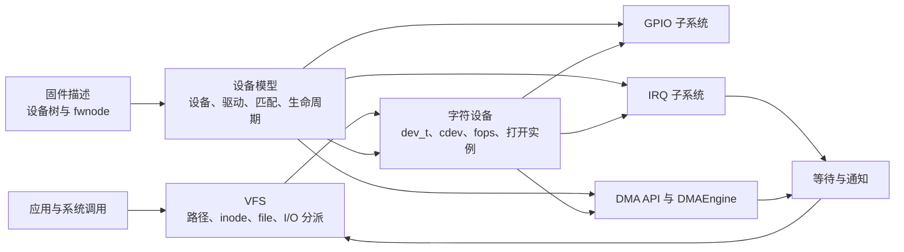

# 第1章\_Linux\_I/O\_与驱动子系统建设路线

## 1.1\_这张图解决什么问题

VFS、设备模型、字符设备、设备树、GPIO、IRQ 和 DMA 经常在一个驱动中同时出现，但它们不是“字符设备的七个附属功能”。**每个专题都必须先完整解释自己的问题、状态和实现；组合驱动只在交叉点使用它们。**

图中的箭头表示 **交叉依赖**，不表示上游专题只为下游专题服务。例如 VFS 必须独立覆盖文件系统抽象、对象模型、路径查找、挂载、打开、I/O 和生命周期；字符设备只复用其中与特殊文件分派相交的部分。

## 1.2\_每个专题的权威职责

| 专题 | 必须独立回答的问题 | 与字符设备的交叉点 |
| --- | --- | --- |
| VFS | 路径怎样解析，`super_block/inode/dentry/file` 怎样协作，文件操作怎样分派，对象怎样释放 | 字符特殊文件的 inode、`chrdev_open()`、`file->f_op` |
| 设备模型 | device、driver、bus、class、kobject 如何组织、匹配、绑定、解绑和释放 | `probe/remove` 中建立和撤销字符设备入口 |
| 设备树 | 硬件描述怎样解析为设备、属性、资源和依赖 | 字符设备所代表的硬件实例从哪里来 |
| GPIO | provider、descriptor、consumer、IRQ 映射和用户接口 | 文件操作控制或采集 GPIO |
| IRQ | irq_domain、irq_desc、irq_chip、流控和处理上下文 | 硬件完成后更新状态并唤醒文件操作 |
| DMA | 映射、所有权、缓存一致性、DMAEngine 请求和完成 | 异步传输与完成通知 |
| 等待与通知 | 条件状态、等待者登记、唤醒和丢失唤醒防护 | 阻塞 `read/write`、`poll/epoll` 和异步完成 |
| 字符设备 | `dev_t -> cdev -> inode -> file -> fops -> private_data` 的注册、打开、I/O 和移除闭环 | 把上述机制组合成用户可访问设备 |

## 1.3\_统一写作顺序

各专题可以分批建设，但正式正文都沿同一条因果链展开：

1. **问题与旧方案代价**：现有办法解决了什么，为什么还不够。
2. **抽象机制推演**：从最小可行结构推演出对象和职责，而不是先背 API。
3. **状态与通信拓扑**：列出状态存放地址、写入者、读取者、通知方向和同步条件。
4. **Linux 实现**：沿 Linux 6.12 源码解释注册、运行、失败和销毁状态机。
5. **接口契约**：说明调用上下文、返回值、锁、内存顺序和生命周期约束。
6. **组合应用**：只解释本专题与相邻专题的交叉面，并链接权威正文。
7. **错误与边界**：通过反例、调试入口和移除场景检验模型。

## 1.4\_跨专题不断线规则

交叉章节不能只写“参见另一专题”。它至少要交代：

- 当前主线为什么需要另一机制；
- 从对方取得或交付什么对象；
- 哪段状态由谁保存；
- 谁修改状态、谁观察状态、怎样通知；
- 引用和资源所有权在哪个边界移交；
- 深入原理应跳转到哪一篇权威正文。

反过来，交叉章节也不能复制另一专题的完整教程。**保证当前执行链走得通，保证权威知识只有一份。**

## 1.5\_分阶段建设顺序

1. 完成设备模型现有重构，固定 `probe/remove`、对象树和资源生命周期边界。
2. 重构字符设备，建立从 VFS 打开到硬件完成、再到安全移除的贯穿案例。
3. 建立独立 VFS 专题，补齐对象模型、路径、挂载、打开、I/O 和生命周期。
4. 重构设备树、GPIO 和 IRQ 的旧式多入口结构。
5. 扩展 DMA 专题，区分 DMA API、DMAEngine 和设备协议层。
6. 统一 Atlas、实验、源码阅读证据和跨专题链接。

## 1.6\_完成判据

一个专题只有在读者能够回答以下问题时才算形成闭环：

- **对象是什么，状态实际存在哪里？**
- **哪些 CPU 或执行上下文会读写它？**
- **事件怎样从产生者传到观察者？**
- **并发时靠什么保证状态可见且不被破坏？**
- **正常、失败、取消和移除路径怎样结束？**
- **它与相邻子系统在哪个对象和调用点交接？**
