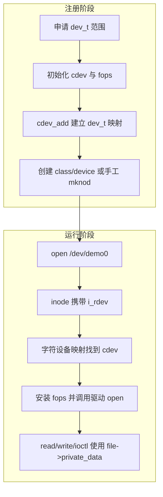
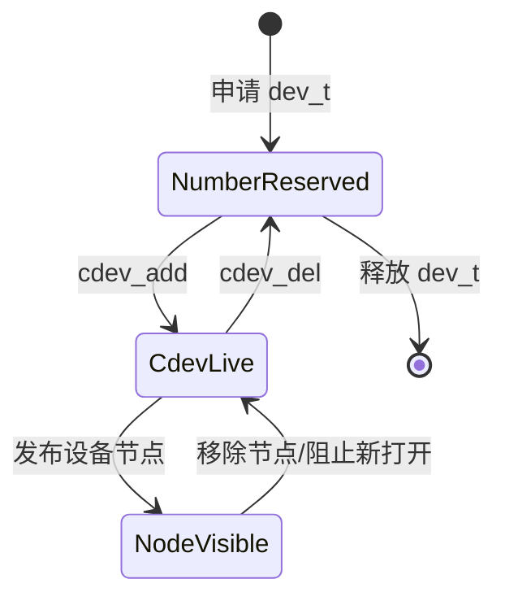

# 第1章\_字符设备最小模型

## 1.1\_字符设备解决什么问题

驱动需要把不同硬件和内核状态暴露给用户空间，但应用不应了解寄存器地址、中断控制器或总线细节。字符设备借用文件接口提供稳定入口：应用对 fd 执行 `open/read/write/ioctl/poll/mmap/close`，VFS 再把操作分派给驱动。

“字符”描述的是按字节流或设备自定义记录进行访问的接口类别，不保证设备只能逐字节传输，也不意味着所有字符设备都必须实现 `read()` 和 `write()`。

## 1.2\_六个对象不要混为一谈

| 对象 | 解决的问题 | 建立或取得位置 |
| --- | --- | --- |
| `dev_t` | 用主、次设备号标识一个字符设备号范围 | `alloc_chrdev_region()` 等 |
| `/dev` 设备节点 | 给用户空间提供带设备号的路径入口 | `device_create()` 配合设备管理器，或 `mknod` |
| `struct cdev` | 把设备号范围接入字符设备分派表 | `cdev_init()`、`cdev_add()` |
| `struct inode` | 表示被打开的设备节点，包含 `i_rdev`、`i_cdev` | VFS 路径解析和字符设备打开路径 |
| `struct file` | 表示一次打开文件描述，保存 flags、位置和驱动私有指针 | 成功打开后由 VFS 管理 |
| `struct file_operations` | 定义 fd 上各种操作怎样进入驱动 | 由 `cdev` 提供，打开时安装到 `file->f_op` |

`struct device`/`class` 负责设备模型和 sysfs 展示，`struct cdev` 负责字符设备调用分派。二者经常同时出现，但不是同一个对象，也不能互相替代。

## 1.3\_从注册到读写的两段路径



注册路径同时满足两个条件后，用户访问才完整：

1. 内核已通过 `cdev_add()` 知道某段设备号应交给哪组操作；
2. 用户空间存在类型为字符设备、设备号匹配的节点。

只有 `/dev/demo0` 而没有 `cdev` 映射，打开会失败；只有 `cdev` 映射而没有节点，用户也没有常规路径可打开。

## 1.4\_设备对象与打开实例对象

驱动通常至少区分两层状态：

```c
struct demo_device {
    struct cdev cdev;       /* 设备号到驱动入口的映射 */
    struct mutex lock;      /* 保护设备级共享状态 */
    bool disconnected;     /* 硬件是否已离线 */
};

struct demo_file_ctx {
    struct demo_device *dev;
    u32 mode;               /* 本次打开实例自己的配置 */
};
```

`open()` 可通过 `inode->i_cdev` 找到内嵌它的 `demo_device`，再把设备对象或新建的会话对象放入 `file->private_data`。后续回调优先从 `private_data` 取上下文，避免重复依赖 inode 查找。

设备级状态被多个打开实例共享；`struct file` 级状态属于一次 open file description，但 `dup()` 和 `fork()` 可以共享同一个 `struct file`。因此“一个 fd 必然对应一份独立状态”并不成立。

## 1.5\_最小生命周期与失败回滚



初始化按“先准备内部对象，最后发布用户入口”的顺序；失败和卸载按相反顺序回滚。对于可热拔出的真实设备，还要先阻止新入口、标记离线并唤醒旧等待者，再停止硬件资源；已经打开的 fd 或 VMA 可能继续存在，不能简单等同于模块初始化/退出生命周期。

## 1.6\_常见概念错误

| 误解 | 正确认识 |
| --- | --- |
| 申请设备号后驱动就能处理 `open()` | 还需要 `cdev_add()` 建立分派映射 |
| `device_create()` 注册了字符设备 | 它主要发布设备模型对象和节点创建事件，不替代 `cdev_add()` |
| `/dev/demo0` 是普通磁盘文件 | 它是携带 `dev_t` 的字符设备特殊文件 |
| `file_operations` 就是设备对象 | 它只描述操作入口，状态应放在设备或会话对象中 |
| `release()` 对应每次 `close(fd)` | 共享的 open file description 要到最后一个引用消失才触发释放 |

## 1.7\_下一步

下一章从设备号范围开始，分别解释 `cdev` 注册和设备节点发布：[设备号、注册与设备节点](P02_设备号_注册与设备节点.md)。
