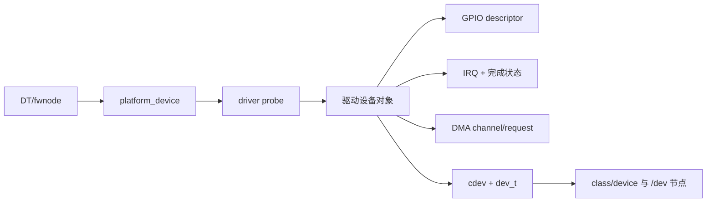

# 第8章\_设备模型与硬件子系统交接

## 8.1\_字符设备不是设备发现机制

真实 SoC 驱动通常先由设备树/ACPI 描述硬件，再由 platform 等总线创建设备并匹配驱动。`probe()` 取得资源、建立设备状态，最后才注册 cdev 并发布节点。字符设备解决用户分派，不负责发现寄存器、中断或 DMA 通道。

## 8.2\_贯穿对象应是设备实例

同一 `struct demo_device` 通常保存 `struct device *`、`cdev`、资源句柄、锁、等待队列、请求队列和离线状态。`platform_set_drvdata()` 让 remove 找回它，`inode->i_cdev` 让 open 找回它，`file->private_data` 让 I/O 找回打开上下文。

这三条查找边汇入同一设备实例，但引用条件不同：probe/remove 的 driver data 不自动保证旧 file 仍安全；file/VMA/请求必须另有生命周期规则。

## 8.3\_GPIO、IRQ、DMA\_各自交付什么

| 子系统 | 交给字符设备组合层的对象/事件 | 字符设备保存的交叉状态 |
| --- | --- | --- |
| 设备树/fwnode | 属性、资源描述、依赖关系 | 不复制节点，保存解析后的资源句柄 |
| GPIO | `gpio_desc` 和方向/值操作 | 设备配置、错误和并发策略 |
| IRQ | Linux IRQ 号与处理入口 | 数据就绪、错误、计数及等待队列 |
| DMA | channel、映射、descriptor/cookie、完成回调 | 请求所有权、完成和取消状态 |

IRQ/DMA 完成方必须先按同步协议更新共享状态，再通知等待者。字符设备不能把一个瞬时中断信号直接等同于“用户尚未读取的事件”；若事件不可丢，必须用计数或队列保存。

## 8.4\_初始化发布顺序

`probe()` 应先解析和申请硬件资源，初始化锁、队列和状态，注册中断/DMA，再建立 cdev，最后发布用户节点。回滚按完成阶段逆序执行。`devm_*` 简化资源释放，但不会替驱动排空已打开 file 或在途 DMA。

设备模型完整状态机见[设备模型专题](../../linux/device_model/大纲.md)；GPIO、IRQ、DMA 分别由其权威专题解释。本章保证它们在字符设备实例上的对象、状态和通知边连续。

下一章沿反方向执行 remove：[安全移除、旧 fd 与模块卸载](P09_安全移除_旧fd与模块卸载.md)。
