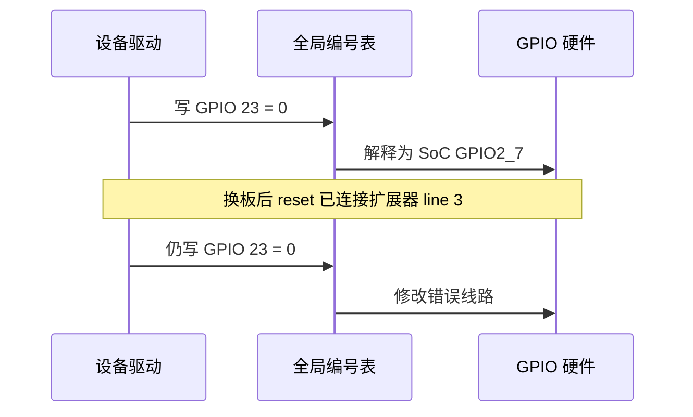
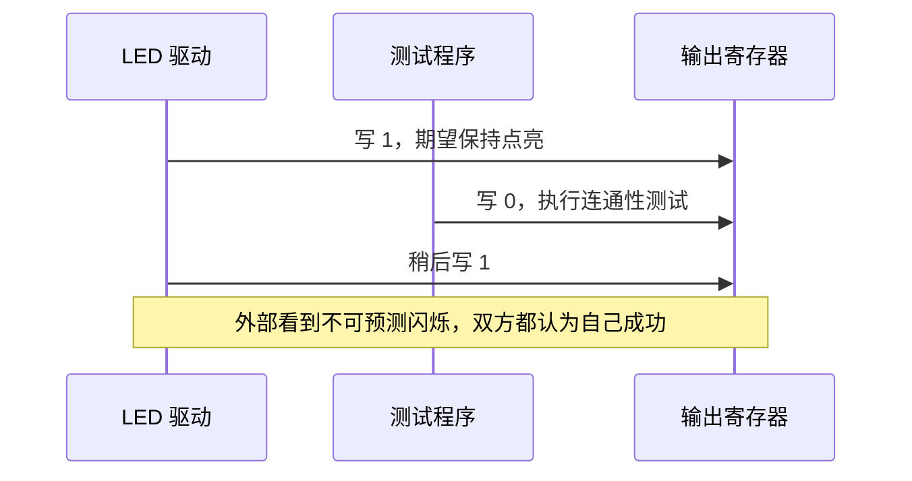
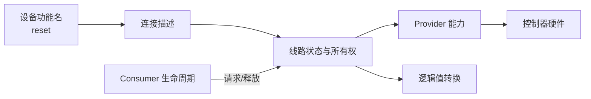

# 第1章\_从寄存器位到\_GPIO\_连接抽象

## 1.1\_裸机方案为什么成立

在硬件固定、只有一个程序控制外设时，GPIO 可以简化为四步：把 pad 复用成 GPIO、设置方向、写数据位、在需要时读输入位。全局编号或寄存器地址已经足够，因为程序作者同时掌握板级连接、寄存器布局和唯一控制权。

这种方案的正确性价值不能忽略：路径短、状态少、故障容易对应到寄存器。在 bootloader 早期点亮状态灯或拉住复位线时，直接寄存器方案仍可能是正确选择。Linux 引入抽象不是因为寄存器方案“落后”，而是运行约束发生了变化。

## 1.2\_连接变化怎样击穿全局编号

假设驱动把 `reset` 写成 GPIO 23。第一块板上它连接 SoC GPIO2_7，程序正常运行；第二块板把它改接 I²C 扩展器第 3 路。此时“23”同时混合了三种知识：设备功能、板级布线和控制器编号策略。

继续给不同控制器分配全局编号只能暂时绕开冲突，不能稳定表达连接。控制器注册顺序、热插拔和配置变化都可能改变编号；驱动也无法从编号得知访问是 MMIO 还是可能睡眠的 I²C 事务。

由此得到第一个需求：**驱动应请求“本设备的 reset 连接”，板级描述再决定它落到哪个控制器的哪根线。**

## 1.3\_多个参与者怎样产生所有权问题

如果 LED 驱动和测试程序都能直接写同一编号，最后电平取决于两次写入的时间顺序。任何一方都不知道另一方存在，局部代码没有错误，组合后却失去确定性。

单纯增加互斥锁仍不够。锁只能防止同时修改寄存器，无法表达谁在一段生命周期内拥有控制权。需要一个可被所有请求者看到的每线状态，在请求时登记占用，在释放时撤销；冲突应在使用前返回错误，而不是在硬件上表现为偶发波形。

## 1.4\_物理电平为什么不能等同业务语义

第一块板的 `reset` 低有效，第二块板通过反相器变成高有效。如果业务代码把“进入复位”写成输出 0，板级极性会渗入驱动。更稳定的契约是：业务写逻辑 1 表示 **断言 reset**，连接描述保存 active-low，公共层在访问硬件前换算物理值。

代价是系统中必须同时存在逻辑值和 raw 物理值两套概念。普通驱动使用逻辑值；硬件诊断或极少数协议实现才绕过转换。混用两套接口会产生双重反相。

## 1.5\_控制器差异为什么必须成为能力契约

SoC 内部 GPIO 通常通过 MMIO 访问，CPU 在很短路径内完成读写。I²C 扩展器需要提交总线事务并等待完成，可能发生调度。若上层只看到“写 GPIO”，便可能在中断顶半部或持有自旋锁时调用会睡眠的操作。

因此抽象不能只统一函数名，还必须传播 Provider 能力：它能否在原子上下文访问、是否支持批量写、是否能读取方向、怎样产生中断、掉电后状态是否保留。统一接口的代价是调用者必须服从能力边界。

## 1.6\_生命周期为什么属于正确性

设备 `probe()` 请求 enable 后，可能在申请时钟时失败；驱动也可能解绑，I²C 扩展器还可能被移除。如果请求状态不随设备生命周期回滚，线路会永久显示忙；如果描述符仍指向已注销控制器，后续访问可能触及失效对象。

需要把“获得连接”设计成一个周期，而不是一次查询：解析、请求、初始化、使用、特殊事件、释放都必须有明确触发者和逆向清理路径。

## 1.7\_从问题推出的最小抽象

到这里还不需要 Linux 字段名，也能推出六个角色：

| 约束 | 必要角色或状态 |
| --- | --- |
| 控制器硬件不同 | Provider 能力对象 |
| 板级连接会变化 | 独立连接描述 |
| 多参与者竞争 | 每线共享所有权状态 |
| 物理极性会变化 | 逻辑属性及转换层 |
| 快慢访问路径不同 | 可睡眠能力契约 |
| probe、解绑和热移除 | 完整请求与释放周期 |

下一篇不直接套用 gpiolib，而是从这些约束推导角色、状态和完整周期：[GPIO 角色、状态与完整操作周期](P02_GPIO_角色_状态与完整操作周期.md)。
