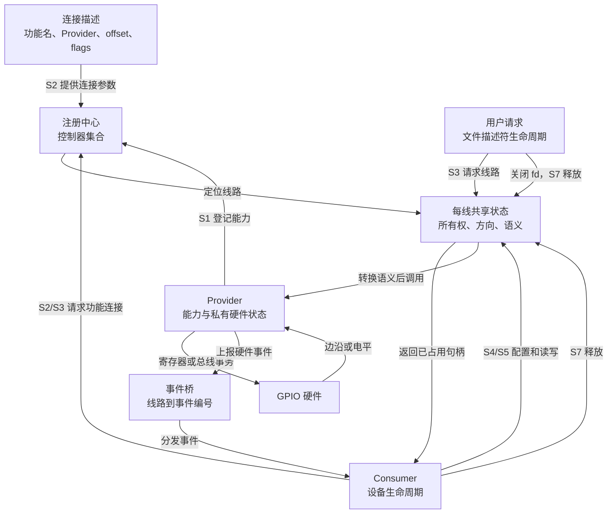
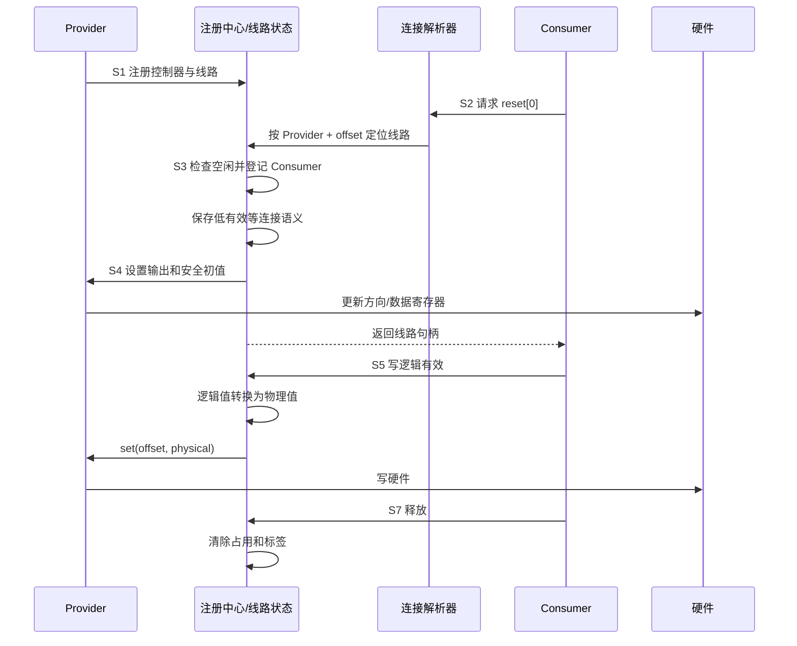
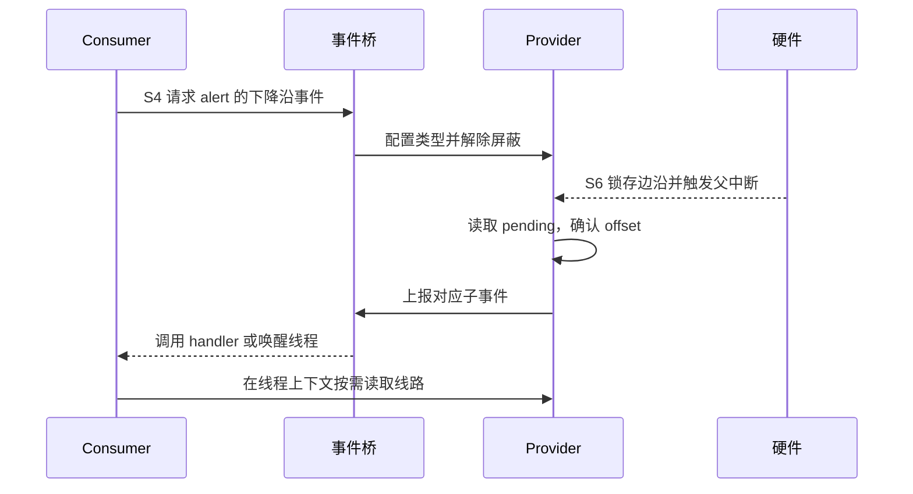

# 第2章\_GPIO\_角色\_状态与完整操作周期

## 2.1\_这不是一个单一状态机

GPIO 同时包含控制器登记、连接解析、线路所有权、方向、逻辑极性、事件和电源状态。把它压缩成“空闲/使用中”会隐藏不同状态的写入者和地址。因此应把它理解为 **多组正交状态组成的分布式状态机**。

| 状态组 | 典型状态 | 所有者 |
| --- | --- | --- |
| 控制器 | 未登记、可用、挂起、注销中 | Provider 与注册中心 |
| 连接 | 未解析、已解析、等待 Provider、无连接 | 固件描述与解析器 |
| 所有权 | 空闲、内核持有、用户请求持有 | 每线共享状态 |
| 配置 | 未知、输入、输出低、输出高 | 每线状态与硬件 |
| 语义 | 高有效、低有效、open-drain 等 | 连接描述与每线状态 |
| 事件 | 未映射、已映射、已屏蔽、待处理 | Provider、事件桥和 IRQ 核心 |
| 电源 | 活动、保存中、断电、恢复中 | Provider PM 路径 |

这些状态不会总是同时变化。例如将输出逻辑值从 0 改为 1，不改变所有权；系统挂起可能改变硬件可访问性，却不释放 Consumer 的逻辑所有权。

## 2.2\_角色和通信载体

连接描述是共享数据而不是主动消息。Consumer 请求时读取它；Provider 尚未出现时，请求不能靠连接描述自行完成，必须返回“稍后再试”并由设备绑定框架重新触发。

## 2.3\_统一的\_S0～S7\_周期

| 阶段 | 进入触发 | 修改前后状态 | 写入者与存储位置 | 后续读取者 | 退出条件 |
| --- | --- | --- | --- | --- | --- |
| S0 | 上电或设备枚举 | 控制器未登记 | 固件保存连接，硬件保存复位状态 | Provider probe | 驱动开始初始化 |
| S1 | Provider 注册 | 未登记 → 可查找 | 注册中心建立控制器与线路集合 | 连接解析器、用户接口 | 注册成功 |
| S2 | Consumer 请求功能 | 未解析 → 描述符候选或等待 | 解析器读取连接描述和 Provider 集合 | 请求路径 | 找到 line 或返回错误 |
| S3 | 所有权检查 | 空闲 → 被请求 | 请求路径写每线共享状态和标签 | 其他请求者、调试接口 | 占用成功或冲突 |
| S4 | 初始化参数生效 | 未知方向 → 输入/安全输出 | 公共层写语义状态，Provider 写硬件 | Consumer、事件路径 | 配置成功或回滚 |
| S5 | 正常操作 | 值、配置或等待状态改变 | Consumer 经公共层访问 Provider | 硬件、Consumer | 操作结束或特殊事件 |
| S6 | IRQ、PM、移除或故障 | 活动状态发生分支变化 | Provider/事件/PM 路径写各自状态 | Consumer、恢复或注销路径 | 恢复正常或进入释放 |
| S7 | put、devres 回收、fd 关闭 | 已请求 → 空闲 | 生命周期路径撤销事件和所有权 | 后续请求者 | 所有引用与硬件动作完成 |

## 2.4\_正常输出周期

S3 与 S4 需要作为一个对调用者可回滚的操作：若设置方向失败，请求路径不能留下“已占用但未初始化”的线路。

## 2.5\_输入事件周期

输入路径在 S4 建立方向，在 S6 经过额外通信链：硬件锁存边沿或电平，Provider 读取 pending 状态，事件桥把控制器内 offset 映射到系统事件编号，最后唤醒处理者。等待方不是轮询每线状态，而是睡眠在事件机制上；代价被移到硬件中断、父中断分发和唤醒路径。

## 2.6\_所有权保证和边界

所有权状态保证通过公共请求路径的参与者不会同时独占同一线路。它不能阻止 bootloader、固件、调试器或绕过框架的寄存器写入，也不能代替外部电路的多主仲裁。因而“请求成功”说明软件登记没有冲突，不等于线路物理上只受本驱动影响。

下一篇用真实系统条件检验这套朴素模型：[从朴素模型到可用 GPIO 机制](P03_从朴素模型到可用_GPIO_机制.md)。
