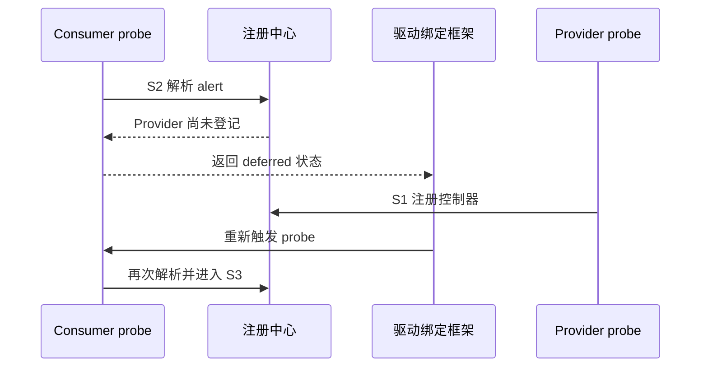

# 第3章\_从朴素模型到可用\_GPIO\_机制

## 3.1\_Provider\_尚未出现\_连接存在不等于资源可用

朴素模型认为连接描述能够直接得到线路。但设备枚举顺序可能让 Consumer 先于 GPIO 扩展器 probe。此时连接中的 Provider 身份是有效的，只是注册中心尚无对应对象。

把这种情况当作“属性不存在”会永久放弃设备；在 Consumer 内循环轮询又会占用线程并制造任意超时。成熟机制返回可区分的延迟状态，由设备绑定框架在依赖条件变化后重新执行 probe。移除主动轮询的成本由 **失败返回、依赖登记和后续重试** 承担。

## 3.2\_并发请求\_锁住寄存器仍不能表达长期所有权

两个线程在 S3 同时请求同一 line。若只在写寄存器时加锁，它们都可能得到“成功”，之后轮流修改硬件。需要在每线共享状态上执行原子检查与登记，使一个请求成功，另一个在进入 S4 前获得忙错误。

新代价包括共享状态写入、同步和跨 CPU 缓存一致性流量。但请求发生在取得资源的低频路径；用这项成本换取整个使用周期的确定所有权通常值得。高频 S5 读写不应重复执行完整查找和请求。

## 3.3\_低有效\_连接属性必须进入线路语义

如果解析器只返回 Provider 和 offset，Consumer 仍需知道电路极性。成熟模型在 S2 读取 active-low，在 S3/S4 把它关联到线路状态。S5 的普通接口接收逻辑值，再在公共层转换成 Provider 所需物理值；raw 接口显式绕过转换。

| Consumer 意图 | 连接属性 | 逻辑值 | 物理输出 |
| --- | --- | --- | --- |
| 断言 reset | active-high | 1 | 高 |
| 断言 reset | active-low | 1 | 低 |
| 解除 reset | active-low | 0 | 高 |

这使驱动可跨板复用，但要求连接描述正确。错误的 active-low 不会触发软件异常，只会稳定地产生相反电平，因此验证必须同时观察逻辑配置和物理波形。

## 3.4\_方向与初值\_拆成两步会出现毛刺窗口

朴素流程先设为输出，再写初值。如果控制器在切换方向时沿用数据寄存器旧值，reset 或 enable 会短暂输出错误电平。更可靠的 Provider 回调应尽可能在启用输出驱动前准备数据值；Consumer 请求也应在 S4 指定 `OUT_LOW` 或 `OUT_HIGH`，而不是先取得 `ASIS` 再晚些初始化。

该保证仍受硬件限制：某些控制器无法原子更新方向和值。Provider 必须按硬件推荐顺序缩短窗口，关键线路还需借助上拉/下拉或外部保持电路。软件抽象不能凭空创造硬件原子性。

## 3.5\_慢速总线\_统一接口不代表统一执行上下文

I²C/SPI Provider 的 S5 操作可能等待总线，不能在硬中断、关闭抢占或持有自旋锁的路径调用。成熟模型把 `can_sleep` 作为 Provider 能力传播给 Consumer，并提供可睡眠调用契约。

正常路径在进程或线程化中断上下文等待；特殊事件路径若从硬中断开始，只做最小确认并唤醒线程；超时和总线错误通过返回值传播。所谓“无需忙等”并未消除成本，而是用调度睡眠、唤醒和总线完成通知替代 CPU 轮询。

## 3.6\_失败回滚与设备解绑

S3 成功后，S4 仍可能失败。请求路径必须按相反顺序清除配置副作用和所有权。设备解绑则从 S6 进入 S7，撤销 IRQ、停止新的访问、等待在途使用满足其生命周期约束，再注销 Provider 或释放 Consumer。

资源管理器可以把 S7 动作挂到 device 生命周期，减少每个 probe 错误分支的重复代码。但它没有删除释放成本：释放仍由 devres 链在 probe 失败或 detach 时调用。若资源必须提前释放或跨设备共享，显式生命周期仍更合适。

## 3.7\_挂起\_恢复和唤醒

系统挂起时，Consumer 的逻辑所有权通常继续存在，但 Provider 的时钟或电源域可能关闭。于是“已请求”与“可访问”是两组正交状态。S6 需要：停止普通访问、保存必要寄存器、配置唤醒线路、切换 pinctrl sleep 状态；恢复时按依赖顺序恢复 Provider，再允许 Consumer 继续 S5。

如果 alert 是唤醒源，硬件、父中断控制器和电源管理都必须保留相应能力。仅在 Consumer 调用启用唤醒，不能补偿板级线路未接到可唤醒域。

## 3.8\_Provider\_注销和失效句柄

热移除使控制器从可用变为注销中。成熟实现要阻止新 S2/S3，注销用户可见接口，并处理仍存活的线路引用。Consumer 不能假定描述符永久有效；设备依赖和注销顺序必须确保在 Provider 消失前停止使用。

## 3.9\_完善后的成本表

| 新机制 | 改变的因果链 | 付出的成本 |
| --- | --- | --- |
| 延迟探测 | 顺序依赖不再变成永久失败 | probe 可能多次执行，错误路径必须可重入 |
| 共享所有权 | 冲突在硬件写入前暴露 | 请求路径同步和状态存储 |
| 逻辑值转换 | 板级极性不进入业务代码 | raw/逻辑接口边界需要严格维护 |
| `can_sleep` 契约 | 慢速访问不再非法出现在原子上下文 | 调度和线程化延迟 |
| 自动生命周期 | probe 失败和解绑能够进入 S7 | 释放顺序受 device 生命周期约束 |
| PM 分层状态 | 已请求与硬件可访问不再混淆 | 保存、恢复及唤醒配置复杂度 |

下一篇把完善后的抽象映射到 Linux 6.12.20 的实际对象与路径：[Linux gpiolib 核心实现](P04_Linux_gpiolib_核心实现.md)。
