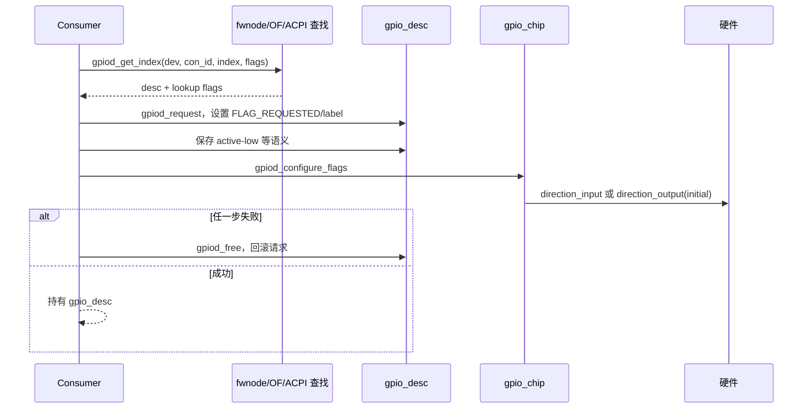

# 第4章\_Linux\_gpiolib\_核心实现

## 4.1\_版本与源码范围

本章核对 NXP Linux `6.12.20`：顶层 `Makefile` 为 `VERSION = 6`、`PATCHLEVEL = 12`、`SUBLEVEL = 20`，默认 `ARCH ?= arm`。公共实现主要位于：

```text
include/linux/gpio/consumer.h
include/linux/gpio/driver.h
drivers/gpio/gpiolib.c
drivers/gpio/gpiolib.h
drivers/gpio/gpiolib-devres.c
drivers/gpio/gpiolib-of.c
drivers/gpio/gpiolib-cdev.c
```

字段和行号会随版本变化；正文关注对象关系和状态推进，详细定位保存在源码阅读文档。

## 4.2\_抽象角色到具体对象

| 抽象角色 | Linux 6.12.20 对象 | 状态位置 |
| --- | --- | --- |
| Provider 能力 | `struct gpio_chip` | `include/linux/gpio/driver.h` |
| 已登记控制器 | `struct gpio_device` | `drivers/gpio/gpiolib.h` |
| 每线共享状态 | `struct gpio_desc` | `drivers/gpio/gpiolib.h` |
| 固件连接 | `fwnode_handle`、OF/ACPI 属性 | 固件节点及解析临时对象 |
| Consumer 身份 | `struct device`、label | device 与 `gpio_desc` 请求状态 |
| 事件桥 | `struct gpio_irq_chip`、irqdomain | `gpio_chip.irq` 与 IRQ core |
| 用户请求 | line request/event 对象 | `gpiolib-cdev.c` 创建的文件私有状态 |

`gpio_chip` 是 Provider 填写的能力和回调；`gpio_device` 是 gpiolib 登记后的内部控制器对象；`gpio_desc` 表示 `gpio_device` 内的一根 line。把三者都称作“GPIO 结构体”会混淆能力、登记身份和单线运行状态。

## 4.3\_S1\_Provider\_注册

Linux 6.12.20 的公共入口 `gpiochip_add_data_with_key()` 位于 `drivers/gpio/gpiolib.c`。注册路径验证 `gpio_chip`，分配并初始化 `gpio_device`，为 `ngpio` 根线路建立描述符集合，加入全局可查找结构，并继续建立字符设备、固件和可选 IRQ 集成。


Provider 私有寄存器地址、锁、缓存和电源数据不搬入 gpiolib；它们仍由具体驱动结构保存，`gpiochip_get_data()` 等关联使回调能够取回私有对象。

## 4.4\_S2～S4\_查找\_请求和配置

Consumer 的 `gpiod_get_index()` 在 `gpiolib.c:4580` 调用 `gpiod_find_and_request()`。后者在 `gpio_devices_srcu` 保护下，根据设备固件节点、`con_id` 和 index 从 OF、ACPI、software node 或 platform lookup table 得到描述符和 lookup flags；离开查找临界区前调用 `gpiod_request()`，随后执行 `gpiod_configure_flags()`，失败则 `gpiod_put()` 回滚。

Linux 6.12.20 中 `gpiod_request()` 与 `gpiod_free()` 位于 `gpiolib.c`，每线 flags 包含 `FLAG_REQUESTED`、`FLAG_IS_OUT`、`FLAG_ACTIVE_LOW` 等状态。请求标签和描述符 flags 是其他请求者、debugfs 和字符设备查询路径可观察的共享状态。



普通独占请求遇到占用时返回 `-EBUSY`。源码另有 `GPIOD_FLAGS_BIT_NONEXCLUSIVE` 特例，允许固定稳压器等多个 Consumer 取得同一描述符，并在注释中明确称其为需要改进的 hack；不能据此宣称 GPIO 普遍支持安全共享。

Provider 未登记时，固件解析可能产生 `-EPROBE_DEFER`。这条路径不会在 gpiolib 内轮询，而是把重试责任交还驱动核心。

## 4.5\_S5\_逻辑值\_raw\_值与\_can\_sleep

普通 `gpiod_get/set_value*()` 根据 `FLAG_ACTIVE_LOW` 转换逻辑值；raw 变体直接表达物理电平。方向状态由 `FLAG_IS_OUT` 等状态和可选 Provider `get_direction()` 共同支持。

`gpio_chip.can_sleep` 在 `include/linux/gpio/driver.h` 中明确说明：当 `get()`/`set()` 会睡眠时必须设置。非 `_cansleep` 接口面向不可睡眠路径，`*_cansleep()` 允许总线型 Provider 完成阻塞事务。该字段不是优化提示，而是跨层调用契约。

## 4.6\_S6\_IRQ\_PM\_和用户请求

`gpio_chip.irq` 内嵌 `gpio_irq_chip`，把控制器 line 与 irqdomain、父 IRQ 和 `irq_chip` 回调关联。`gpiod_to_irq()` 位于 `gpiolib.c`，通过 Provider 的 `to_irq`/domain 能力取得 Linux IRQ；之后的屏蔽、类型和 handler 生命周期属于 IRQ 核心。

字符设备路径由 `gpiolib-cdev.c` 建立 `/dev/gpiochipN` 及 line request。用户请求同样写描述符请求状态，但持有者和释放事件是文件对象；关闭 request fd 才进入 S7。

PM 状态主要保存在具体 Provider 私有结构和硬件寄存器，而不是由通用 `gpio_desc` 自动保存所有电平。是否恢复方向和值属于控制器驱动和设备约束，不能从“使用 gpiolib”自动推出。

## 4.7\_S7\_释放与注销

显式 Consumer 调用 `gpiod_put()`，devm Consumer 由 `gpiolib-devres.c` 注册的资源动作在 detach 或 probe 回滚时释放；字符设备由 fd 关闭路径释放。Provider 使用 `gpiochip_remove()` 撤销控制器登记。

释放顺序必须先停止 Consumer 和事件访问，再注销 Provider。devm 简化了常见 device 从属关系，但跨设备依赖仍需由驱动绑定和设备链接保证。

## 4.8\_稳定结论与版本证据的分层

稳定正文可以断言：gpiolib 分离 Provider 能力、登记控制器和每线状态；请求把本地意图写成共享占用；普通值接口执行逻辑极性转换；慢速 Provider 通过 `can_sleep` 传播约束。具体 flag 位、函数拆分和内部锁属于版本证据，应链接 [Linux 6.12 GPIO 源码证据](../../../research/source_reading/linux/gpio/linux_6.12_gpio_核心路径.md)。

下一篇从 Consumer 视角沿 S2～S7 使用这些对象：[GPIO Consumer 请求与使用](P05_GPIO_Consumer_请求与使用.md)。
