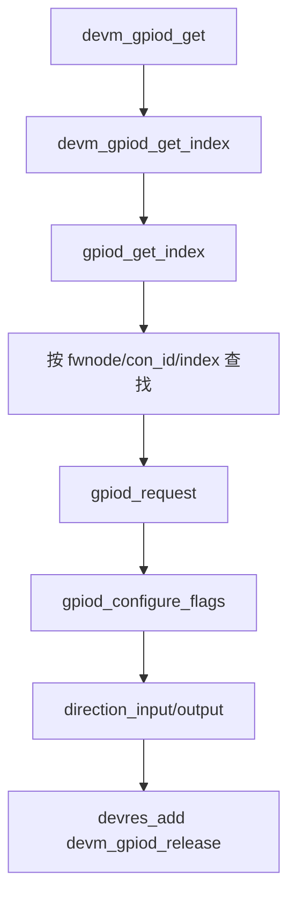

# 第5章\_GPIO\_Consumer\_请求与使用

## 5.1\_Consumer\_请求的不是编号

Consumer 用 `struct device`、功能名 `con_id` 和 index 描述需求。以设备树为例：

```dts
my-device@0 {
    compatible = "vendor,my-device";
    enable-gpios = <&gpio1 5 GPIO_ACTIVE_HIGH>;
    reset-gpios = <&gpio2 7 GPIO_ACTIVE_LOW>;
    alert-gpios = <&gpio_expander 3 GPIO_ACTIVE_LOW>;
};
```

`devm_gpiod_get(dev, "reset", GPIOD_OUT_LOW)` 查找 `reset-gpios` 的第 0 项。`con_id` 表达功能，index 表达同一功能的第几根线；Provider phandle、offset 和 flags 留在板级连接描述中。驱动因而可以在不改源码的情况下把 alert 从 SoC 控制器迁到扩展器。

## 5.2\_S2～S4\_的源码路径

Linux 6.12.20 中，`devm_gpiod_get()` 位于 `drivers/gpio/gpiolib-devres.c`，直接调用 `devm_gpiod_get_index(..., 0, ...)`；后者先调用 `gpiod_get_index()`，成功后以 `devres_alloc()` 和 `devres_add()` 登记 `devm_gpiod_release`。



这说明 devm 并没有改变 GPIO 请求语义，只在成功后增加 S7 自动释放动作。源码注释明确：描述符在 driver detach 时自动 disposed。

## 5.3\_接口族按连接形态选择

| 连接形态 | 接口 | 无连接时的语义 |
| --- | --- | --- |
| 必需的单线功能 | `devm_gpiod_get()` | 返回错误，probe 应失败或延迟 |
| 必需的同名多线之一 | `devm_gpiod_get_index()` | 返回错误 |
| 可选单线 | `devm_gpiod_get_optional()` | 不存在返回 `NULL`，其他错误仍为 `ERR_PTR` |
| 可选同名多线之一 | `devm_gpiod_get_index_optional()` | 不存在返回 `NULL` |
| 一组同名线路 | `devm_gpiod_get_array()` | 返回 `struct gpio_descs` |

optional 只把“没有分配该功能”转成 `NULL`，不能吞掉 `-EPROBE_DEFER`、`-EBUSY` 或 I/O 错误。使用者必须先 `IS_ERR()`，再单独判断 `NULL`。

## 5.4\_初始化\_flags\_决定安全窗口

`enum gpiod_flags` 的核心选择是：

| flags | S4 行为 | 适用条件 |
| --- | --- | --- |
| `GPIOD_IN` | 请求后配置输入 | alert、按键、状态检测 |
| `GPIOD_OUT_LOW` | 以逻辑 0 建立输出 | 默认不使能的 enable |
| `GPIOD_OUT_HIGH` | 以逻辑 1 建立输出 | 默认需要断言的信号 |
| `GPIOD_ASIS` | 不主动改变方向 | 固件已配置且驱动明确接管策略 |

LOW/HIGH 是 **逻辑值**。Linux 6.12.20 的 `gpiod_direction_output()` 在 `gpiolib.c` 读取 `desc->flags`，若设置 `FLAG_ACTIVE_LOW` 就反相，然后进入 raw 输出提交路径。`gpiod_direction_output_raw()` 则明确忽略 ACTIVE_LOW。

请求 reset 时选择 `GPIOD_OUT_LOW` 表示逻辑上先不断言；若设备树声明 `GPIO_ACTIVE_LOW`，实际物理电平是高。不得看到 LOW 就断言它必然输出低电平。

## 5.5\_方向状态与\_Provider\_回调

Linux 6.12.20 的 `gpiod_direction_input()` 优先调用 `gpio_chip.direction_input()`；成功后清除 `FLAG_IS_OUT`。输出路径调用 `direction_output(gc, offset, initial)`，成功后设置 `FLAG_IS_OUT`。如果 Provider 是固定输入或固定输出，公共层允许在满足回调组合约束时省略方向回调。

方向 flag 是 gpiolib 的软件观察状态；真实硬件方向仍由 Provider 寄存器或 `get_direction()` 结果决定。绕过框架写寄存器可能使两者不一致。

## 5.6\_逻辑值\_raw\_值和电气模式

普通接口面向功能语义：

```c
/* 1 表示断言 reset，不表示必然输出高电平。 */
gpiod_set_value_cansleep(reset, 1);
```

raw 接口面向物理电平，通常仅用于控制器测试或协议明确要求的路径。open-drain/open-source 还可能通过方向切换模拟非驱动电平，因此“set 1”不能总被简化为写数据寄存器 1。

## 5.7\_普通接口与\_cansleep\_接口

| Provider | 可以使用 | 不应使用的位置 |
| --- | --- | --- |
| `can_sleep = false` | 普通或 `_cansleep`；原子路径用普通接口 | 无额外睡眠限制 |
| `can_sleep = true` | `_cansleep`，且调用者必须处于可调度上下文 | 硬中断、关闭中断、自旋锁临界区 |

`gpiod_cansleep()` 可查询描述符所属 `gpio_device.can_sleep`。对于可能换接扩展器的板级功能，驱动若没有硬实时原子要求，直接在可睡眠上下文使用 `_cansleep` 更稳健；若必须在硬中断访问，就必须约束 Provider 类型或重构执行路径。

## 5.8\_错误传播与释放

| 错误 | 典型阶段 | 含义 |
| --- | --- | --- |
| `-ENOENT` | S2 | 没有分配请求的功能连接 |
| `-EPROBE_DEFER` | S2/S3 | Provider 或依赖尚未就绪 |
| `-EBUSY` | S3 | line 已被不兼容请求占用；非独占 flag 是少数框架特例 |
| `-ENODEV` | S4/S5 | Provider 已不可用 |
| `-EIO` | S4 | Provider 回调组合或硬件操作失败 |

Linux 6.12.20 的 `gpiod_free_commit()` 调用可选 Provider `free()`，清除 `FLAG_ACTIVE_LOW`、`FLAG_REQUESTED`、open-drain/source、bias、edge 和 hog 等状态，清除 label，并发出 released 状态通知。随后 `gpiod_free()` 释放 Provider module 和 `gpio_device` 引用。

这比“把一个指针设成 NULL”更完整：S7 同时撤销 Provider 私有请求、共享 flag、可观察标签和对象引用。

## 5.9\_最小且完整的\_Consumer

```c
struct my_device {
    struct gpio_desc *enable;
    struct gpio_desc *reset;
    struct gpio_desc *alert;
};

static int my_probe(struct platform_device *pdev)
{
    struct device *dev = &pdev->dev;
    struct my_device *priv;

    priv = devm_kzalloc(dev, sizeof(*priv), GFP_KERNEL);
    if (!priv)
        return -ENOMEM;

    priv->enable = devm_gpiod_get(dev, "enable", GPIOD_OUT_LOW);
    if (IS_ERR(priv->enable))
        return dev_err_probe(dev, PTR_ERR(priv->enable),
                             "无法取得 enable GPIO\n");

    priv->reset = devm_gpiod_get(dev, "reset", GPIOD_OUT_LOW);
    if (IS_ERR(priv->reset))
        return dev_err_probe(dev, PTR_ERR(priv->reset),
                             "无法取得 reset GPIO\n");

    priv->alert = devm_gpiod_get(dev, "alert", GPIOD_IN);
    if (IS_ERR(priv->alert))
        return dev_err_probe(dev, PTR_ERR(priv->alert),
                             "无法取得 alert GPIO\n");

    platform_set_drvdata(pdev, priv);
    return 0;
}
```

示例在请求阶段建立安全方向和初值，用 `dev_err_probe()` 保留 deferred probe 语义，并让 devres 在失败或解绑时推进 S7。

下一篇转到能力提供方：[GPIO Provider 控制器实现](P06_GPIO_Provider_控制器实现.md)。
