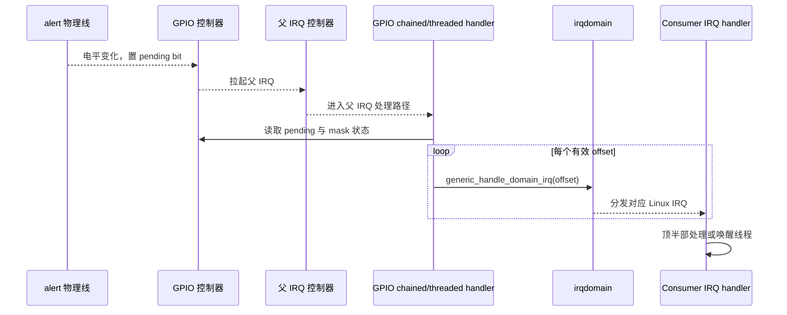
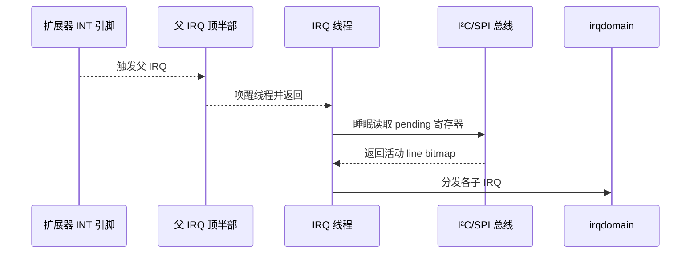

# 第7章\_GPIO\_中断桥接与事件传播

## 7.1\_四个不能混用的身份

| 身份 | 作用域 | 示例 |
| --- | --- | --- |
| 物理 pin | 芯片封装和原理图 | pad A17 |
| GPIO offset | 一个 `gpio_chip` 内 | line 3 |
| hwirq | 一个 irqdomain 内 | 通常与 offset 对应，但由 Provider 定义 |
| Linux IRQ | IRQ core 全局虚拟编号 | `gpiod_to_irq()` 返回值 |

GPIO offset 不能直接传给 `request_irq()`。Provider 通过 `gpio_irq_chip`/irqdomain 或 `to_irq()` 建立映射，Consumer 得到 Linux IRQ 后才进入 IRQ API 生命周期。

## 7.2\_源码中的桥接对象

Linux 6.12.20 的 `struct gpio_chip` 在启用 `CONFIG_GPIOLIB_IRQCHIP` 时内嵌 `struct gpio_irq_chip irq`。后者关联 `irq_chip`、domain、父 IRQ、handler、默认类型和映射回调。`gpiod_to_irq()` 在 `gpiolib.c`：

1. 校验描述符；
2. 从 `desc->gdev` 取得 `gpio_device`；
3. 在 SRCU 保护下读取 `gdev->chip`；
4. Provider 已移除则返回 `-ENODEV`；
5. 计算控制器内 offset；
6. 调用 `gc->to_irq(gc, offset)`，0 被转换成 `-ENXIO`。

因此 `gpiod_to_irq()` 是映射查询，不会替 Consumer 请求 handler，也不会自动选择边沿、线程化或唤醒属性。

## 7.3\_级联控制器的端到端路径



信息承载位置依次是：GPIO 硬件 pending 寄存器、父中断控制器状态、Provider 的 mask/type 配置、irqdomain 映射表和 IRQ descriptor。不能只画“GPIO 调用 IRQ”而省略 pending 位和映射状态。

## 7.4\_边沿与电平触发的不同退出条件

边沿触发通常由硬件锁存一次变化，ack 后 pending 清除；电平触发只要线路仍保持有效电平，解除屏蔽后就可能再次触发。因此：

- “一直来”常见于电平条件未解除或设备状态未清；
- “只来一次”可能是 ack/mask 顺序错误、边沿极性错误或 handler 未解除屏蔽；
- active-low 描述的是逻辑极性，IRQ rising/falling 描述的是物理或控制器定义的触发边，二者不能机械互换。

Consumer 必须先清外设导致 alert 的原因，再允许电平 IRQ 重新触发。只读 GPIO 电平不一定会清设备内部状态。

## 7.5\_睡眠型扩展器为何需要线程化

SoC MMIO GPIO 可在 chained handler 中直接读 pending。I²C/SPI 扩展器读取 pending 需要睡眠，不能运行在硬中断 chained 上下文。Linux 6.12.20 `gpio_chip.can_sleep` 的源码注释明确要求：此类 chip 若支持 IRQ，需要 threaded IRQ，因为读取 IRQ 状态寄存器可能睡眠。



移除硬中断内总线访问的代价，是调度唤醒和线程运行延迟。对按键、告警等事件通常合理；对严格纳秒级时序，GPIO 扩展器本身就可能不适用。

## 7.6\_Consumer\_建立\_IRQ\_生命周期

典型顺序是：

```c
irq = gpiod_to_irq(priv->alert);
if (irq < 0)
    return dev_err_probe(dev, irq, "无法映射 alert IRQ\n");

ret = devm_request_threaded_irq(dev, irq, NULL, my_alert_thread,
                                IRQF_ONESHOT | IRQF_TRIGGER_FALLING,
                                dev_name(dev), priv);
```

`IRQF_ONESHOT` 在线程完成前保持线路屏蔽，适合线程读取慢速设备状态。触发类型最好由固件 IRQ specifier 或明确硬件契约统一描述，避免设备树和请求 flags 互相矛盾。

## 7.7\_去抖\_唤醒和特殊路径

硬件去抖由 GPIO/pinctrl 能力决定；软件去抖通常在首次 IRQ 后屏蔽或延后确认，并在稳定条件满足后重新使能。它以响应延迟换取抖动过滤，不能用固定数字声称适合所有按键。

唤醒路径还需要父 IRQ 和电源域支持。Consumer 设置 wake 只把意图传给 IRQ/PM 层；Provider 可能在 suspend 中重编程 wake mask。若 GPIO 控制器在深度睡眠断电且没有常开唤醒路径，软件标志不能让它产生唤醒。

## 7.8\_标准消费者还是自定义驱动

`gpio-keys`、`gpio-leds`、固定稳压器、GPIO restart/poweroff 等驱动已经把 GPIO 语义接入 input、LED、regulator 或系统电源接口。需求与标准绑定一致时，继续使用标准驱动能复用已有 ABI、PM 和生命周期处理；只有设备还包含专有寄存器协议、复合状态机或标准绑定无法表达的时序时，才编写自定义 Consumer。完整比较和 Linux 6.12.20 实现见 [标准 GPIO Consumer 专题](../gpio_consumers/大纲.md)。

下一篇比较内核 Consumer、标准驱动和用户空间请求：[用户空间 ABI、迁移与方案选择](P08_用户空间_ABI_迁移与方案选择.md)。
