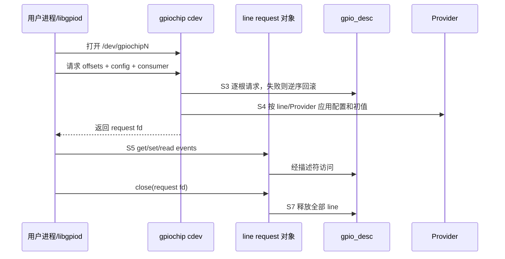
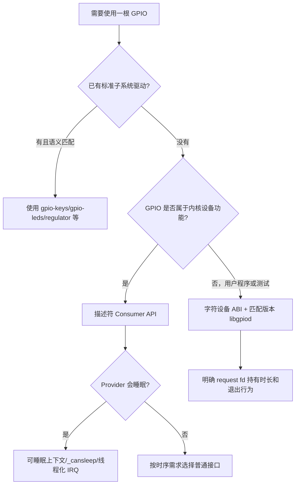

# 第8章\_用户空间\_ABI\_迁移与方案选择

## 8.1\_用户空间也必须先取得所有权

现代 GPIO 字符设备不是对寄存器的裸文件映射。进程先打开 `/dev/gpiochipN`，再用一次 line request 申请一根或一组 line，配置方向、逻辑极性、输出初值或事件，之后通过 request fd 操作；关闭 request fd 进入 S7。Linux 6.12.20 内部逐根请求并在失败时回滚，因此调用者只会得到完整 request fd 或错误，但这不等于多根物理 line 在同一硬件时刻完成配置。

gpiochip fd 用于查询和创建请求；真正持有 line 的是 request fd。仅关闭最初的 chip fd，不等于释放已建立的 request。

## 8.2\_Linux\_6.12.20\_中的状态地址

`drivers/gpio/gpiolib-cdev.c:1733` 的 `linereq_create()` 校验 v2 request，分配 `struct linereq`，取得 `gpio_device` 引用，初始化 waitqueue、事件 kfifo 和序号，然后循环每个 offset：取得描述符、`gpiod_request_user()`、写入描述符配置 flags、设置方向/输出初值或建立 edge detector。全部成功后才分配并安装 request fd；任一步失败进入统一释放路径。`gpiod_line_state_notify()` 向监听者报告 requested、config 或 released 变化。

边沿事件包含内核时间戳和序号，并进入 request 的事件缓冲；用户进程的 `read/poll` 等待缓冲状态，而不是反复轮询 GPIO 数据寄存器。无轮询的成本由 IRQ、事件分配、缓冲和进程唤醒承担。

## 8.3\_内核\_标准驱动和字符设备的边界

| 方案 | 所有权主体 | 生命周期 | 对外语义 | 适用条件 |
| --- | --- | --- | --- | --- |
| 内核 Consumer | `struct device` | probe 到 detach | 设备私有功能 | GPIO 是内核设备工作的一部分 |
| 标准功能驱动 | 对应子系统 device | 子系统生命周期 | input、LED、regulator 等 | 标准绑定足以表达需求 |
| 字符设备 + libgpiod | request fd | 请求建立到 fd 关闭 | line 读写与事件 | 测试、管理程序、用户态控制 |

同一 line 通常不能同时被内核独占 Consumer 和用户 request 持有。用户工具报告 busy 往往说明所有权模型正常工作，不应通过卸载关键驱动或直接写寄存器强行绕过。

## 8.4\_sysfs\_与字符设备的保证差异

| 维度 | `/sys/class/gpio` | 字符设备 ABI v2 |
| --- | --- | --- |
| 状态建立 | export 后分散写 direction/value | 一个 request 携带 line 集合和配置 |
| 多线配置 | 多次文件操作，中间状态可见 | 一个请求描述一组 line，内核尽可能统一应用 |
| 所有权载体 | export 状态和 sysfs 文件 | request fd |
| 事件能力 | edge + poll，表达有限 | edge、时钟、缓冲和序号 |
| 新设计定位 | 遗留兼容 | 现代用户 ABI |

迁移不能把 `echo 1 > value` 机械替换成一次 `gpioset`。必须确认工具版本的持有模式：如果命令退出后 request fd 关闭，线路即被释放，输出保持行为取决于 Provider 和后续配置，不能把“最后写入值”当成跨释放保证。

## 8.5\_libgpiod\_版本边界

libgpiod 是用户库，不是内核 ABI 本身。v1 与 v2 的对象和函数接口不同，脚本工具选项也可能变化；知识正文不把某个发行版命令行固化为内核契约。迁移时先确认目标系统的 libgpiod major version，再按该版本文档重写，并用 ioctl 可表达的 line request 语义验证。

稳定语义是：选择 chip、以 offset/name 定位 line、建立带 consumer 名称和配置的 request、在 fd 生命周期内操作、关闭后释放。

## 8.6\_整数\_GPIO\_API\_到描述符\_API

迁移需要逐项转换：

| 旧假设 | 描述符模型中的替代 |
| --- | --- |
| 驱动保存全局 GPIO number | 设备 + `con_id` + index 解析连接 |
| `gpio_request()` 后分步配置 | `devm_gpiod_get(..., GPIOD_IN/OUT_*)` |
| 0/1 是物理电平 | 普通接口是逻辑值，raw 才是物理值 |
| 任意上下文可访问 | 根据 `gpiod_cansleep()` 和 Provider 约束选择路径 |
| 手写每个错误分支释放 | devres 或明确的逆序 put |
| GPIO number 直接转 IRQ | 描述符请求后 `gpiod_to_irq()`，再使用 IRQ API |

迁移完成的判据不是“成功编译”，而是换板极性、Provider 延迟加载、line 被占用、probe 中途失败、扩展器慢路径和 suspend/resume 下的行为仍符合契约。

## 8.7\_最终选择流程

## 8.8\_专题结论

GPIO 的选择依据不是“哪个 API 更新”，而是所有权主体、状态地址、执行上下文、连接稳定性和生命周期。描述符模型把板级连接与驱动分离，把冲突变成 S3 可见错误，把极性变成共享语义，把慢速访问约束传播给调用者；字符设备把同一模型扩展到 fd 生命周期。为这些保证付出的代价是更多对象、状态同步、错误传播和严格的上下文契约。

需要实际排障、迁移脚本和验证剧本时，继续阅读 [GPIO 调试、迁移与工程模板](../../../engineering/driver_development/gpio/GPIO_调试迁移与工程模板.md)。
