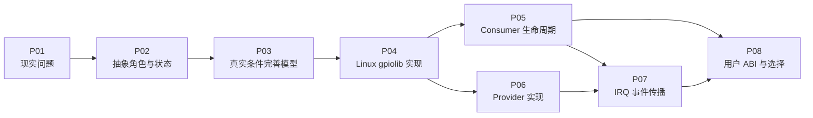

# 第1章\_GPIO\_专题大纲

GPIO 表面上只读写一个数字电平，Linux 却必须协调引脚复用、板级连接、控制器能力、线路所有权、逻辑极性、中断和用户空间生命周期。本专题不从 API 清单开始，而是重现机制的形成过程：先看裸寄存器和全局编号解决了什么，再用多板、多控制器、并发、慢速总线和热插拔等条件暴露缺口，最后映射到 Linux 6.12.20 的 gpiolib 实现。

## 1.1\_贯穿场景

全专题沿用同一块设备：

```text
my-device
├── enable：高有效输出，控制电源
├── reset：低有效输出，禁止产生错误脉冲
└── alert：低有效输入，由 GPIO 控制器转成中断
```

它先连接到 SoC 内部 MMIO GPIO，随后把 `alert` 攓到 I²C GPIO 扩展器。这个变化迫使我们回答：连接怎样换而驱动不改、逻辑有效怎样不受物理极性影响、慢速总线怎样改变调用上下文、线路变化怎样跨越 irqdomain 到达 Consumer。

## 1.2\_阅读地图



| 顺序 | 文档 | 本篇解决的问题 | 为下一篇留下的问题 |
| --- | --- | --- | --- |
| 1 | [从寄存器位到 GPIO 连接抽象](P01_从寄存器位到_GPIO_连接抽象.md) | 裸机方案为何有价值，又为何无法支撑可移植驱动 | 应增加哪些角色与状态 |
| 2 | [GPIO 角色、状态与完整操作周期](P02_GPIO_角色_状态与完整操作周期.md) | 从约束推导 Provider、连接、线路状态和 S0～S7 周期 | 朴素模型遇到真实系统条件会在哪里失效 |
| 3 | [从朴素模型到可用 GPIO 机制](P03_从朴素模型到可用_GPIO_机制.md) | 用并发、极性、慢速总线、延迟探测和电源管理完善模型 | Linux 把这些状态放在哪里 |
| 4 | [Linux gpiolib 核心实现](P04_Linux_gpiolib_核心实现.md) | 将抽象角色映射到 Linux 6.12.20 对象和调用路径 | Consumer 与 Provider 各自怎样使用这些对象 |
| 5 | [GPIO Consumer 请求与使用](P05_GPIO_Consumer_请求与使用.md) | 描述符如何取得、初始化、读写并随设备释放 | 输入事件怎样跨入 IRQ 核心 |
| 6 | [GPIO Provider 控制器实现](P06_GPIO_Provider_控制器实现.md) | 控制器如何注册 MMIO/总线能力并兑现回调 | GPIO offset 怎样桥接 Linux IRQ |
| 7 | [GPIO 中断桥接与事件传播](P07_GPIO_中断桥接与事件传播.md) | 硬件电平如何经 irqdomain、父 IRQ 和 handler 到达 Consumer | 内核驱动、标准驱动与用户空间怎样选择 |
| 8 | [用户空间 ABI、迁移与方案选择](P08_用户空间_ABI_迁移与方案选择.md) | line request 生命周期及现代/遗留接口选择 | 形成可执行的方案判断 |

## 1.3\_统一阶段

后续文档统一使用以下阶段，避免每篇自行发明流程：

| 阶段 | 含义 |
| --- | --- |
| S0 | 只有硬件和板级连接，Provider 尚未登记 |
| S1 | Provider 注册控制器能力和线路集合 |
| S2 | Consumer 按设备、功能名和索引解析连接 |
| S3 | 请求线路并把所有权写入共享状态 |
| S4 | 建立方向、安全初值、极性和可选事件配置 |
| S5 | 正常读写或等待事件 |
| S6 | 中断、挂起、恢复、移除等特殊路径 |
| S7 | 释放线路、撤销事件并允许后续请求者使用 |

## 1.4\_专题边界

| 内容 | GPIO 正文保留 | 权威位置 |
| --- | --- | --- |
| pinmux、上下拉、驱动强度 | 只解释与 GPIO 请求、`gpio-ranges` 的交界 | [pinctrl 专题](../device_tree/设备树语法专题-02-pinctrl.md) |
| phandle 通用解析 | 本专题完整解释 `*-gpios` 到描述符的专属路径，通用语法可继续深入 | [设备树专题入口](../device_tree/readme.md) |
| devres 通用原理 | 本专题完整解释释放怎样推进到 S7，通用 API 可继续深入 | [devres API 说明](../../linux/object_lifetime/devres/devres_API说明.md) |
| IRQ core | 只解释 GPIO offset 到 Linux IRQ 的桥接 | [中断专题](../../kernel_subsystems/irq/中断机制简介/大纲.md) |
| 操作脚本和工程模板 | 正文只给观察点和选择依据 | [GPIO 调试、迁移与工程模板](../../../engineering/driver_development/gpio/GPIO_调试迁移与工程模板.md) |
| 具体版本字段和调用链 | 正文保存稳定模型和必要证据摘要 | [Linux 6.12 GPIO 源码证据](../../../research/source_reading/linux/gpio/linux_6.12_gpio_核心路径.md) |
| `gpio-keys`、`gpio-leds`、regulator 等功能驱动 | 本专题说明选择原则，具体领域适配独立维护 | [标准 GPIO Consumer 专题](../gpio_consumers/大纲.md) |

## 1.5\_版本边界

源码结论核对自 NXP i.MX Linux 树 `6.12.20`，默认 `ARCH ?= arm`。gpiolib 公共实现位于 `drivers/gpio/` 和 `include/linux/gpio/`，可用于说明跨架构公共机制；SoC 寄存器、ARM 中断入口和 BSP 差异不据此外推为通用契约。
