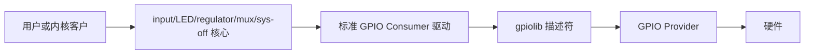

# 第1章\_为什么优先使用标准\_GPIO\_Consumer

## 1.1\_问题不是少写几行代码

自定义驱动可以请求 GPIO 并导出私有 sysfs 属性，但它还必须自行定义用户 ABI、并发规则、休眠恢复、解绑和事件语义。标准 Consumer 已把这些职责交给成熟子系统：按键产生 input event，LED 使用 brightness/trigger，电源使能进入 regulator 依赖图。

标准驱动的价值是 **把 GPIO 的低层所有权转换成领域所有权**。应用不再知道 offset 和电平，而是操作按键、LED 或电源对象。

## 1.2\_同一场景中的因果比较

以低有效状态灯为例：

| 环节 | 自定义字符驱动 | `gpio-leds` |
| --- | --- | --- |
| 连接 | 驱动解析 `led-gpios` | 标准绑定解析子节点 GPIO |
| 极性 | 自行保证逻辑/物理值不混淆 | gpiod 描述符统一转换 |
| 用户接口 | 自定义 ioctl/sysfs | LED class brightness 和 trigger |
| 并发 | 自行定义多个写者 | LED core 管理类设备状态 |
| suspend | 自行决定保留/熄灭 | 标准属性和 LED core 路径协作 |
| 维护成本 | 驱动、ABI、文档都由项目维护 | 复用上游接口和测试经验 |

如果硬件只是一个可开关 LED，自定义驱动没有增加表达能力，反而创建第二套 ABI。只有灯还参与专有时序协议、与其他寄存器形成不可拆分状态机，或标准绑定无法表达硬件约束时，自定义驱动才成立。

## 1.3\_标准驱动没有消除底层成本

标准 Consumer 仍然调用 `devm_*gpiod_get*()`，仍受 active-low、`can_sleep`、Provider 注销和 S0～S7 生命周期约束。它移除的是项目重复实现的领域适配层，不是 GPIO 访问、锁、总线事务或 IRQ 唤醒成本。

## 1.4\_选择条件

继续使用标准 Consumer 的条件：

- 硬件功能与已有 binding 的语义一致；
- 所需用户 ABI 正是对应子系统 ABI；
- GPIO 之外没有必须原子协调的私有寄存器状态；
- 标准驱动的 PM、触发、去抖或时序参数足够表达需求。

编写自定义驱动前必须写明标准驱动缺少的具体保证，例如“复位脉冲必须与设备寄存器事务形成同一状态机”，不能只写“需要更灵活”。
