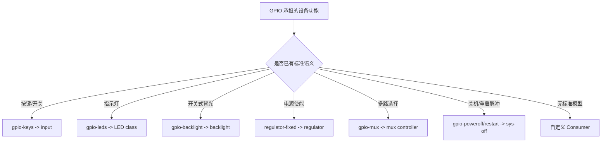

# 第1章\_标准\_GPIO\_Consumer\_专题大纲

本专题解释 Linux 已有功能驱动怎样把 GPIO 连接转换成 input、LED、backlight、regulator、mux 和系统关机/重启语义。它不重复 gpiolib 请求、极性和 IRQ 原理；这些基础由 [GPIO 专题](../gpio/大纲.md) 完整提供。

## 1.1\_建立独立专题的原因

`gpio-keys` 与 `gpio-leds` 不是 gpiolib 的“高级 API”，而是 input 和 LED 子系统的 Consumer；固定稳压器、GPIO mux 和 poweroff 又属于其他领域。把它们塞进 GPIO Provider 或 IRQ 章节，会让一个专题同时维护多个子系统的完整契约。

独立专题保留共同的方案选择与源码事实，同时要求具体子系统语义继续以相应核心专题为准。

## 1.2\_阅读顺序

1. [为什么优先使用标准 Consumer](P01_为什么优先使用标准_GPIO_Consumer.md)：比较标准驱动与自定义驱动的状态所有权、ABI 和维护成本。
2. [输入、指示、电源与控制类实现](P02_输入_指示_电源与控制类_GPIO_Consumer.md)：以 Linux 6.12.20 源码核对各标准驱动如何取得、使用和释放 GPIO。

## 1.3\_选择地图

