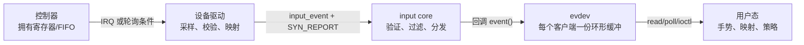
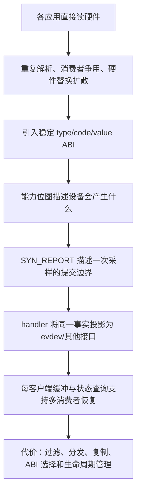

# 第1章\_从硬件样本到统一输入事件

## 1.1\_原方案解决了什么

最直接的输入路径是让应用打开控制器字符设备，读取按键寄存器、ADC 值或触摸点数组。它在单设备、单应用、固定硬件的原型中很有价值：路径短，硬件语义完整，调试时能直接对照手册。

问题出现在系统需要同时支持多类设备和多个消费者之后。每个应用都必须知道总线格式、量程、按键编号、采样边界和热插拔方式；两个应用同时读取同一队列还会争夺样本。硬件替换时，上层协议也随之变化。

## 1.2\_缺口怎样形成

以一次双指移动为例：控制器先更新内部帧并拉低 IRQ；驱动通过 I²C 读出两个触点；桌面、测试程序和录制程序都想观察结果。如果直接暴露寄存器，则每个程序都要完成设备识别、拆帧和异常恢复，而且一次读取被某个消费者取走后，其他消费者未必还能看到同一结果。

统一事件层把变化转换为三元组：

```text
type = 事件类别，例如 EV_KEY、EV_REL、EV_ABS
code = 类别内的语义编号，例如 KEY_A、REL_X、ABS_MT_POSITION_X
value = 当前值、相对增量或按键状态
```

`SYN_REPORT` 再把同一采样周期中的若干变化封成一帧。这样硬件格式停在驱动内，用户态面对稳定 ABI；处理层还能为每个打开的文件维护独立缓冲，避免消费者互相取走事件。

## 1.3\_四类角色与边界



- 控制器拥有原始样本，保证能力以芯片手册为准。
- 驱动拥有总线访问和帧解析状态，负责把硬件编号映射为 Linux 事件码。
- input core 拥有已注册设备、能力位图、当前值和 handler 连接关系。
- evdev 拥有面向每个打开文件的队列；用户态拥有手势、按键布局、指针加速度和显示映射等策略。

## 1.4\_新机制改变了哪段因果链

统一层没有消灭采样、同步和缓存成本，而是把它们集中到可复用位置：驱动仍需读硬件并保证一帧自洽；input core 按设备串行化事件并调用 handler；evdev 为每个客户端复制事件并在有数据时唤醒等待者。收益是设备和应用解耦，代价是一次格式转换、分发和缓冲复制。

Input 适合表达人的动作和少量状态变化，不适合高吞吐传感数据流。摄像头、音频、工业高速采样应使用对应子系统；强行转成 input 事件会放大每样本开销并丢失领域协议。

## 1.5\_应继续使用专用接口的条件

如果数据只服务一个紧耦合程序、需要完整原始波形、吞吐远高于人机输入，或者现有子系统已经定义了更强的时序和缓冲契约，应继续使用专用接口。只有当数据需要被通用桌面、游戏、按键或触摸栈识别时，稳定的 Input ABI 才能抵偿适配成本。

## 1.6\_事件模型覆盖哪些设备

Input 的统一不等于把所有设备都伪装成键盘。事件类型保留了不同物理量的更新规则：

| 事件类型 | `value` 的含义 | 典型设备 | 状态恢复方式 |
| --- | --- | --- | --- |
| `EV_KEY` | 0 释放、1 按下、2 自动重复 | 键盘、按钮、触摸接触键 | `EVIOCGKEY` 查询当前按下位图 |
| `EV_REL` | 相对上一次报告的增量 | 鼠标、滚轮 | 增量消费后没有“当前位置”可查询 |
| `EV_ABS` | 某一绝对轴的当前值 | 触摸屏、摇杆、传感输入 | `EVIOCGABS` 查询当前值与轴参数 |
| `EV_SW` | 开关当前状态 | 上盖、耳机插入、模式开关 | `EVIOCGSW` 查询当前开关位图 |
| `EV_MSC` | 不能归入标准轴/键的辅助信息 | 扫描码、时间戳等 | 依具体 code 解释，不承诺都有快照 |
| `EV_LED`、`EV_SND`、`EV_FF` | 用户态发往设备的输出请求 | 键盘灯、蜂鸣器、力反馈 | 由设备 `.event()` 或 FF 层消费 |
| `EV_SYN` | 帧和异常同步标记 | 所有 Input 设备 | `SYN_REPORT` 提交，`SYN_DROPPED` 提示失步 |

`type/code/value` 只解决语法统一，设备能力位图才说明哪些组合对当前设备有效。用户态应查询能力，而不是仅凭设备名称或 `/dev/input/eventX` 的编号猜类型。

## 1.7\_稳定\_ABI\_与策略边界

事件编号和 evdev ioctl 属于 UAPI。一旦驱动选择了某个标准 code，就同时选择了用户态长期积累的解释。例如触摸板上报 `INPUT_PROP_POINTER` 会进入间接指针策略，直触屏上报 `INPUT_PROP_DIRECT` 会进入显示平面映射。错误的“近似 code”可能让 `evtest` 看起来有数据，却让 libinput、SDL 或桌面环境走错策略。

驱动应提交能够被多个用户态共同理解的事实：按键身份、相对增量、绝对位置、接触生命周期、可靠时间和物理量程。布局重映射、组合键、手势、加速度、显示旋转和应用快捷键属于可变策略，通常留在用户态。若硬件必须先做校准或坐标变换才能得到稳定物理含义，该变换仍可位于驱动或固件，但要与设备树属性及 binding 契约一致。

## 1.8\_完整问题链小结


