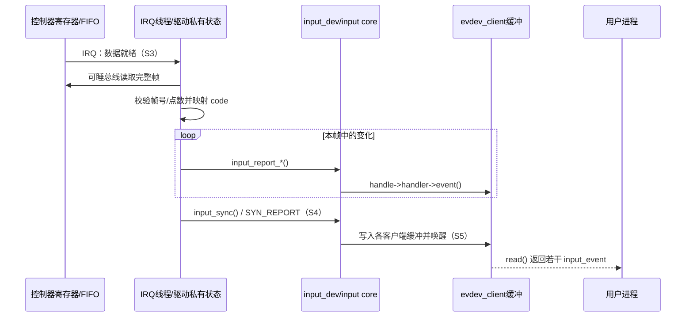
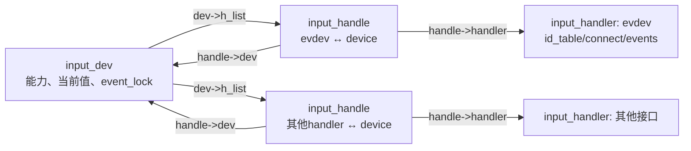
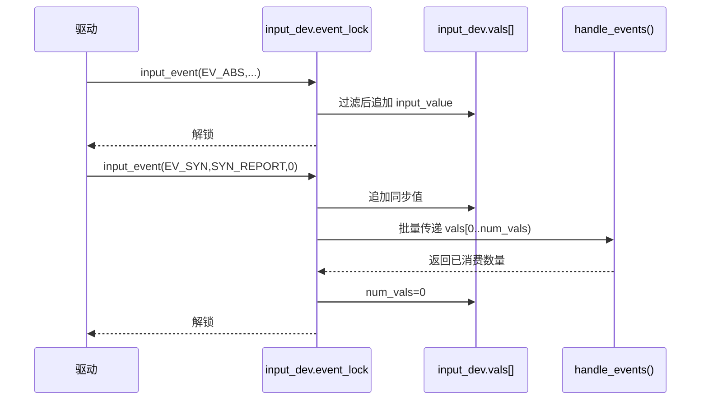
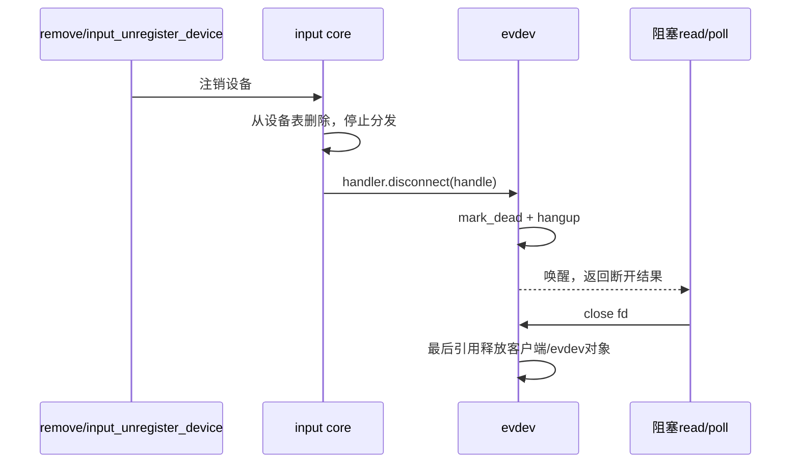

# 第2章\_Input\_体系结构与事件传递

## 2.1\_它不是一台全局状态机

Input 由几组正交状态共同组成：设备注册状态、设备与 handler 的连接状态、设备当前事件值、每个 evdev 客户端的缓冲状态，以及设备驱动自己的采样/电源状态。它们存放在不同对象中，由不同执行路径推进，不能只用一张“调用关系图”替代。

| 状态 | 主要存储位置 | 主要写入者 | 主要读取者 |
| --- | --- | --- | --- |
| 身份、能力、当前值 | `struct input_dev` | 驱动初始化；input core 事件路径 | handler、ioctl、过滤逻辑 |
| 设备与 handler 的连接 | `struct input_handle` 链接两侧链表 | 注册/注销和匹配路径 | input core 分发路径 |
| MT 槽位状态 | `input_dev->mt` | MT 辅助函数和驱动上报路径 | input core、evdev、用户态重同步 |
| 客户端事件队列 | `struct evdev_client` | evdev 的 `event()` 回调 | 对应 fd 的 `read()`/`poll()` |
| 控制器帧与电源状态 | 驱动私有结构 | IRQ 线程、工作队列、PM 回调 | 同一驱动的采样和停机路径 |

## 2.2\_一个完整操作周期

下面的 S0～S6 是后文共同使用的阶段：

| 阶段 | 触发与状态变化 | 写入位置和所有者 | 后续读取者/退出条件 |
| --- | --- | --- | --- |
| S0 就绪 | `probe()` 建立设备，尚未可见 | 驱动私有状态、`input_dev` | 能力完整后进入 S1 |
| S1 注册 | 设备加入 input core 并匹配 handler | 设备表、`input_handle` | 注册成功后可被打开 |
| S2 激活 | 首个用户打开 evdev，设备 users 从 0 变 1 | `input_dev` 和驱动 `.open()` 状态 | 采集源启动 |
| S3 采集 | IRQ/轮询发现新样本，驱动读取完整硬件帧 | 驱动私有缓冲 | 校验成功后进入 S4 |
| S4 提交 | 驱动上报变化并以 `SYN_REPORT` 收束 | `input_dev` 当前值、handler 回调 | 本帧分发完毕 |
| S5 交付 | evdev 写入各客户端缓冲并唤醒 | 每个 `evdev_client` | 用户态读走或发生溢出 |
| S6 停止 | 最后一个用户关闭，或 PM/remove 阻止新采集 | users、驱动运行/电源状态 | 在途工作退出后关硬件 |

## 2.3\_正常路径时序

通信不是“无通知”：控制器用 IRQ 或驱动轮询传递就绪信息；input core 通过函数回调主动推送；evdev 写共享缓冲并唤醒等待队列；用户进程通过 `read()` 或 `poll()` 取走数据。

## 2.4\_handler\_匹配与设备节点

设备注册和 handler 注册都会触发匹配。匹配依据是 `input_device_id` 中的总线、厂商、产品、版本及能力位图；匹配成功后 handler 的 `connect()` 创建 `input_handle`。evdev 的连接随后注册字符设备，因此“调用 `input_register_device()` 就必然产生 eventX”还依赖内核启用了并注册 evdev handler。

详细函数和字段位置见 [Input 源码导读](../../../research/source_reading/linux/drivers/input/README.md)。

## 2.5\_三类核心对象如何连接

`struct input_dev` 表示事件来源，`struct input_handler` 表示一种消费接口，`struct input_handle` 表示某个 handler 与某个设备之间的一次连接。handle 同时挂入设备的 `h_list` 和 handler 的 `h_list`，因此分发路径能够从设备找到所有消费者，注销 handler 时也能反向找到全部连接。

注册设备时，input core 遍历已有 handler；注册 handler 时，它反过来遍历已有设备。`input_match_device_id()` 先检查 id table 中声明的身份与能力条件，handler 的可选 `.match()` 还能做进一步筛选；`.connect()` 负责分配 handler 私有对象并注册 handle。连接建立不代表硬件已经启动，handler 通常还要在首个用户打开时调用 `input_open_device()`。

## 2.6\_事件不是逐个立即穿透全部层

Linux 6.12.20 的 input core 在 `input_dev->vals` 中暂存本帧需要传给 handler 的 `struct input_value`。普通事件先经过能力检查、当前状态更新和过滤；通常遇到 `SYN_REPORT` 后，`input_sync()` 使 core 调用 `input_pass_values()`，将本帧批量交给 handle 的 `handle_events()`。若暂存数组接近容量上限，core 会插入同步值并提前传递一批，避免越界；因此 `vals` 是调用批处理，不是保证整帧永远只调用一次的事务缓冲。若 handler 只实现单事件 `.event()`，handle 会使用兼容分派函数逐项调用。

这一批量机制改变的是 core 到 handler 的调用次数，不改变 UAPI 中事件的逻辑顺序。`input_set_events_per_packet()` 只是给 core 一个预计每包事件数，用于调整内部缓冲容量；它不是限流器，也不会替驱动补上 `SYN_REPORT`。

## 2.7\_grab、filter\_和\_inhibit\_是三种不同控制

- **grab**：某个 handle 调用 `input_grab_device()` 后成为 `input_dev->grab`。此后事件只发给该 handle，常用于校准、独占测试或 compositor 接管。它不转移设备所有权，也不自动阻止驱动采样。
- **filter**：handler 的 `.filter()` 在 `event_lock` 和关中断条件下运行；返回 true 可截住该事件，使后续 handle 不再收到。它必须极短且不能睡眠。
- **inhibit**：设备被 inhibit 后，input core 忽略输入事件，并在需要时调用设备 `.close()`；解除 inhibit 时重新 `.open()`。这用于临时禁止设备，与用户 fd 是否还存在是两回事。

三者移除的成本也不同：grab 省掉多路分发但制造独占；filter 把判断放入高频锁内；inhibit 停止设备功能却需要完整的关闭/重开路径。驱动不能把它们都概括成“禁用输入”。

## 2.8\_断开和热拔插怎样传播

设备注销时，core 先把设备标成不再可用并断开 handle。evdev 将实例标记为 dead、唤醒阻塞 reader，并让后续操作返回错误或读到队列结束；已经打开的 `evdev_client` 可能暂时保留内存引用，但不会继续访问已经断开的硬件。最后一个引用释放后对象才销毁。

这条路径解释了为什么 remove 不能只关电并释放驱动私有内存：必须先阻止新采集并等待在途路径，再让 input/evdev 的引用链按顺序断开。
