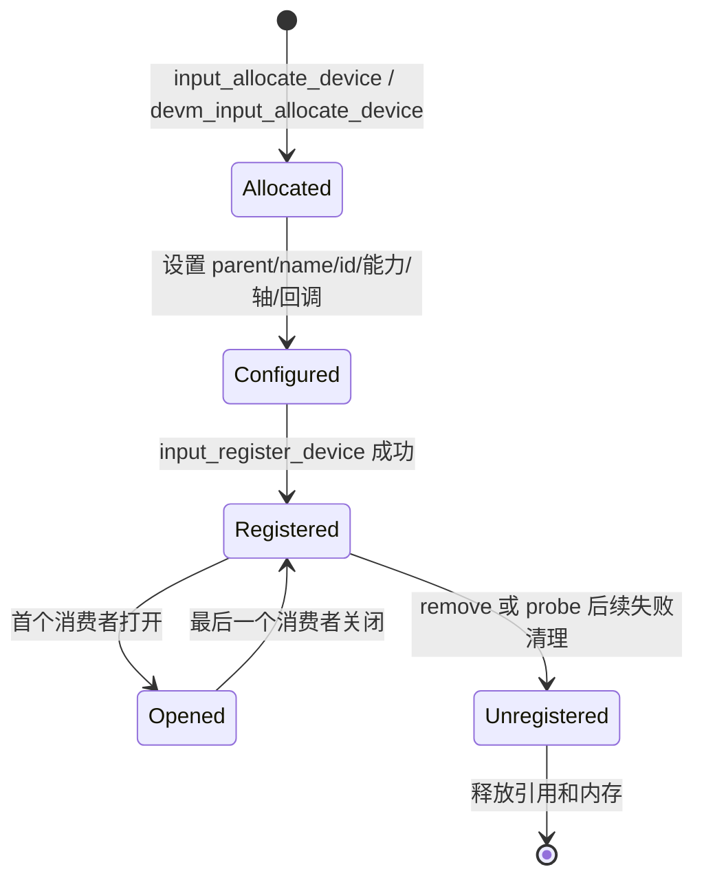
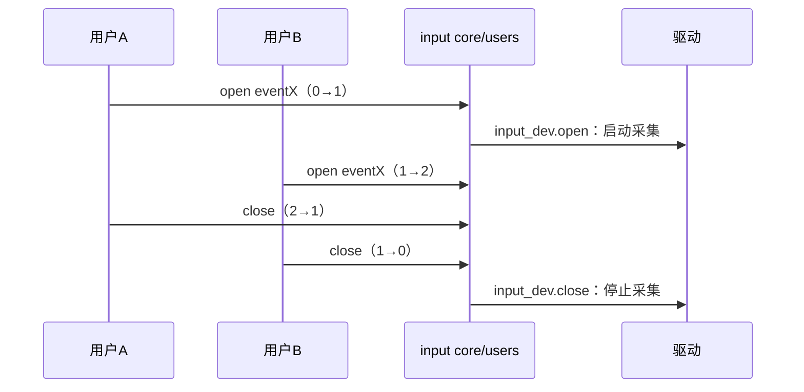
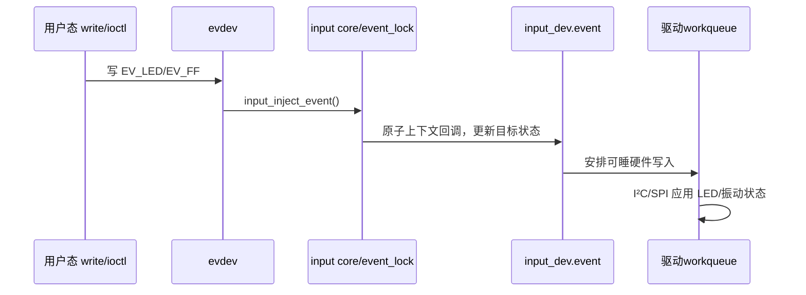

# 第3章\_Input\_设备注册能力与生命周期

## 3.1\_注册是一条提交边界

`input_dev` 在注册前是驱动私有的可变对象；注册成功后，handler 和用户态可观察其身份、能力与轴信息。因此驱动应按“分配 → 填充 → 注册”完成 S0～S1，不应把能力声明分散到设备上线以后。



## 3.2\_能力是协议，不是设备标签

`evbit` 声明事件类型，`keybit`、`relbit`、`absbit`、`swbit` 等声明该类型下的 code，`propbit` 补充 DIRECT、POINTER 等设备属性。`input_set_capability(dev, type, code)` 同时设置事件类型位和相应 code 位；属性通常用 `__set_bit()` 设置。

能力码来自 UAPI 约定。自创数值即使能进入位图，通用用户态也不知道其语义。若标准事件不能表达数据，应先判断是否选错子系统，而不是占用未定义 code。

绝对轴还需要 `input_set_abs_params()` 提供 minimum、maximum、fuzz、flat，并可用 `input_abs_set_res()` 设置 resolution。它们是轴描述和过滤参数，不等同于屏幕策略：`flat` 主要供用户态解释；坐标旋转、缩放和手势通常仍在用户态完成。

## 3.3\_最小注册骨架

```c
static int demo_probe(struct platform_device *pdev)
{
	struct input_dev *input;
	int error;

	input = devm_input_allocate_device(&pdev->dev);
	if (!input)
		return -ENOMEM;

	input->name = "demo-buttons";
	input->id.bustype = BUS_HOST;
	input_set_capability(input, EV_KEY, KEY_ENTER);

	error = input_register_device(input);
	if (error)
		return error;

	platform_set_drvdata(pdev, input);
	return 0;
}
```

`devm_input_allocate_device()` 管理分配资源；注册后的注销也由该 devres 路径处理。若使用 `input_allocate_device()`，注册前失败调用 `input_free_device()`；注册成功后的撤销调用 `input_unregister_device()`，不能随后再对同一对象调用 `input_free_device()`。

## 3.4\_open/close\_改变的是使用状态

`.open()`/`.close()` 适合在首个消费者出现时启动硬件，在最后一个消费者离开时停止硬件。它们不是每个 fd 各调用一次的设备级电源开关：input core 维护 users 计数，只在 0→1 和 1→0 边界调用设备回调。回调还需与 PM/remove 共用一套运行状态和停机顺序。



## 3.5\_选择核对表

| 条件 | 建议 |
| --- | --- |
| 对象严格隶属可热拔设备，释放顺序简单 | 使用 devres 分配 |
| 对象需要早于父设备释放或跨设备转移所有权 | 使用显式生命周期，并记录每条失败路径 |
| 硬件可按需启动且启动可能失败 | 实现 `.open()`，把错误返回给首个打开者 |
| 硬件必须持续扫描或承担唤醒 | 不要仅以 evdev 打开数决定断电，和 PM/wakeup 策略统一设计 |

## 3.6\_身份字段分别解决什么

`name` 是面向人的可读名称，`phys` 描述拓扑位置，`uniq` 可保存稳定序列标识，`id` 则包含 bus/vendor/product/version。它们会被 sysfs、`/proc/bus/input/devices`、uevent 和用户态规则消费，但都不能替代能力位图。

| 字段 | 适合内容 | 常见错误 |
| --- | --- | --- |
| `name` | 型号或功能名称 | 塞入动态 eventX，导致每次枚举变化 |
| `phys` | 类似 `usb-.../input0` 的物理路径 | 当作全球唯一序列号 |
| `uniq` | 硬件可提供的稳定唯一标识 | 为没有序列号的设备伪造随机值 |
| `id.bustype` | `BUS_I2C`、`BUS_USB`、`BUS_HOST` 等 | 用设备类别代替实际连接总线 |
| vendor/product/version | 能可靠取得的硬件身份 | 随意编常量，误导用户态匹配 |

使用 `devm_input_allocate_device(parent)` 时，core 已将 parent 设为所有者设备，6.12.20 的源码注释明确要求调用者不要覆盖它。因此前面的通用骨架只需设置名称和总线身份，无需再次赋值 `input->dev.parent`。

## 3.7\_能力声明的内部保证

`input_set_capability()` 根据 type 选择对应位图，并同时设置 `evbit`。如果 type 不受支持，6.12.20 会打印错误而不是创建新语义。注册时 core 自动设置 `EV_SYN`、清除 `KEY_RESERVED`，并清理未在 `evbit` 中启用类型的附属位图；这能消除矛盾声明，但不能替驱动选择正确 code。

对于 `EV_ABS`，只置 `absbit` 而没有分配 `absinfo` 会在注册时被拒绝。`input_set_abs_params()` 会分配 `absinfo`、设置 minimum/maximum/fuzz/flat 并声明该轴；resolution 需另用 `input_abs_set_res()` 设置。

### 3.7.1\_绝对轴五个字段的准确边界

| 字段 | 内核中的作用 | 用户态用途 | 不应推断 |
| --- | --- | --- | --- |
| `value` | core 保存最近接受的轴值 | 失步后查询当前状态 | 不代表控制器原始寄存器仍是该值 |
| `minimum/maximum` | 描述逻辑范围 | 归一化、校准、映射 | 6.12.20 core 不会据此自动钳位所有报告值 |
| `fuzz` | `input_defuzz_abs_event()` 分段平滑和去重 | 展示设备噪声尺度 | 不是固定的 `abs(delta) <= fuzz` 死区 |
| `flat` | 元数据 | 摇杆中心区等用户态策略 | core 不自动把中心值归零 |
| `resolution` | 每毫米单位数等物理分辨率 | 物理距离、速度估计 | 像素数量本身不等于物理分辨率 |

因此驱动必须先依据协议校验和必要时裁剪损坏/越界数据，再交给 core；不能用 `minimum/maximum` 替代协议验证。

## 3.8\_启动、轮询和自动重复

中断型设备通常在 `.open()` 中使能 IRQ/扫描，在 `.close()` 中停止。没有 IRQ 的设备可以使用 Input polling helper：`input_setup_polling()` 安装 poll 回调，再设置当前、最小和最大轮询间隔。poller 仍在 input 设备生命周期内运行，驱动不得另外启动一个不受 close/remove 约束的永久定时器。

键盘若声明 `EV_REP`，core 可以用定时器产生 value=2 的自动重复。注册时，如果驱动没有预设 `REP_DELAY` 和 `REP_PERIOD`，6.12.20 会使用默认软件重复参数。硬件已经自行重复时，驱动应避免再叠加一层软件重复，并准确区分新的按下与重复事件。

## 3.9\_输出事件和双向设备

Input 并非严格单向。用户态可通过 evdev 写入 `EV_LED`、`EV_SND`、`EV_FF` 等输出事件，最终进入 `input_dev->event()` 或 force-feedback 辅助层。该回调在 `event_lock` 持有、关中断的条件下执行，不能睡眠；需要 I²C/SPI 写设备时，应只更新驱动状态并安排 work，而不能直接做可睡传输。



## 3.10\_注册和错误回滚核对表

1. 在对象可见前完成身份、能力、轴、MT、open/close/event 和 drvdata 初始化。
2. 检查每个可能失败的分配和 `input_register_device()` 返回值。
3. 非 devres 对象区分“注册前失败调用 free”和“注册后调用 unregister”。
4. 注册 IRQ 前确保 IRQ 路径能看见完整私有状态；若 IRQ 可能立即触发，应先完成 input 对象初始化。
5. remove 先阻止新 IRQ/work，再注销或让 devres 注销 input 对象，最后释放硬件资源。
6. 不把用户态是否打开、runtime PM、system PM 和物理拔出混成同一个布尔值。
