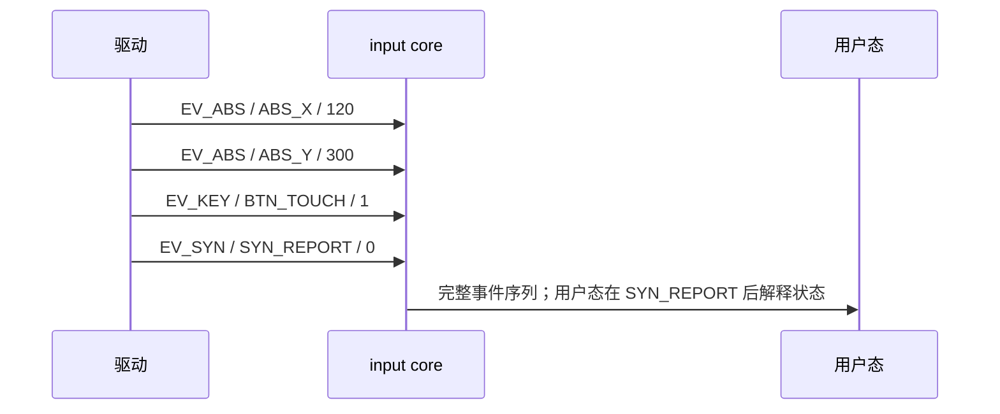
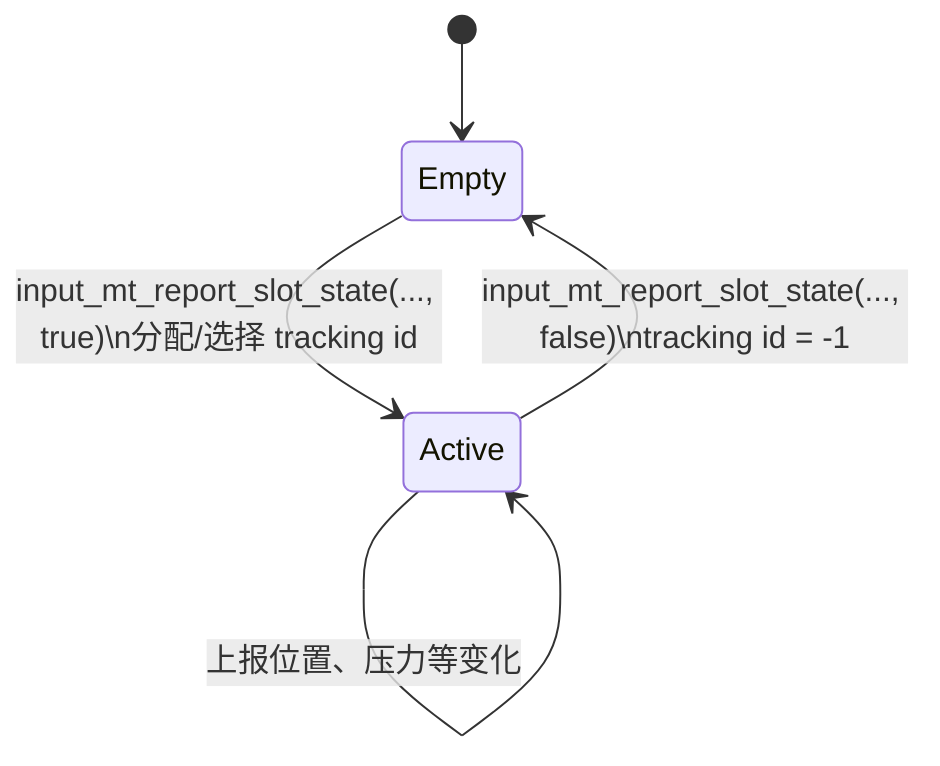
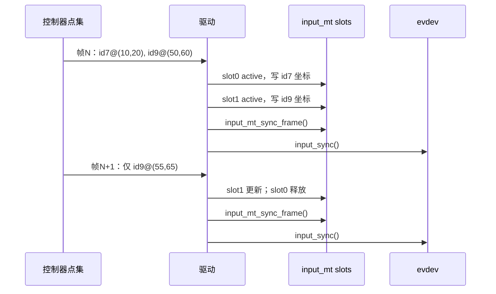

# 第4章\_Input\_事件帧与多点触控

## 4.1\_为什么单个事件不够

一次触摸采样会同时改变 X、Y、压力和接触状态。如果每个字段都被当作独立时刻，用户态可能在 X 更新而 Y 尚未更新时计算出不存在的位置。驱动应连续上报本次采样发生的变化，并以 `input_sync()` 产生的 `EV_SYN/SYN_REPORT` 提交帧。



Input 帧不是内存事务：handler 在每次 `input_event()` 时就接收事件。它的契约是以同步事件标出逻辑边界，所以同一设备不能由两个无协调的上报者交错拼帧。最稳妥的方案是每个设备只保留一个上报上下文；若确需多个来源，驱动先在自己的锁下合并状态，再由单一路径提交。

## 4.2\_当前值、过滤与不变事件

input core 保存设备当前 key/switch/absolute 值，并会忽略部分没有变化的事件。绝对轴的 `fuzz` 参与值去抖，但它不是简单的“差值小于等于 fuzz 就永远丢弃”；实现会根据新旧值差距分段调整，因此正文和调试不能把它当作固定死区。轴范围用于描述合法区间，驱动仍应依据控制器协议拒绝损坏帧，不能指望元数据替代硬件数据校验。

## 4.3\_为什么多点触控需要槽位

只连续发送若干 `(x,y)` 无法回答“本帧中的第二个点是不是上一帧的第二根手指”。MT Protocol B 引入 slot 保存活动接触的局部状态，以 tracking ID 表达一次接触生命周期。slot 是内核和协议中的存储位置，不等于手指身份；手指跨帧关联由 tracking ID 表达。



典型上报周期是：选择 slot → 报告该 slot 是否活动 → 对活动点报告坐标等字段 → 处理其余点 → `input_mt_sync_frame()` → `input_sync()`。`input_mt_sync_frame()` 处理 MT 帧级状态，`input_sync()` 才提交整个 input 帧，二者不能互相替代。

## 4.4\_两条时间线



若控制器提供稳定且连续落在槽范围内的硬件 ID，可直接用 `input_mt_slot()` 选择槽；稳定但稀疏的 ID 需要映射。若没有稳定 ID，可使用 input MT 辅助匹配，但必须理解它只基于当前点集推测对应关系，快速交叉或样本缺失时可能改变身份。

## 4.5\_A\_与\_B\_协议的选择

Protocol A 每帧重述全部接触，简单但事件量随触点数增长，用户态还需匹配前后帧；Protocol B 把持续状态放在 slot 中，只报告变化，更适合现代多点设备。已有只支持 A 的硬件/旧 ABI 可以继续使用 A；新驱动通常优先 B，但要承担槽位初始化、释放和身份维护成本。具体协议见 [上游 MT 文档副本](../../../research/source_reading/linux/Documentation/input/multi-touch-protocol.rst)。

## 4.6\_Protocol\_A\_与\_B\_的线级差异

Protocol A 用 `SYN_MT_REPORT` 分隔同一帧内的接触包，最后仍用 `SYN_REPORT` 结束整帧。Protocol B 用 `ABS_MT_SLOT` 选择要更新的槽位，用 `ABS_MT_TRACKING_ID` 的非负值创建/维持接触、`-1` 释放接触；未变化的槽位可以不重复发送。

```text
Protocol A：contact 0 fields → SYN_MT_REPORT
            contact 1 fields → SYN_MT_REPORT
            SYN_REPORT

Protocol B：ABS_MT_SLOT=0 → TRACKING_ID=45 → fields
            ABS_MT_SLOT=1 → TRACKING_ID=46 → fields
            SYN_REPORT
```

用户态不能按事件出现顺序把“第一个点”永久当成第一根手指；必须依协议维护槽状态。驱动也不能在一帧中复用刚释放槽位却省略 tracking ID 转换，否则用户态会把两次接触误认为同一生命周期。

## 4.7\_MT\_轴表达什么

| code | 含义 | 常见边界 |
| --- | --- | --- |
| `ABS_MT_POSITION_X/Y` | 接触中心的表面坐标 | 量程和方向来自设备/firmware 描述 |
| `ABS_MT_TOUCH_MAJOR/MINOR` | 接触椭圆尺寸 | 没有可靠硬件数据就不要伪造 |
| `ABS_MT_WIDTH_MAJOR/MINOR` | 工具接近区域尺寸 | 与 touch size 不是同一物理量 |
| `ABS_MT_ORIENTATION` | 椭圆方向 | 编码范围必须与上游协议一致 |
| `ABS_MT_PRESSURE` | 每个接触压力 | 电容屏只有面积时不要冒充压力 |
| `ABS_MT_DISTANCE` | 工具离表面距离 | 0 通常表示接触表面 |
| `ABS_MT_TOOL_TYPE` | finger、pen、palm 等工具类型 | 只有硬件/可靠分类能提供时上报 |
| `ABS_MT_BLOB_ID` | 将多个接触分组为不规则接触 | 普通独立手指通常不需要 |

“字段越多越完整”是误区。伪造恒定 pressure、面积或工具类型会让用户态错误分类；只声明硬件能够稳定提供且语义明确的轴，通常更可靠。

## 4.8\_slot\_分配的三种情况

1. **硬件 ID 已是连续槽号**：ID 范围稳定落在 `[0, num_slots)`，可直接 `input_mt_slot(dev, id)`。
2. **硬件 ID 稳定但稀疏**：驱动维护 ID→slot 映射，或用 `input_mt_get_slot_by_key()` 按 key 找/分配槽；不能直接作数组下标。
3. **硬件没有稳定 ID**：构造本帧位置数组，使用 `input_mt_assign_slots()` 依据距离代价匹配。该算法需要上一帧槽位状态，必须在每帧结束调用 `input_mt_sync_frame()`，并接受交叉、遮挡或大位移时身份可能改变的边界。

`INPUT_MT_DROP_UNUSED` 让 `input_mt_sync_frame()` 自动释放本帧未标记为 seen 的活动槽。使用它的前提是驱动每一帧都枚举所有仍然活动的接触；若硬件只报告变化，自动 drop 会错误释放未变化的手指。

## 4.9\_pointer\_emulation\_解决兼容而非手势

部分旧用户态只理解 `ABS_X/ABS_Y/BTN_TOUCH`。`input_mt_report_pointer_emulation()` 可以从 MT 槽生成单指兼容状态，通常选择最老活动接触作为指针并报告接触数。它不是手势识别器，也不会产生滚动、缩放或掌拒；现代纯 MT 消费链可以依据设备和兼容需求决定是否启用。

## 4.10\_MT\_帧验收核对表

- slot 数来自控制器可同时跟踪的最大接触数，而不是面板分辨率或硬件 ID 最大值。
- 每次新接触获得非负 tracking ID，释放时明确变为 `-1`。
- 同一帧所有活动点完成后调用 `input_mt_sync_frame()`，最后调用 `input_sync()`。
- `INPUT_MT_DROP_UNUSED` 与控制器“全量帧/增量帧”语义匹配。
- X/Y 量程、方向和设备树变换在所有槽上保持一致。
- 用按下、静止、移动、交叉、逐个抬起、整帧丢失六类序列验证。
