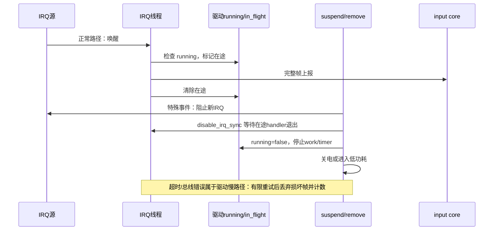
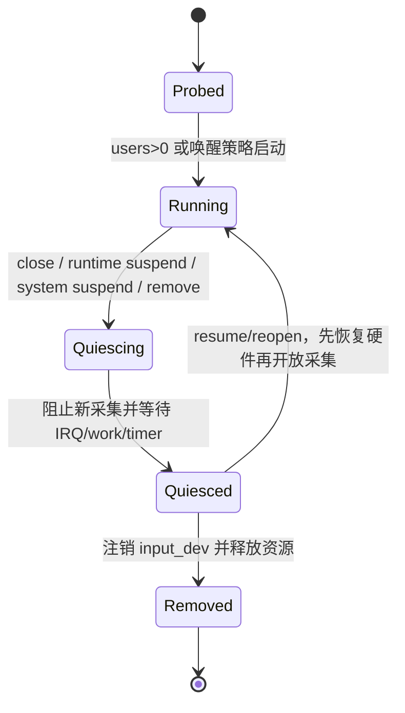

# 第5章\_Input\_并发、丢帧与电源管理

## 5.1\_先区分采集和提交

I²C/SPI 传输可能睡眠，不能放在硬 IRQ 中。`input_event()` 路径本身可从中断上下文调用，因此不能睡眠；这并不意味着“上报必须发生在硬中断”，而是调用者不能期望上报过程提供睡眠机会。常见设计是在 threaded IRQ 或 workqueue 中完成总线读取、帧校验和上报。

| 来源 | 能否执行可睡总线 I/O | 合适职责 |
| --- | --- | --- |
| hard IRQ | 否 | 确认中断并唤醒线程/安排工作 |
| threaded IRQ | 是 | 读取一帧、校验、提交，适合中断型 I²C/SPI 设备 |
| workqueue | 是 | 轮询、延迟重试、合并事件 |
| timer/hrtimer 回调 | 否 | 只安排可睡工作，或处理无需睡眠的状态 |
| probe/open/PM | 是 | 配置、启动和停机；不得与在途采集失去协调 |

## 5.2\_正常、特殊与强制慢路径

停机的关键不是某个固定 API，而是两个保证：不再产生新采集；所有可能访问硬件或上报的在途路径已经退出。IRQ 型设备常用 `disable_irq()`/`disable_irq_sync()`，工作队列还需 `cancel_work_sync()` 或对应同步取消，定时器也需同步停止。具体调用顺序必须避免当前 IRQ 线程对自身 IRQ 做同步禁用。

## 5.3\_硬件帧一致性属于驱动

`SYN_REPORT` 只能标记驱动已经提交的事件，不能修复驱动读到的半帧。若控制器在读取期间可能更新寄存器，驱动应采用硬件提供的快照、FIFO、帧序号前后核对，或 data-ready 握手。重试必须有上限；达到上限时丢弃整帧比拼接新旧数据更可恢复，并应留下错误计数或限速日志。

## 5.4\_evdev\_溢出和重同步

每个打开的 evdev 文件有自己的缓冲，所以慢消费者不会让快消费者替它承担积压。但慢客户端自己的缓冲仍可能溢出。evdev 以 `SYN_DROPPED` 通知该客户端：在下一个 `SYN_REPORT` 前忽略普通事件，然后通过 `EVIOCGKEY`、`EVIOCGABS`、`EVIOCGSW` 等 ioctl 查询当前状态并重建本地镜像。

```mermaid
sequenceDiagram
    participant C as input core
    participant E as 慢客户端缓冲
    participant U as 用户态状态镜像
    C->>E: 事件持续到达，缓冲溢出
    E->>U: SYN_DROPPED
    U->>U: 进入丢弃模式
    E->>U: SYN_REPORT
    U->>E: ioctl 查询 key/abs/switch 当前状态
    E-->>U: 快照
    U->>U: 重建状态并恢复解析
```

驱动不应为了某个慢应用私建无限队列或重发历史帧；那会把延迟和内存占用转移到内核。需要完整历史的应用应及时读取，并在自己的存储层持久化。

## 5.5\_PM\_与唤醒的选择边界

非唤醒设备 suspend 时通常先阻止新采集、同步等待在途路径，再让控制器休眠。恢复时先恢复供电、时钟和控制器状态，再允许采集。唤醒设备不能简单关闭 IRQ：通常要把控制器放入低功耗检测模式并配置 IRQ wake；被唤醒后的数据是否仍有效取决于控制器协议。

`open/close`、runtime PM、system suspend 和 remove 都会改变运行状态。驱动应以一个明确的锁和状态字段协调它们，并规定锁与 `disable_irq_sync()` 的顺序，避免 PM 持锁等待 IRQ，而 IRQ 又等待同一把锁。

## 5.6\_两把核心锁分别保护什么

Linux 6.12.20 的 `input_dev` 至少有两个不能混用的同步域：

| 同步对象 | 保护内容 | 运行约束 |
| --- | --- | --- |
| `event_lock` 自旋锁 | 当前事件值、帧缓冲 `vals`、grab、向 handler 分发 | 关中断、不可睡；handler 的 filter/events 和设备 `.event()` 受此约束 |
| `mutex` | open/close/flush、users、handle 生命周期相关控制 | 可睡；不保护驱动自己的控制器寄存器状态 |

`input_event()` 每次调用会取得 `event_lock`，所以单个事件的状态更新不会并发破坏；但连续四次 `input_report_*()` 并不自动形成不可插入的事务。另一个 CPU 可以在两次调用之间取得锁，因此驱动仍需单一上报上下文或自己的帧级串行化。

驱动私有 mutex 保护可睡总线和 PM 状态时，不应在持锁状态下调用会同步等待 IRQ/work 的 API，除非已经证明在途路径不会请求同一把锁。一个常用顺序是先通过原子/受保护状态拒绝新工作，释放私有锁，再同步取消 IRQ/work，最后重新持锁执行断电。

## 5.7\_时间戳属于采样事实

默认情况下，input core 为事件帧取得内核时间。硬件若能提供更准确的采样时刻，驱动可在上报该帧前调用 `input_set_timestamp()`；同一帧内的事件应共享该采样时刻。evdev 客户端可通过 `EVIOCSCLOCKID` 选择 realtime、monotonic 或 boottime 表示，切换时钟且队列非空时会清空旧队列并注入 `SYN_DROPPED`，避免混合两个时间基准。

硬件计数器不能不经转换直接冒充 `ktime_t`。驱动必须处理计数器频率、回绕、复位和 suspend 后连续性；无法可靠换算时，使用 core 时间比制造精确外观更安全。

## 5.8\_evdev\_每客户端状态

每个 `open()` 产生一个 `evdev_client`，其中保存独立环形缓冲、head/tail/packet_head、缓冲锁、所选时钟、事件 mask 和 revoke 状态。设备级 grab 最终由某个 client 通过 `EVIOCGRAB` 持有，但缓冲溢出、mask 和读取进度仍是客户端私有的。

`read()` 以完整 `struct input_event` 为单位复制，阻塞读取在无数据时睡在等待队列；`poll()`/`epoll()` 观察同一就绪条件。客户端可以设置事件 mask 降低不关心事件的复制量，但 mask 不是安全边界，也不能改变 input core 的设备状态。

## 5.9\_失步后哪些状态能恢复

| 事件类别 | 可查询快照 | 恢复说明 |
| --- | --- | --- |
| key | `EVIOCGKEY` | 重建全部当前按下键 |
| switch | `EVIOCGSW` | 重建开关状态 |
| LED | `EVIOCGLED` | 查询 core 当前 LED 位图 |
| sound | `EVIOCGSND` | 查询声音状态 |
| absolute axis | `EVIOCGABS(code)` | 取得当前值与参数 |
| MT slots | `EVIOCGMTSLOTS` | 按 axis 查询所有 slot 的当前值 |
| relative motion | 无当前位置快照 | 丢失增量无法还原，只能从下一事件继续 |
| MSC 等瞬态信息 | 通常无统一快照 | 依协议放弃丢失历史 |

这说明 `SYN_DROPPED` 恢复不是“重读最后一帧”。用户态只能重建有持久状态的类别；已经丢失的鼠标增量或扫描码历史无法凭 ioctl 复原。

## 5.10\_挂起、关闭、注销的统一状态机

`Quiescing` 必须记录触发原因：普通 close 可以停主扫描，但 system wakeup 可能还需低功耗扫描；runtime suspend 可以恢复，remove 则不可逆。只用一个 `suspended` 布尔值无法区分这些退出条件，容易在 resume 后复活已 remove 的工作。

## 5.11\_故障注入建议

1. 在总线读取的每个阶段注入 `-EIO`、短读和校验失败，确认不会提交半帧。
2. 在 IRQ 线程进入后立即 unbind，确认 remove 等到线程退出且无 UAF。
3. 在持续事件下反复 open/close 两个客户端，确认 users 的 0↔1 边界正确。
4. 缩小或压满某个客户端缓冲，确认 `SYN_DROPPED` 后能查询状态恢复。
5. 在触摸保持期间 suspend/resume，确认恢复后 slot 不残留幽灵接触；必要时显式释放或重建状态。
6. 开启 lockdep、KASAN、KCSAN 和 `might_sleep` 检查，分别覆盖锁顺序、生命周期、数据竞争和错误上下文睡眠。
