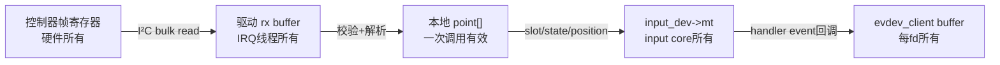
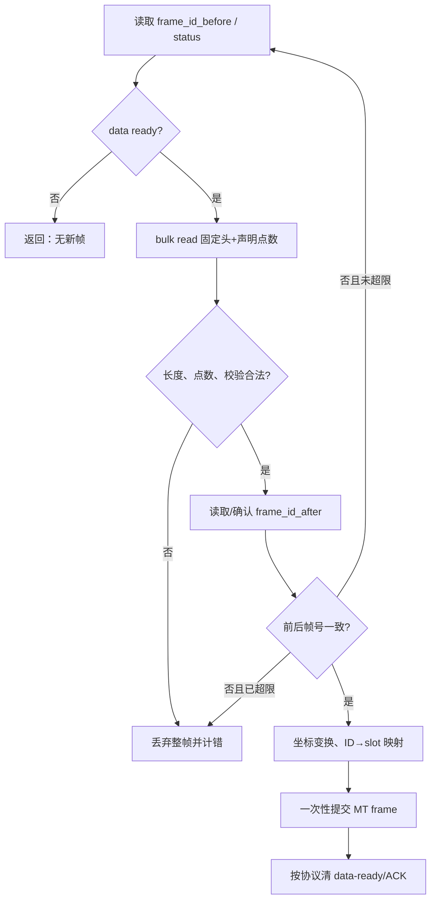

# 第6章\_Input\_触摸驱动设计与验证

## 6.1\_从约束推导设计

假设 I²C 触摸控制器用低电平 IRQ 表示一帧就绪，并提供点数、稳定硬件 ID、X/Y 和帧序号。I²C 会睡眠，因此选择 `request_threaded_irq(..., IRQF_ONESHOT, ...)`；硬件 ID 能稳定关联接触，因此选择 MT Protocol B；控制器帧可能在读取期间变化，因此读取前后核对帧序号；用户态需要物理分类，因此声明 `INPUT_PROP_DIRECT` 和准确量程。

这只是控制器无关骨架。寄存器地址、复位延时、电源顺序、坐标单位、IRQ 极性和设备树属性必须来自具体芯片 binding 与手册，不能从本例外推。

## 6.2\_状态所有权

| 状态 | 存储位置 | 写入者 | 读取者 |
| --- | --- | --- | --- |
| `running`、错误计数 | 驱动私有结构 | probe/open/PM/IRQ 线程 | IRQ 线程、调试接口 |
| 原始接收缓冲 | 驱动私有结构 | IRQ 线程中的 I²C 读取 | 同一线程的解析函数 |
| 能力、轴范围、MT slots | `input_dev` | probe 与 MT 上报路径 | input core、evdev、用户态 |
| 每客户端事件 | `evdev_client` | evdev callback | 对应 fd |



## 6.3\_probe\_与上报骨架

```c
static int demo_touch_setup_input(struct demo_touch *ts)
{
	struct input_dev *input = ts->input;
	int error;

	input->name = "demo-i2c-touch";
	input->id.bustype = BUS_I2C;
	input->dev.parent = &ts->client->dev;
	__set_bit(INPUT_PROP_DIRECT, input->propbit);
	input_set_abs_params(input, ABS_MT_POSITION_X,
			     0, ts->max_x, ts->fuzz_x, 0);
	input_set_abs_params(input, ABS_MT_POSITION_Y,
			     0, ts->max_y, ts->fuzz_y, 0);

	error = input_mt_init_slots(input, ts->max_contacts,
				    INPUT_MT_DIRECT | INPUT_MT_DROP_UNUSED);
	if (error)
		return error;

	return input_register_device(input);
}
```

```c
static void demo_touch_report(struct demo_touch *ts,
			      const struct demo_frame *frame)
{
	unsigned int i;

	for (i = 0; i < frame->num_points; i++) {
		const struct demo_point *point = &frame->points[i];

		input_mt_slot(ts->input, point->slot);
		input_mt_report_slot_state(ts->input, MT_TOOL_FINGER, true);
		input_report_abs(ts->input, ABS_MT_POSITION_X, point->x);
		input_report_abs(ts->input, ABS_MT_POSITION_Y, point->y);
	}

	input_mt_sync_frame(ts->input);
	input_sync(ts->input);
}
```

代码假设解析阶段已经把硬件 ID 映射为合法的 `point->slot`；若硬件 ID 稀疏或会复用，必须维护 ID→slot 映射，不能直接把 ID 当数组下标。解析函数还必须先验证点数、报文长度、坐标编码和校验字段，任何一项失败都丢弃整帧。

## 6.4\_端到端验收

1. 用 `/proc/bus/input/devices` 确认名称、总线和 `eventX`。
2. 用 `evtest` 检查声明的事件码、按下/移动/抬起以及每帧末尾的 `SYN_REPORT`。
3. 用 `libinput debug-events` 检查设备是否被识别为 touchscreen；分类不对时先检查能力和属性，不要先改用户态规则。
4. 用 `EVIOCGABS(ABS_MT_POSITION_X/Y)` 核对 minimum、maximum、fuzz、flat、resolution。
5. 并发压测打开多个 reader，确认它们各自收到事件；故意暂停一个 reader，验证该 reader 能处理 `SYN_DROPPED`。
6. 在持续触摸时反复 suspend/resume、unbind/bind，配合 lockdep、KASAN 或动态调试检查 use-after-free、睡眠上下文和在途 IRQ。

## 6.5\_故障到因果链

| 现象 | 首先检查 | 形成原因 |
| --- | --- | --- |
| 没有 `eventX` | evdev 配置、注册返回值、handler 匹配 | 设备存在不等于 evdev handler 已连接 |
| 有节点但无事件 | IRQ 极性、运行状态、能力位 | 中断未到，或未声明事件被 core 拒绝 |
| 两指交叉时身份跳变 | 硬件 ID 与 slot 映射 | 把不稳定/稀疏 ID 直接当 slot |
| 偶发对角跳点 | 帧序号、长度和 data-ready 协议 | 读取期间控制器更新，拼出半帧 |
| 恢复后 IRQ 风暴 | 清状态、IRQ 电平和恢复顺序 | 控制器状态未清就重新开放 IRQ |
| 慢应用状态卡住 | `SYN_DROPPED` 处理 | 客户端缓冲溢出后没有查询快照 |

## 6.6\_源码证据入口

- [Input 核心与 evdev 源码导读](../../../research/source_reading/linux/drivers/input/README.md)
- [上游 Input 编程文档副本](../../../research/source_reading/linux/Documentation/input/input-programming.rst)
- [上游多点触控协议副本](../../../research/source_reading/linux/Documentation/input/multi-touch-protocol.rst)

## 6.7\_完整\_probe\_阶段划分

| 阶段 | 操作 | 失败时的退出保证 |
| --- | --- | --- |
| E0 资源取得 | 分配私有结构，取得 regulator/clock/GPIO/IRQ | 尚无异步路径，可直接返回 |
| E1 控制器确认 | 上电、复位、读取 chip ID/固件能力 | 关闭已开启电源 |
| E2 Input 建模 | 分配 `input_dev`，解析量程/接触数，配置 MT | 对象尚未注册，无用户可见 |
| E3 采集准备 | 初始化锁、工作、错误计数和运行状态 | IRQ 尚未开放 |
| E4 Input 注册 | `input_register_device()` | devres 或显式路径负责注销 |
| E5 IRQ 注册 | 请求 threaded IRQ，初始状态与 open/PM 策略一致 | 注册后 IRQ 可能立即执行，前述状态必须完整 |
| E6 可运行 | 允许 open/runtime PM，记录 probe 完成 | remove 按相反依赖顺序静默化 |

IRQ 与 input 注册谁先发生取决于硬件：若请求 IRQ 后可能立即触发，必须确保 handler 能安全访问已注册或至少完整初始化的 input 对象；若先注册导致用户可立即 open，则 `.open()` 也不能假设 IRQ 已准备好。常见做法是让设备初始保持停止状态，全部资源就绪后再允许 `.open()` 启动采集。

## 6.8\_读取一帧的事务边界



ACK 放在读取前还是提交后必须以芯片协议为准：过早 ACK 可能允许硬件覆盖当前帧，过晚 ACK 可能保持电平 IRQ 并重复进入。这里不能给出跨控制器固定顺序。

## 6.9\_稀疏硬件\_ID\_映射骨架

```c
static int demo_find_slot(struct demo_touch *ts, unsigned int hw_id)
{
	unsigned int slot;

	for (slot = 0; slot < ts->max_contacts; slot++) {
		if (ts->slot_active[slot] && ts->slot_hw_id[slot] == hw_id)
			return slot;
	}

	for (slot = 0; slot < ts->max_contacts; slot++) {
		if (!ts->slot_active[slot]) {
			ts->slot_hw_id[slot] = hw_id;
			ts->slot_active[slot] = true;
			return slot;
		}
	}

	return -ENOSPC;
}
```

真实实现还要在本帧开始清 seen 位、为每个成功解析点标记 seen，并在帧末释放 active 但未 seen 的映射。若使用 `INPUT_MT_DROP_UNUSED`，input core 会释放 MT slot，驱动自己的 `slot_active[]` 仍必须同步释放；否则下一帧会认为槽仍被旧 ID 占用。

## 6.10\_设备树和固件属性

通用触摸属性应优先通过 touchscreen property helper 和对应 binding 解析，例如尺寸、反转、交换坐标、压力范围等。驱动的 `max_x/max_y` 必须明确表示“控制器逻辑最大值”还是“变换后的最终最大值”，并保证 input abs 参数与实际上报空间一致。

不要在通用章节硬编码 i.MX6ULL 的 `gpio1_15`、I²C 控制器编号或任意自定义 `demo,*` 属性。平台连线属于 `platforms`，具体控制器兼容串和属性属于 binding/设备驱动文档；Input 专题只说明它们如何影响统一事件模型。

## 6.11\_remove\_和\_PM\_伪代码

```c
static void demo_touch_quiesce(struct demo_touch *ts)
{
	/* 先让新的处理路径看见停止状态。 */
	WRITE_ONCE(ts->running, false);

	/* 等待已经开始的线程化中断退出。 */
	disable_irq(ts->irq);

	/* 若还存在工作或定时器，应在这里同步取消。 */
}
```

该片段只表达阶段，不是所有驱动都应照抄：`disable_irq()` 会等待正在执行的 handler，因此不能从会造成自等待的上下文调用；IRQ 是否由 devm 管理、wakeup IRQ 是否必须保持等，也要结合内核 IRQ API 和控制器设计核对。核心验收条件仍是“无新采集 + 无在途访问”。

## 6.12\_从 bring-up 到长期维护

首次点亮应保存设备身份、能力位图、ABS 参数和一组标准动作的 `evtest` 输出作为基线。后续升级内核、固件或设备树时，比较以下不变量：

- 相同物理动作产生相同的标准 type/code 语义；
- 量程、方向、resolution 和属性没有无意变化；
- 所有接触都有成对的创建与释放，挂起/拔出不留下活动 slot；
- 多客户端、grab、缓冲溢出和断开路径仍可恢复；
- 错误计数能区分总线失败、协议帧损坏、无空闲 slot 和用户态失步。

只有控制器寄存器或板级连线发生变化时，修改应停留在采集层；如果需要改变 UAPI code、属性或量程，应视为用户态兼容性变更单独审查。
