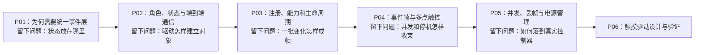

# 第1章\_Linux\_Input\_子系统专题大纲

## 1.1\_专题定位

Input 子系统把键盘、鼠标、触摸屏、摇杆等不同硬件产生的数据统一为 `type/code/value` 事件流。本专题不按 API 名称堆目录，而沿着“直接暴露硬件的缺口 → 事件模型 → Linux 状态与通信实现 → 驱动生命周期 → 复杂设备与异常路径 → 验证”的因果链展开。

## 1.2\_阅读地图

| 阶段 | 文档 | 本篇解决的问题 | 前置结论 | 为下一篇留下的问题 |
| --- | --- | --- | --- | --- |
| 看见问题 | [P01](P01_从硬件样本到统一输入事件.md) | 每个应用直接读硬件为何不可维护 | 无 | 统一层内部如何保存和传播状态 |
| 建立模型 | [P02](P02_体系结构与事件传递.md) | 四类角色如何通信，状态归谁所有 | 需要稳定事件 ABI | 驱动如何声明设备并上线 |
| 兑现对象 | [P03](P03_设备注册能力与生命周期.md) | `input_dev` 如何建立、匹配、打开和释放 | handler 根据能力连接设备 | 怎样表达同一采样周期 |
| 完善协议 | [P04](P04_事件帧与多点触控.md) | 帧边界、去重和 MT-B 槽位怎样协作 | 事件以设备为顺序域 | 并发、溢出和停机如何处理 |
| 检验边界 | [P05](P05_并发丢帧与电源管理.md) | IRQ、睡眠、缓冲溢出、PM 竞态 | 驱动必须提交完整帧 | 如何形成真实驱动设计 |
| 工程落地 | [P06](P06_触摸驱动设计与验证.md) | 从控制器帧到 evdev 的实现与验收 | 前五篇完整模型 | 平台寄存器细节留给具体设备文档 |

## 1.3\_版本与证据边界

通用模型以 Linux 6.12.20 为源码核对基线。正文链接到 [Input 源码导读](../../../research/source_reading/linux/drivers/input/README.md)，源码文件保持上游相对路径；控制器寄存器、设备树 binding 和电气时序必须再以具体芯片资料为准。
