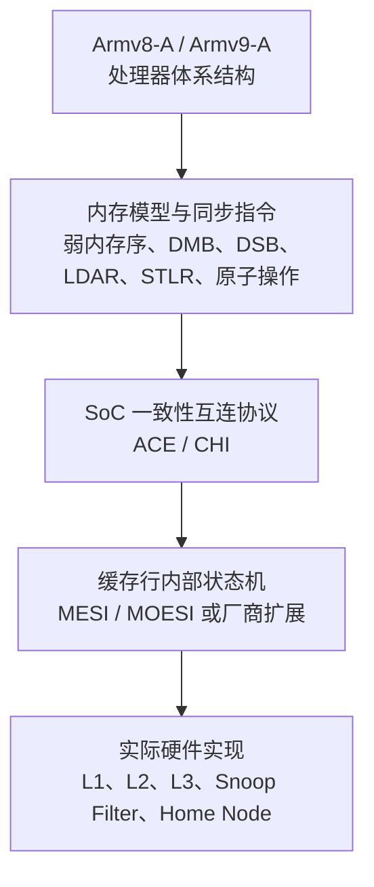
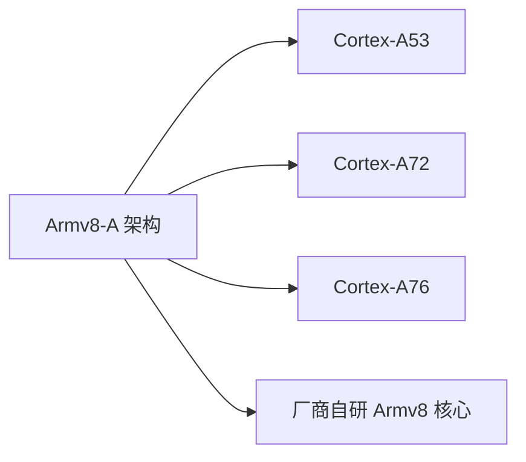
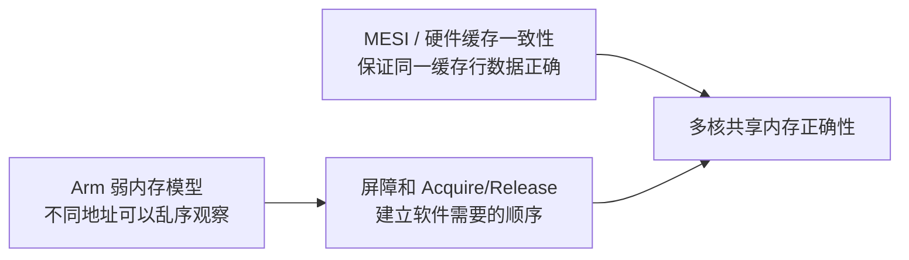
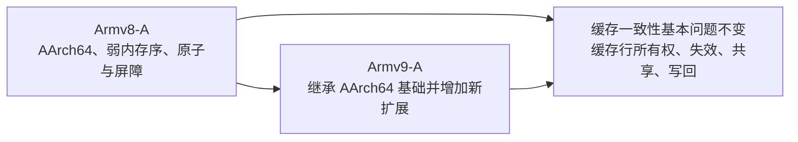
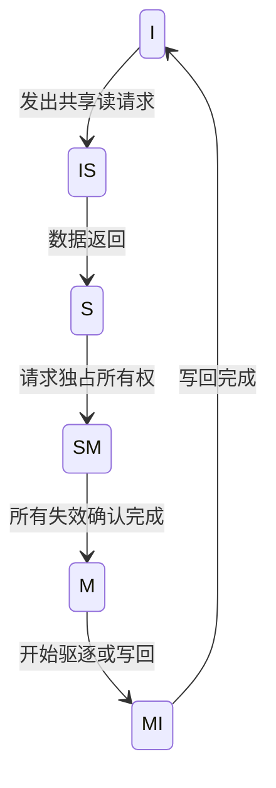
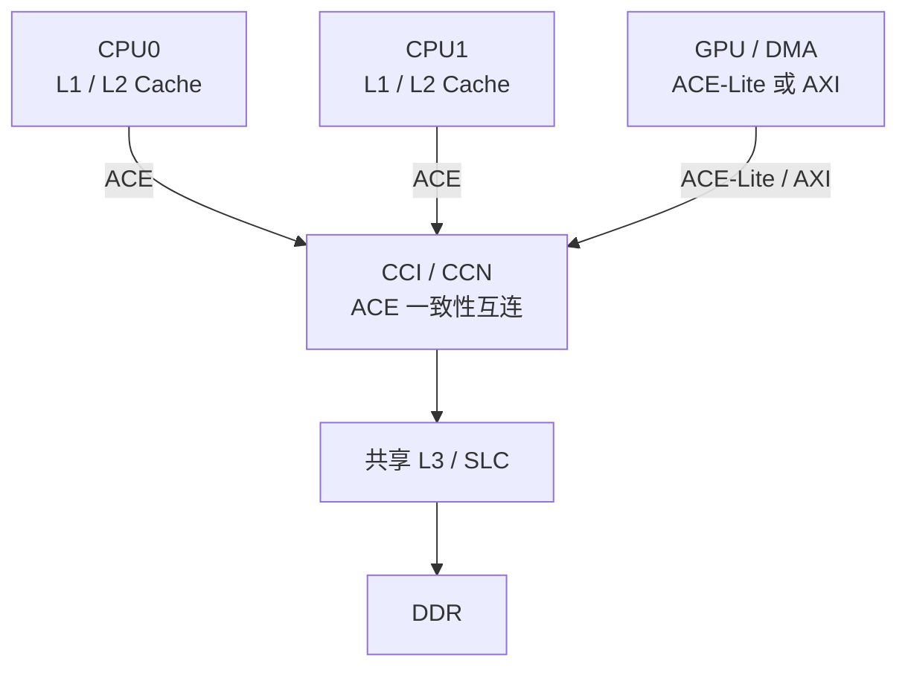
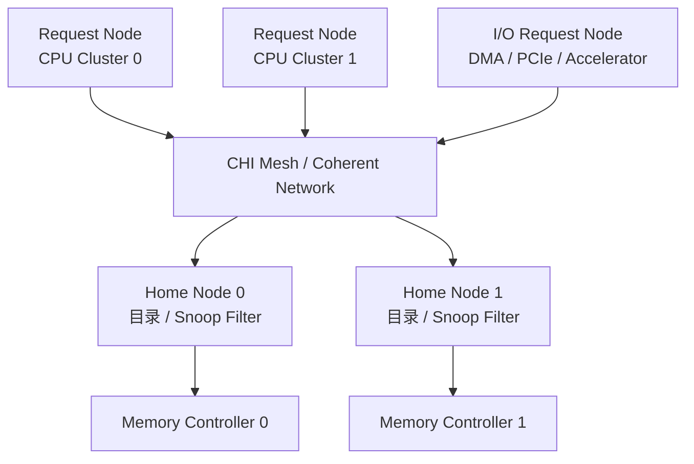
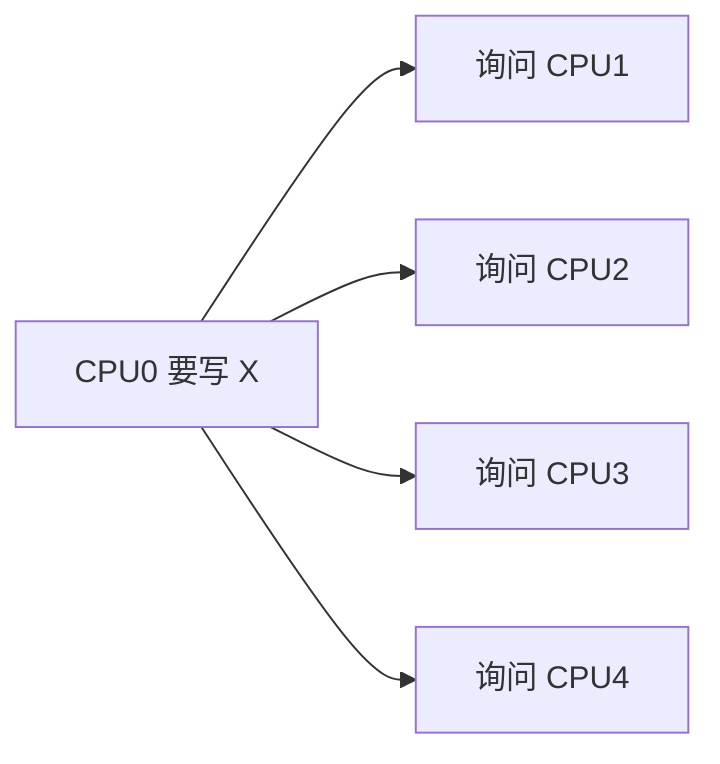
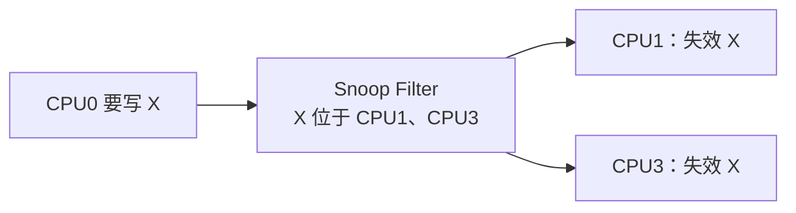
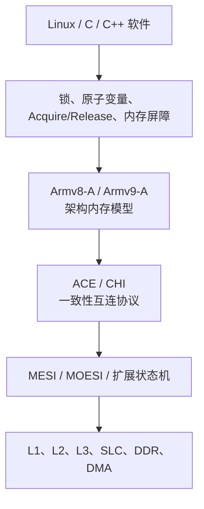

你说得对。上一版直接从缓存行进入 MESI，容易让人产生一个误解：

> **Armv8/Armv9 处理器内部是不是规定必须使用 MESI？**

答案是：**不是。**

下面这部分适合放在原 MESI 介绍之前，作为 Arm 架构背景。

---

# 第1章\_Armv8\_Armv9\_与\_MESI\_的关系

## 1.1\_先区分三个层次

理解 Arm 多核系统时，必须把下面三层分开：



它们分别解决不同问题：

| 层次                | 解决的问题                          |
| ----------------- | ------------------------------ |
| Armv8-A / Armv9-A | 软件能够看到什么架构行为                   |
| 内存模型              | 多个 Load/Store 可以按什么顺序被观察       |
| ACE / CHI         | 多个 CPU、GPU、DMA 如何交换一致性事务       |
| MESI / MOESI      | 一条缓存行当前由谁持有、是否被修改              |
| 微架构实现             | Cache、Store Buffer、目录和互连具体怎么设计 |

所以不能简单地说：

```text
Armv8 使用 MESI
Armv9 使用 MOESI
```

这种说法并不准确。

更准确的说法是：

> Armv8-A 和 Armv9-A 定义软件可观察的内存行为；具体芯片可以使用 MESI、MOESI 或更复杂的缓存状态机，并通过 ACE、CHI 等一致性互连协议实现这些行为。

---

# 第2章\_Armv8-A\_的背景

Armv8-A 最重要的变化之一，是加入了 64 位的 **A64 指令集**，并引入 AArch64 执行状态；同时也可以包含 AArch32 执行状态。Armv8-A 面向运行 Linux、Android、虚拟化平台和服务器系统的 A-profile 处理器。([Arm开发者][1])

典型 Armv8-A 处理器包括：

```text
Cortex-A53
Cortex-A55
Cortex-A57
Cortex-A72
Cortex-A76
Neoverse N1
```

但“Armv8-A”描述的是**体系结构规范**，并不等于某一个具体 CPU 微架构。

例如：



这些 CPU 都能实现 Armv8-A，但它们可以具有不同的：

* 流水线；
* Cache 大小；
* Cache 层数；
* 预取器；
* 一致性互连；
* 缓存行状态机；
* Store Buffer 深度。

## 2.1\_Armv8-A\_的内存模型

Armv8-A 使用**弱顺序内存模型**。没有依赖关系的内存访问，不一定按照程序书写顺序发出、完成或被其他观察者看到。这样做允许处理器利用缓存、写缓冲区、乱序执行等机制提高性能。([Arm开发者][2])

例如 CPU0 执行：

```c
data = 42;
ready = 1;
```

在没有同步操作时，CPU1 不一定按照下面的顺序观察：

```text
先观察到 data = 42
再观察到 ready = 1
```

为此，Armv8-A 提供：

```text
DMB / DSB / ISB
LDAR / STLR
LDAXR / STLXR
以及后续架构扩展中的 LSE 原子指令
```

因此：



MESI 并不能代替 `DMB`、Acquire/Release 或 Linux 的锁。

---

# 第3章\_Armv9-A\_的背景

Armv9-A 是 Arm A-profile 架构在 Armv8-A 基础上的后续架构世代，继续使用 AArch64 软件生态，并增加了面向向量计算、AI、安全和机密计算的扩展，例如 SVE2、SME 和 Realm Management Extension。([Arm][3])

但从 MESI 学习的角度，最重要的是：

> **Armv9-A 没有抛弃 Armv8-A 的多核内存基本模型，也没有规定一种名叫“Armv9 MESI”的全新协议。**

Armv9-A 仍然是弱顺序架构，仍然需要：

* Acquire/Release；
* 内存屏障；
* 原子操作；
* 锁和其他同步原语；
* 硬件缓存一致性互连。



因此，站在 Linux 内核开发者角度：

```text
Armv8-A 与 Armv9-A 的 MESI 基本理解方式相同。
```

代码仍然应该使用：

```c
spin_lock();
spin_unlock();

smp_load_acquire();
smp_store_release();

smp_mb();
smp_rmb();
smp_wmb();

atomic_*();
```

而不是根据“Armv8 还是 Armv9”自行猜测底层缓存协议。

---

# 第4章\_Arm\_架构并不强制\_MESI

Arm 架构规范主要规定：

* 内存类型；
* Cacheability；
* Shareability；
* 访问顺序；
* 原子性；
* 屏障语义；
* Cache maintenance 指令；
* 软件可观察的结果。

它通常不会要求厂商：

```text
L1 Cache 必须采用四状态 MESI
```

芯片设计者可以采用：

```text
MESI
MOESI
MESIF
目录式一致性状态
ACE 状态机
CHI 状态机
厂商自定义瞬态状态
```

只要最终对软件表现出的行为符合 Arm 架构要求。

实际硬件可能有很多 MESI 教材中没有的瞬态状态：

```text
I → 等待数据 → S
S → 等待失效确认 → M
M → 正在写回 → I
```

例如：



这里的：

```text
IS
SM
MI
```

是为了表达“事务正在进行中”的瞬态状态，不属于经典 MESI 的四个稳定状态。

---

# 第5章\_Armv8\_时代常见的\_ACE

在许多 Armv8 多核 SoC 中，CPU Cluster 与一致性互连之间会使用 AMBA ACE，或者使用基于 ACE 的 CoreLink CCI、CCN 等互连。

ACE 是 AXI 的一致性扩展，允许具有缓存的处理器参与完整硬件一致性；ACE-Lite 则常用于 DMA、GPU 或其他 I/O Master，使这些设备以受限方式参与一致性系统。([Arm开发者][4])

典型结构如下：



ACE 定义的稳定缓存状态并不直接叫 MESI，而是类似：

| ACE 状态      | 含义          | 近似 MESI 状态        |
| ----------- | ----------- | ----------------- |
| Invalid     | 当前缓存没有有效副本  | I                 |
| UniqueClean | 唯一、干净、可直接写  | E                 |
| UniqueDirty | 唯一、已修改      | M                 |
| SharedClean | 可能被多个缓存共享   | S                 |
| SharedDirty | 共享但内存可能不是最新 | 类似 MOESI 的 O/S 组合 |

ACE 规范明确区分了 `UniqueClean`、`UniqueDirty`、`SharedClean` 和 `SharedDirty` 等缓存状态。([Arm开发者][5])

这说明：

> Arm 硬件中的状态语义与 MESI 很接近，但实际协议可能比四状态 MESI 更丰富。

尤其是 `SharedDirty`：

```text
多个缓存可以读取该缓存行，
但主存中的副本可能已经过期。
```

这已经超出了经典 MESI 中 `S` 状态“共享且干净”的简单定义，更接近 MOESI 中的 `Owned` 概念。

---

# 第6章\_Armv9\_和现代高性能系统常见的\_CHI

随着 CPU 核心数量增多，简单地向所有 CPU 广播 Snoop 请求会产生很大开销。

现代高性能 Arm 系统越来越多使用：

```text
AMBA CHI
Coherent Hub Interface
```

CHI 面向大型、多核、异构、可扩展一致性系统。它引入更清晰的 Request、Response、Snoop 和 Data 通道，并常配合 Home Node、System Level Cache 和 Snoop Filter 工作。([Arm开发者][6])

典型结构：



## 6.1\_Snoop\_Filter\_的作用

没有目录时，CPU0 想修改缓存行 `X`，互连可能需要询问所有 CPU：



有 Snoop Filter 后，互连能够记录：

```text
缓存行 X 可能存在于 CPU1 和 CPU3。
```

于是只需要定向发送：



目录或 Snoop Filter 保存共享缓存行位置，可减少不必要的广播 Snoop；CHI 的 Home Node 可以充当系统一致性点，并结合系统级缓存或 Snoop Filter。([Arm开发者][7])

---

# 第7章\_Armv8\_Armv9\_ACE\_CHI\_MESI\_的最终关系

可以用下面这张图统一起来：



其中：

```text
Armv8-A / Armv9-A：
    定义软件能看到什么结果。

ACE / CHI：
    定义一致性事务怎样在 SoC 中传输。

MESI / MOESI：
    描述缓存行的所有权与数据状态。

Linux 同步原语：
    告诉硬件软件需要什么顺序。
```

---

# 第8章\_最准确的总结

不要记成：

```text
Armv8 = MESI
Armv9 = CHI
```

应该记成：

```text
Armv8-A / Armv9-A
    是处理器体系结构和内存模型。

MESI / MOESI
    是缓存行一致性状态机思想。

ACE / CHI
    是 Arm SoC 中传递一致性事务的互连协议。
```

最终一句话：

> **在 Armv8/Armv9 多核系统里，MESI描述“缓存行当前属于谁”；ACE或CHI负责“如何询问、传输、失效和转移所有权”；Arm弱内存模型与屏障则规定“多个内存访问以什么顺序被软件观察”。**

[1]: https://developer.arm.com/community/arm-community-blogs/b/architectures-and-processors-blog/posts/programmer-s-guide-for-armv8-a?utm_source=chatgpt.com "Arm Community"
[2]: https://developer.arm.com/documentation/102336/0100/Memory-ordering?utm_source=chatgpt.com "Memory ordering"
[3]: https://www.arm.com/architecture/cpu/a-profile/armv9?utm_source=chatgpt.com "Armv9-A – CPU Architecture for AI"
[4]: https://developer.arm.com/-/media/Arm%20Developer%20Community/PDF/IHI0022H_amba_axi_protocol_spec.pdf?utm_source=chatgpt.com "AMBA AXI and ACE Protocol Specification"
[5]: https://developer.arm.com/-/media/Arm%20Developer%20Community/PDF/IHI0022H_amba_axi_protocol_spec.pdf?hash=6325311012DDADF238C35A6C0FD734E520754F82&la=en&revision=71bd7c57-2ed7-487b-bc3e-68c4ab56fa5f&utm_source=chatgpt.com "AMBA AXI and ACE Protocol Specification"
[6]: https://developer.arm.com/documentation/102407/0102/CHI-protocol-fundamentals?utm_source=chatgpt.com "CHI protocol fundamentals"
[7]: https://developer.arm.com/community/arm-community-blogs/b/soc-design-and-simulation-blog/posts/introducing-new-amba-5-chi-protocol-enhancements?pifragment-27083=2%3Fpifragment-27083%3D2&utm_source=chatgpt.com "Arm Community"
