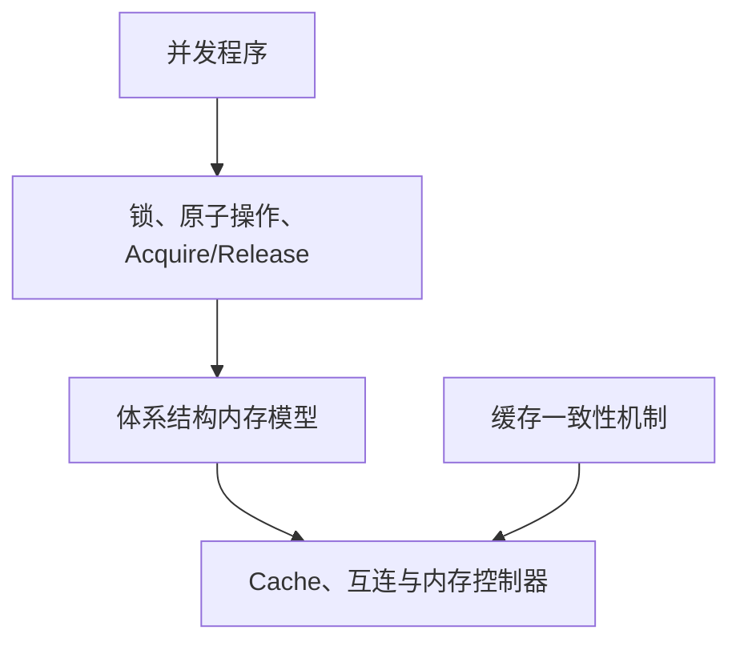

# 第1章\_缓存一致性问题与缓存行

MESI 是理解多核处理器缓存一致性的经典模型。它描述一条缓存行在多个处理器缓存中的所有权、共享关系和新旧状态，回答的是：当多个 CPU 缓存了同一物理地址的数据时，硬件怎样避免它们长期使用相互矛盾的副本。

学习 MESI 时必须先划清三个边界：

- MESI 管理的是缓存行，不是 C 语言变量；
- MESI 解决缓存一致性问题，不直接规定不同地址的访问顺序；
- Armv8-A 和 Armv9-A 定义架构行为，但不强制具体处理器只能实现经典 MESI。

## 1.1\_概念边界与问题背景

### 1.1.1\_先区分一致性与内存序

“缓存一致性”和“内存一致性模型”经常被混用，但二者解决的问题不同。

| 概念 | 主要问题 | 典型机制 |
| --- | --- | --- |
| 缓存一致性（Cache Coherence） | 同一内存位置的多个缓存副本如何保持一致 | MESI、MOESI、目录协议、Snoop |
| 内存序（Memory Ordering） | 多个内存访问可以按什么顺序被其他 CPU 观察 | Acquire/Release、DMB、`smp_mb()` |
| 软件同步 | 程序如何建立互斥、发布与消费关系 | 锁、原子操作、RCU、内存屏障 |

可以把它们的关系理解为：



缓存一致性保证针对同一缓存行的写入能够传播并使旧副本失效；内存序则约束多个访问之间的可观察顺序。前者成立，并不意味着后者自动满足程序需要。

### 1.1.2\_为什么多核缓存需要一致性协议

假设内存中的 `X` 初始为 `10`，CPU0 和 CPU1 都读取了它：

```text
CPU0 Cache：X = 10
CPU1 Cache：X = 10
内存：       X = 10
```

如果 CPU0 把 `X` 改成 `20`，写回缓存（Write-back Cache）通常不会立即把新值写入主存：

```text
CPU0 Cache：X = 20
CPU1 Cache：X = 10
内存：       X = 10
```

此时硬件必须知道：

- 哪个副本包含最新数据；
- 哪些副本仍然可以读取；
- 哪个 CPU 拥有写权限；
- 其他 CPU 再次访问时应从哪里取得最新数据。

MESI 用缓存行状态和一致性事务表达这些信息。它的目标不是让主存时刻保持最新，而是让一致性系统始终能够定位最新副本，并阻止 CPU 使用已经失效的旧副本。

### 1.1.3\_一致性的粒度是缓存行

MESI 管理的基本单位通常是 Cache Line，而不是单个变量。很多处理器使用 64 字节缓存行，但具体大小由实现决定。

```c
struct shared_data {
    int ready;
    int value;
};
```

即使 CPU 只修改 `ready`，硬件转移所有权或使副本失效时，处理的也是包含 `ready` 和 `value` 的整条缓存行。这一事实既解释了缓存一致性的工作方式，也解释了后文的伪共享问题。

下一篇：[MESI 状态机与一致性事务](P02_MESI_状态机与一致性事务.md)。
