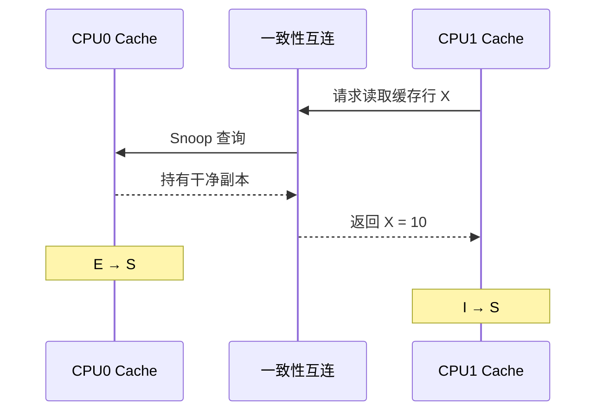
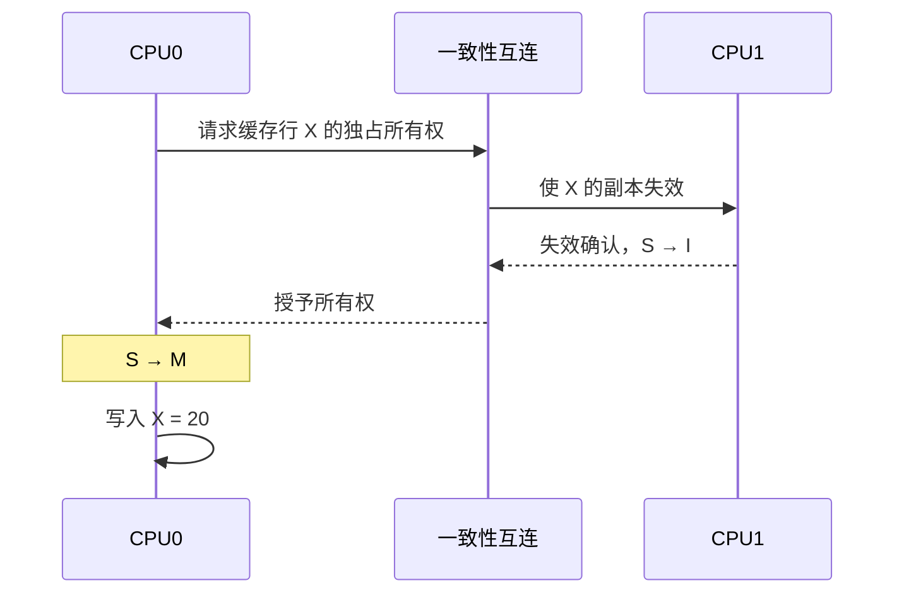
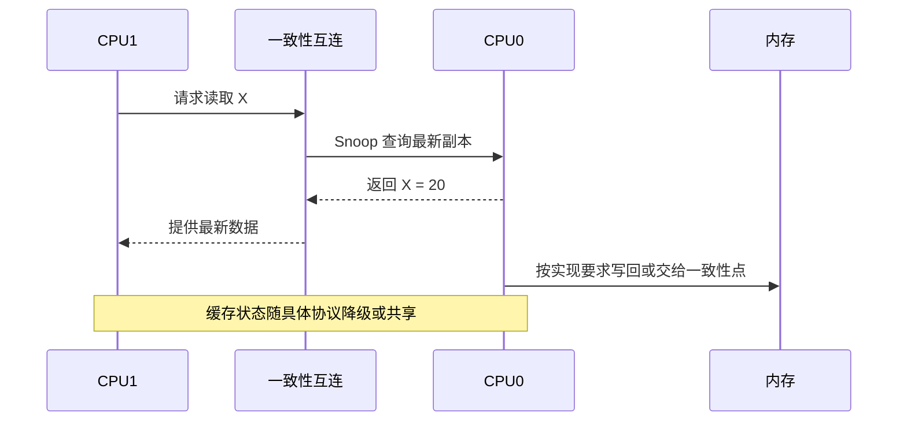
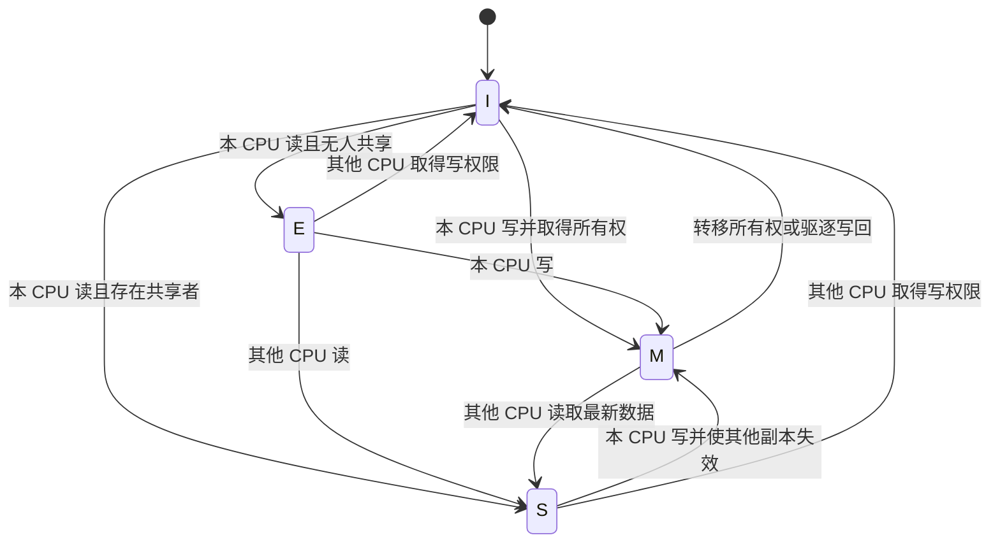

# 第2章\_MESI\_状态机与一致性事务

## 2.1\_MESI状态与一致性事务

### 2.1.1\_MESI的四种稳定状态

MESI 由四种状态的英文首字母组成：Modified、Exclusive、Shared 和 Invalid。

| 状态 | 含义 | 可读取 | 可直接写入 | 其他缓存可有有效副本 | 主存副本 |
| --- | --- | ---: | ---: | ---: | --- |
| M（Modified） | 独占且已修改 | 是 | 是 | 否 | 可能已经过期 |
| E（Exclusive） | 独占但未修改 | 是 | 是 | 否 | 与缓存一致 |
| S（Shared） | 多个缓存可共享 | 是 | 否 | 是 | 经典 MESI 中与缓存一致 |
| I（Invalid） | 当前副本无效 | 否 | 否 | 不限制 | 对本缓存无意义 |

#### (1)\_Modified

`M` 表示当前缓存拥有唯一有效且已经修改的副本。最新数据位于该缓存中，主存可能仍是旧值。缓存行被驱逐或响应其他 CPU 的一致性请求时，脏数据必须被写回或转交到系统认可的一致性位置。

```text
CPU0：M，X = 20
CPU1：I
内存：   X = 10
```

#### (2)\_Exclusive

`E` 表示当前缓存拥有唯一有效副本，而且数据尚未被修改。由于其他缓存没有有效副本，本 CPU 第一次写入时通常可以在本地完成 `E → M`，不必先广播失效请求。

```text
CPU0：E，X = 10
CPU1：I
内存：   X = 10
```

#### (3)\_Shared

`S` 表示多个缓存可以持有相同的干净副本。CPU 可以读取它，但要写入之前必须先取得独占所有权，并使其他缓存中的副本失效。

```text
CPU0：S，X = 10
CPU1：S，X = 10
内存：   X = 10
```

#### (4)\_Invalid

`I` 表示缓存行在逻辑上无效。缓存 SRAM 中可能仍残留旧比特，但处理器不能把它们作为有效数据返回；下一次访问必须重新发起请求。

```text
CPU0：M，X = 20
CPU1：I，X = 10  ← 物理内容可能仍在，但已经不可使用
```

### 2.1.2\_一次完整的状态转换

下面用两个 CPU 对同一缓存行的读写说明 MESI 的核心过程。图中的状态是教学用的稳定状态，实际微架构还会加入等待数据、等待失效确认等瞬态状态。

#### (1)\_CPU0首次读取

初始时两个缓存都没有有效副本：

```text
CPU0：I
CPU1：I
内存：X = 10
```

CPU0 读取 `X` 并发生 Cache Miss。如果一致性系统确认没有其他有效副本，CPU0 可以获得 `E`；有些实现也可能保守地授予共享状态，因此不能把“首次读取必然得到 E”当作软件可依赖的规则。

```text
CPU0：E，X = 10
CPU1：I
内存：   X = 10
```

#### (2)\_CPU1随后读取

CPU1 发起共享读请求后，CPU0 的独占副本变为共享副本：

```text
CPU0：E → S
CPU1：I → S
```



#### (3)\_CPU0取得写权限

CPU0 不能直接修改 `S` 状态的缓存行。它必须发起升级或所有权请求，等待其他共享副本失效后再写入：



结果是：

```text
CPU0：M，X = 20
CPU1：I
内存：   X = 10
```

#### (4)\_CPU1再次读取

CPU1 再次读取时不能使用本地无效副本。由于最新数据位于 CPU0 的 `M` 缓存行中，一致性系统必须从拥有者或一致性点取得 `20`，而不能直接返回主存中的旧值 `10`。



### 2.1.3\_简化状态机与一致性事务



一致性请求在不同协议中名称并不完全相同，但可以抽象为两类：

- 共享读：只请求可读副本，允许其他 CPU 继续持有副本；
- 所有权请求：请求可写的唯一副本，同时使其他副本失效。

常见资料可能把后一类操作称为 Read For Ownership、Read Unique 或 Read Exclusive。这些名称来自不同总线或互连语境，不应机械地当成同一协议中的固定命令。

真实硬件还存在 `IS`、`SM`、`MI` 等瞬态状态，用于表示请求已发出但数据、权限或确认尚未全部到达。MESI 的四个字母主要描述便于理解的稳定状态，并不是完整的微架构状态机。

上一篇：[缓存一致性问题与缓存行](P01_缓存一致性问题与缓存行.md)。

下一篇：[Store Buffer、内存序与伪共享](P03_Store_Buffer_内存序与伪共享.md)。
