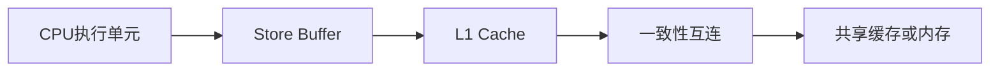
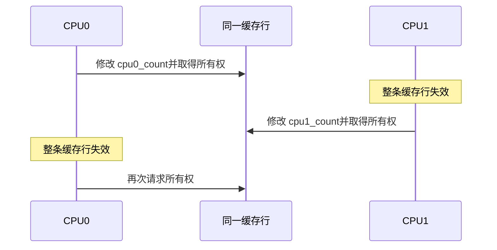

# 第3章\_Store\_Buffer\_内存序与伪共享

## 3.1\_内存序与性能影响

### 3.1.1\_MESI不等于内存屏障

考虑经典的消息传递：

```c
/* CPU0 */
data = 42;
ready = 1;

/* CPU1 */
if (ready == 1)
    value = data;
```

缓存一致性可以分别维护 `data` 和 `ready` 所在缓存行的新旧状态，却不必保证 CPU1 按源代码顺序观察到这两个地址的写入。Store Buffer、乱序执行和互连中的独立事务都可能影响观察顺序。

Linux 内核中可以用 Release/Acquire 建立发布与消费关系：

```c
/* CPU0：先初始化数据，再发布 ready。 */
data = 42;
smp_store_release(&ready, 1);

/* CPU1：看到 ready 后，才能读取已发布的数据。 */
if (smp_load_acquire(&ready))
    value = data;
```

这里的职责分工是：

- MESI 一类机制保证同一缓存行不会长期存在相互矛盾的有效副本；
- Arm 内存模型规定 Load/Store 可以怎样重排和被观察；
- Acquire/Release 或内存屏障为程序建立所需的先后关系。

### 3.1.2\_StoreBuffer为何影响可见性

处理器通常不会让执行流水线一直等待缓存行所有权和一致性事务完成，而是先把写入放入 Store Buffer：



因此，“写指令已经执行”不等于“其他 CPU 已经能够观察到该写入”。MESI 管理缓存行状态和所有权，内存屏障则约束写缓冲、缓存访问和其他内存操作之间的顺序。

### 3.1.3\_伪共享与缓存行抖动

两个线程即使修改不同变量，只要变量位于同一缓存行，也会竞争整条缓存行的写权限：

```c
struct counters {
    int cpu0_count;
    int cpu1_count;
};
```

```text
| cpu0_count | cpu1_count | 其余数据…… |
|<------------- 同一 Cache Line ------------->|
```

CPU0 写入后，CPU1 的整条缓存行副本失效；CPU1 随后写入时又会反向夺取所有权。缓存行在两个 CPU 之间反复迁移，这就是 False Sharing（伪共享），其外在表现也常被称为 Cache Line Bouncing。



常见优化方法包括：

- 把不同 CPU 高频写入的数据分散到不同缓存行；
- 使用 per-CPU 数据减少共享写热点；
- 避免多个核反复写入同一全局计数器；
- 只在测量证明有必要时增加缓存行对齐或填充。

Linux 内核提供 `____cacheline_aligned`、`____cacheline_aligned_in_smp` 等对齐标记，但手工填充不能硬编码假设所有平台的缓存行都是 64 字节。

上一篇：[MESI 状态机与一致性事务](P02_MESI_状态机与一致性事务.md)。

下一篇：[Arm ACE、CHI 与一致性域](P04_ARM_ACE_CHI_与一致性域.md)。
