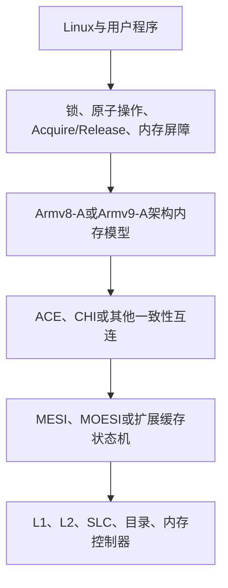
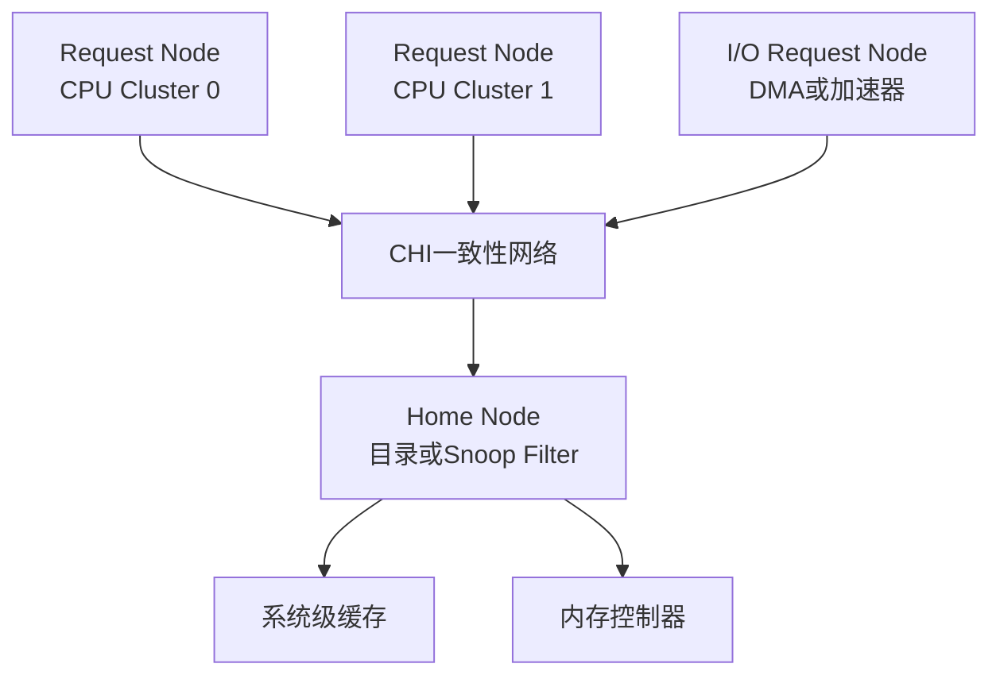
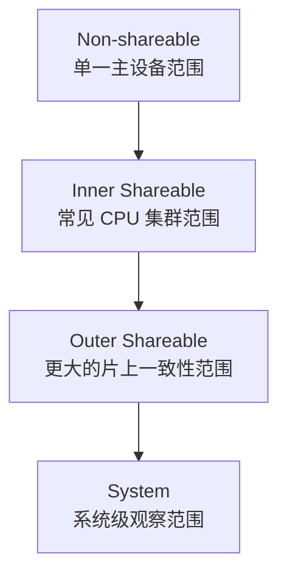
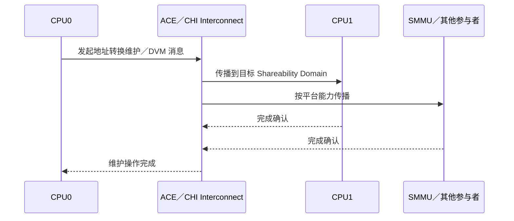

# 第4章\_ARM\_ACE\_CHI\_与一致性域

## 4.1\_Arm多核系统中的实现关系

### 4.1.1\_Armv8与Armv9没有规定必须使用MESI

Armv8-A 和 Armv9-A 是 A-profile 体系结构版本，定义指令集、异常模型、内存模型以及软件可观察的行为。具体 CPU 或 SoC 可以使用 MESI、MOESI、目录式协议或厂商扩展状态机，只要最终满足体系结构要求。

因此，下面的等式并不成立：

```text
Armv8 = MESI
Armv9 = MOESI
```

更准确的层次关系是：



这张图用于区分抽象层次，并不表示每个具体系统都严格按同一方向逐层实现。

### 4.1.2\_ACE与CHI负责传递一致性事务

Arm SoC 常通过一致性互连在 CPU Cluster、系统级缓存和其他主设备之间交换请求、响应、Snoop 与数据。

#### (1)\_ACE

AMBA ACE 是 AXI 的一致性扩展，可让具有缓存的主设备参与硬件一致性。ACE-Lite 面向不保存完整一致性缓存状态、但需要发起一致性访问的 I/O 主设备。

ACE 使用的状态语义比经典四状态 MESI 更丰富，例如 UniqueClean、UniqueDirty、SharedClean 和 SharedDirty。它们可以借助 MESI/MOESI 理解，但不应与 MESI 四个字母逐项等同。

#### (2)\_CHI

AMBA CHI 面向规模更大的多核和异构系统，把 Request、Response、Snoop 与 Data 等通道分离，并通过 Home Node、目录或 Snoop Filter 管理缓存行的位置和所有权。



目录记录某条缓存行可能位于哪些节点，使互连能够定向发送 Snoop，而不必无条件广播给所有 CPU。MESI/MOESI 描述“缓存行处于什么状态”，ACE/CHI 则更侧重“请求、失效、数据和所有权怎样在系统中传递”。

### 4.1.3\_CPU一致性与DMA一致性的边界

CPU 集群内部保持一致，并不代表所有 DMA 设备都会自动参与同一个一致性域。设备是否具有硬件一致性能力，取决于 SoC 互连、IOMMU、设备端口和平台配置。

Linux 驱动不能仅凭“CPU 使用 MESI”就跳过 DMA API。驱动仍应使用 `dma_alloc_coherent()`、`dma_map_*()`、`dma_sync_*()` 等接口表达设备访问方向和所有权转换，由体系结构代码处理一致或非一致平台之间的差异。

### 4.1.4\_扩展协议为何存在

经典 MESI 便于教学，但现代处理器通常需要更丰富的状态和事务：

- MOESI 增加 Owned，允许某个缓存持有脏数据并与其他缓存共享；
- MESIF 增加 Forward，指定共享副本中的响应者；
- 目录协议记录缓存行持有者，降低大规模系统中的广播成本；
- 实际微架构还会加入大量瞬态状态处理并发事务。

这些扩展没有改变核心问题：硬件仍需追踪最新数据、读共享者和写所有者，并在权限转移时正确处理失效与数据传递。

## 4.2\_Shareability\_Domain\_与\_DVM

Arm 的 Shareability 属性限定一次内存访问需要在哪个范围内参与一致性和屏障传播。概念上可区分 Non-shareable、Inner Shareable、Outer Shareable 和 System；具体哪些主设备属于某个域由平台互连定义，不能只看 CPU 指令名称猜测。



DVM（Distributed Virtual Memory）事务传播的不是普通缓存行数据，而是地址转换与维护相关信息，例如使相关节点观察到 TLB 或地址空间维护事件。CHI/ACE 互连负责把这类消息送到应参与的节点。



缓存一致性与 DVM 都借助一致性互连，但职责不同：前者维护数据缓存行副本，后者协调分布式地址转换状态。

上一篇：[Store Buffer、内存序与伪共享](P03_Store_Buffer_内存序与伪共享.md)。

下一篇：[Snooping 与 Directory 一致性](P05_Snooping_与_Directory_一致性.md)。
