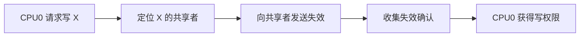
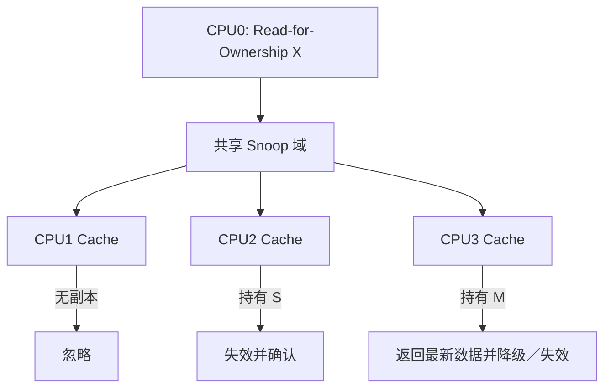
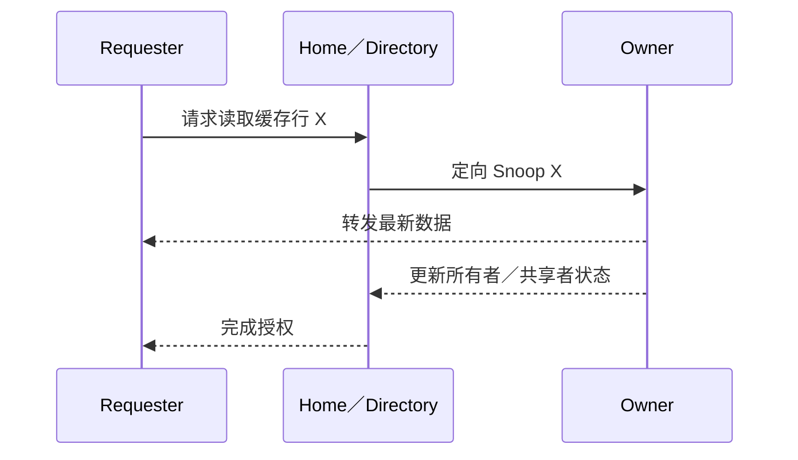

# 第5章\_Snooping\_与\_Directory\_一致性

## 5.1\_状态机还需要消息投递机制

MESI 说明缓存行应处于什么状态，却没有规定系统怎样找到其他副本。真正的实现还必须回答：读缺失发给谁、写者怎样使共享副本失效、脏数据由缓存还是内存返回。

## 5.2\_Snooping\_广播观察

Snooping 系统让一致性参与者观察共享互连上的请求。某个缓存看到与自己持有缓存行相关的读、独占读或失效事务后，更新本地状态并在需要时提供数据。

优点是结构直观、查找副本延迟低；代价是广播流量随参与者增多而增长。总线式小型 SMP 很适合这一模型，但大型多核系统无法让所有节点无条件监听每一笔事务。

## 5.3\_Directory\_定向查找

Directory 为每条缓存行或一组缓存行保存持有者信息，例如“无缓存者、一个所有者、若干共享者”。请求先到 Home/Directory，再由它定向联系相关节点。

Directory 减少广播范围，更适合 many-core、片上网络和多 Socket；代价是目录存储、查找跳数、并发事务状态和目录容量管理。目录可以精确记录共享者，也可以使用稀疏目录或 Snoop Filter，以少量误报换取更低存储成本。

## 5.4\_两者不是缓存行状态的替代品

Snooping 与 Directory 解决“消息发给谁”，MESI/MOESI/MESIF 解决“节点收到消息后处于什么权限状态”。现代系统可以在一个层级内广播，在另一个层级使用目录，不能把整台机器简单贴成单一实现。

上一篇：[Arm ACE、CHI 与一致性域](P04_ARM_ACE_CHI_与一致性域.md)。

下一篇：[MESIF、MOESI 与协议扩展](P06_MESIF_MOESI_与协议扩展.md)。
