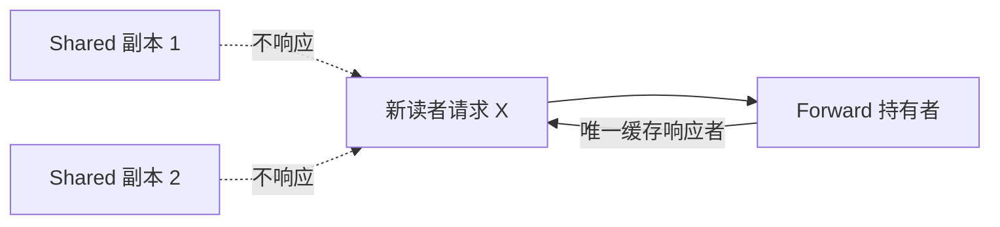
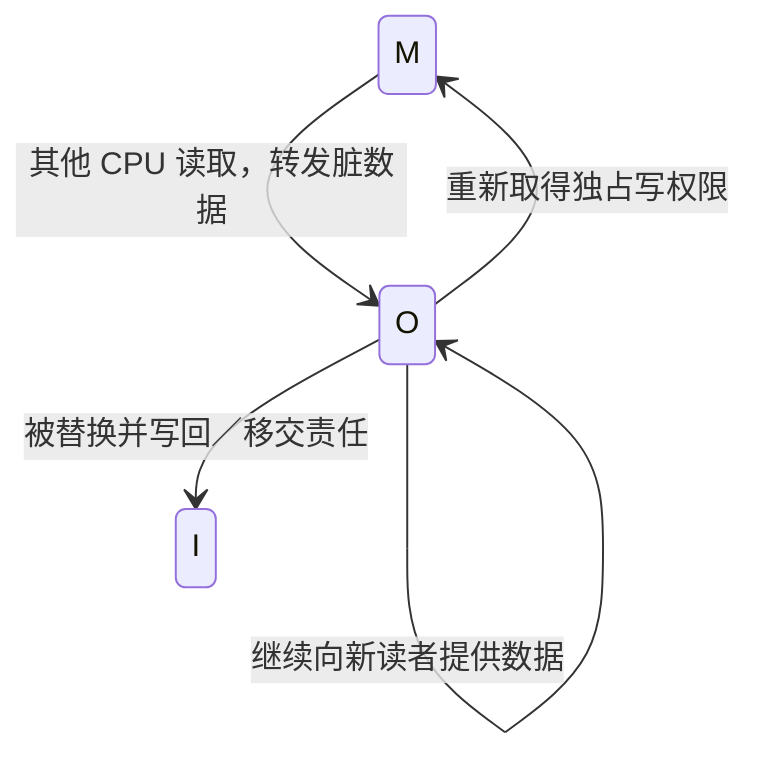
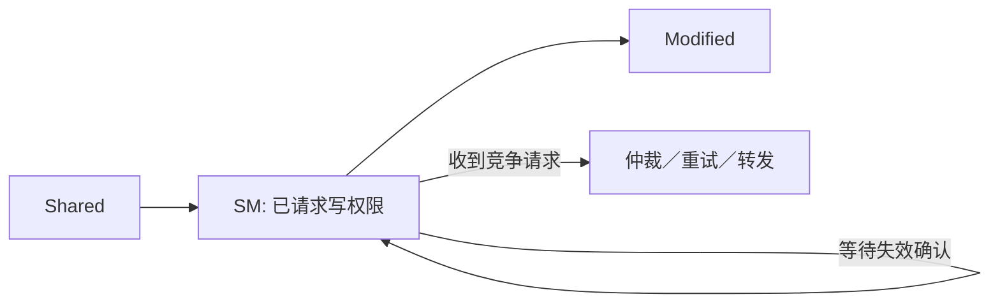

# 第6章\_MESIF\_MOESI\_与协议扩展

## 6.1\_为什么四个稳定状态还不够

MESI 足以描述基本所有权，但共享脏数据和多个共享副本同时响应会产生额外流量。MESIF 与 MOESI 分别增加 Forward 和 Owned 状态，优化的不是软件语义，而是数据由谁响应、何时必须写回内存。

## 6.2\_MESIF\_的\_Forward

多个缓存都处于 Shared 时，如果所有副本都响应同一读请求，会产生重复响应。Forward 从共享者中指定一个首选转发者：

F 仍是干净共享副本，内存通常也是最新的。它主要减少共享数据的响应仲裁和重复流量。

## 6.3\_MOESI\_的\_Owned

Owned 表示某缓存持有最新的脏数据，同时允许其他缓存持有 Shared 副本。Owner 负责响应请求并最终写回，因此不必在第一次共享时立即把脏数据写回内存。

此时必须牢记：内存可能不是最新副本，Owner 才承担最新数据责任。Owned 与 Exclusive 不同，前者可被共享且为脏，后者独占且与内存一致。

## 6.4\_稳定状态之外还有瞬态状态

真实控制器还需要表示“已发请求、等待数据、等待失效确认、发生冲突重试”等瞬态状态。例如从 S 升级到 M 不是瞬时动作，在全部失效确认返回前不能让本地写入对外宣称完成。

因此，教材状态图是稳定状态的抽象，不等于芯片 RTL 的全部状态机。

上一篇：[Snooping 与 Directory 一致性](P05_Snooping_与_Directory_一致性.md)。

下一篇：[LLC 包含策略与缓存写策略](P07_LLC_包含策略与缓存写策略.md)。
