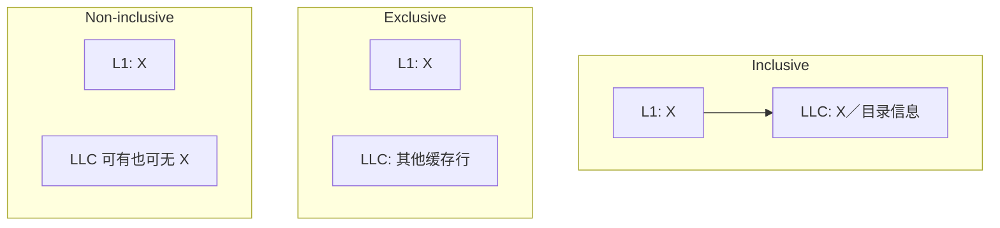

# 第7章\_LLC\_包含策略与缓存写策略

## 7.1\_包含关系回答上层副本在哪里

多级缓存除了一致性状态，还要定义 L1/L2 的缓存行与 LLC 之间是否存在包含关系。

| 策略 | 基本约束 | 优势 | 代价 |
| --- | --- | --- | --- |
| Inclusive | 上层缓存行在 LLC 中也有对应项 | LLC 标签可辅助定位上层副本 | LLC 驱逐可能反向驱逐上层，重复占用容量 |
| Exclusive | 同一数据尽量只处于一个层级 | 提高总有效容量 | 层级间搬运与状态管理更复杂 |
| Non-inclusive/non-exclusive | 不强制包含或排斥 | 设计更灵活 | 不能仅凭 LLC 命中与否判断上层是否持有 |

“LLC 不包含数据”不代表系统没有目录信息；数据阵列与 Snoop Filter/Directory 标签可以分离实现。

## 7.2\_Write-through\_与\_Write-back

Write-through 在写缓存时同步把数据传给下一层，简化下层最新性判断但增加写流量。Write-back 只把本层标记为脏，在驱逐、降级或一致性请求需要时才传递数据，降低带宽压力但必须追踪最新副本。

## 7.3\_Write-allocate\_与\_No-write-allocate

写缺失时，Write-allocate 先把缓存行取入本地再修改，适合后续仍会访问该行；No-write-allocate 则让写请求绕过本层或直接传给下层，避免一次性流式写污染缓存。

这些策略可以组合，例如常见的 Write-back + Write-allocate，但不能从“使用 MESI”推导出唯一写策略。协议权限与缓存填充/写回策略属于相互配合但不同的设计维度。

## 7.4\_反向失效为何影响性能

Inclusive LLC 驱逐 X 时，必须先确保私有缓存中的 X 不再有效，否则 LLC 的目录意义可能失真。容量冲突因此可能变成跨核失效；这也是分析 LLC 容量、共享压力和尾延迟时不能只看命中率的原因。

上一篇：[MESIF、MOESI 与协议扩展](P06_MESIF_MOESI_与协议扩展.md)。

下一篇：[ccNUMA 与多 Socket 一致性](P08_ccNUMA_与多_Socket_一致性.md)。
