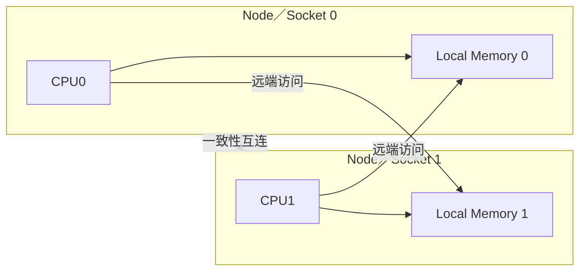
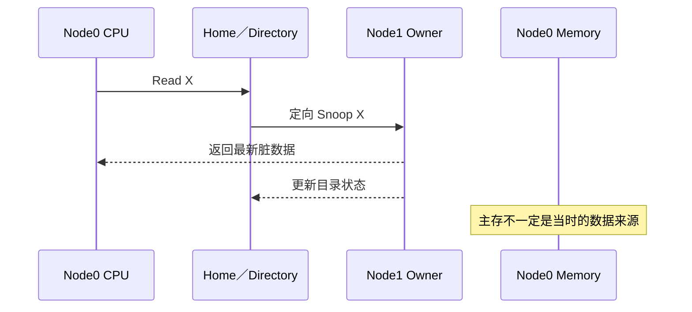

# 第8章\_ccNUMA\_与多\_Socket\_一致性

## 8.1\_一致不等于等距

ccNUMA 让所有 CPU 可以访问统一物理地址空间，并由缓存与系统互连维持一致性；但访问本地内存和远端内存的延迟、带宽与互连占用不同。

一致性回答“读到的值是否符合缓存行协议”，NUMA locality 回答“为了得到这个值走了多远”。两者不能互相替代。

## 8.2\_一次远端脏行读取

假设物理页归属 Node 0，但最新缓存行在 Node 1 的 CPU 上且为脏：

因此“访问本地页”也不保证数据一定由本地 DRAM 返回；共享写入可能把所有权和最新数据带到远端缓存。

## 8.3\_扩展性代价

- 远端访问需要更多互连跳数和协议消息。
- 跨 Socket 写共享会引起缓存行所有权往返，通常比本 Socket 内竞争更昂贵。
- Directory 能限制 Snoop 目标，但目录容量和 Home 节点本身也可能成为压力点。
- 内存放置、线程亲和性和共享数据布局共同决定性能。

Linux 将硬件单元抽象为 NUMA node，并提供距离与内存策略；这些属于操作系统使用层。本章只建立硬件前提，进一步可阅读 [Linux NUMA 文档](https://docs.kernel.org/mm/numa.html)。

上一篇：[LLC 包含策略与缓存写策略](P07_LLC_包含策略与缓存写策略.md)。

下一篇：[CXL.cache 与设备一致性](P09_CXL.cache_与设备一致性.md)。
