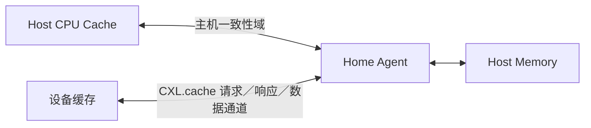
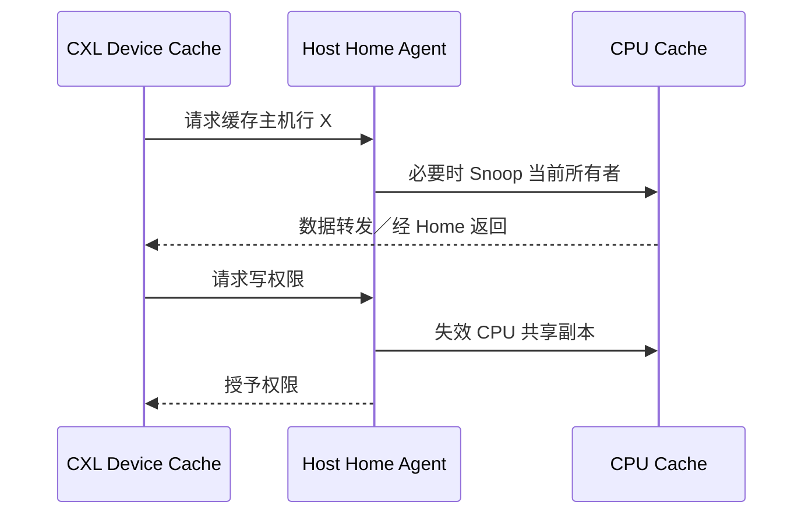

# 第9章\_CXL.cache\_与设备一致性

## 9.1\_一致性参与者从 CPU 扩展到设备

传统 PCIe 设备主要通过 DMA 访问主机内存，软件使用 DMA API 协调所有权与可见性。CXL.cache 进一步定义设备缓存主机内存时使用的缓存一致性语义，使加速器能够作为一致性参与者，而不是把所有共享都退化成显式拷贝。

## 9.2\_CXL.io\_CXL.cache\_与\_CXL.mem

| 协议 | 核心用途 |
| --- | --- |
| CXL.io | 发现、配置、错误报告以及 PCIe 风格 I/O 语义 |
| CXL.cache | 设备缓存主机内存，并参与相应一致性事务 |
| CXL.mem | 主机访问设备附加内存 |

三者解决的方向不同。支持 CXL 链路不代表设备必然实现全部协议，也不能把 `CXL.cache` 与“CPU 缓存设备内存”的 `CXL.mem` 混为一谈。

## 9.3\_设备缓存行也需要权限转换

设备读取主机缓存行后可能保留副本；CPU 随后写入时，Home Agent 必须根据一致性模型探测或失效设备副本。设备希望修改缓存行时，也必须取得相应写权限，不能绕过主机一致性控制。

## 9.4\_它没有消除软件协议

CXL.cache 扩大了硬件一致性域，但设备驱动仍需处理命令完成、对象生命期、错误恢复、安全隔离和设备重置。硬件缓存一致性也不等于所有 MMIO、doorbell 和设备内部状态天然满足软件所需顺序。

版本细节以 [CXL Consortium 发布的规范](https://computeexpresslink.org/cxl-specification/)为准。本章只建立协议分层，不绑定某一代链路编码或设备类型。

上一篇：[ccNUMA 与多 Socket 一致性](P08_ccNUMA_与多_Socket_一致性.md)。

下一篇：[协议边界与学习核对](P10_协议边界与学习核对.md)。
