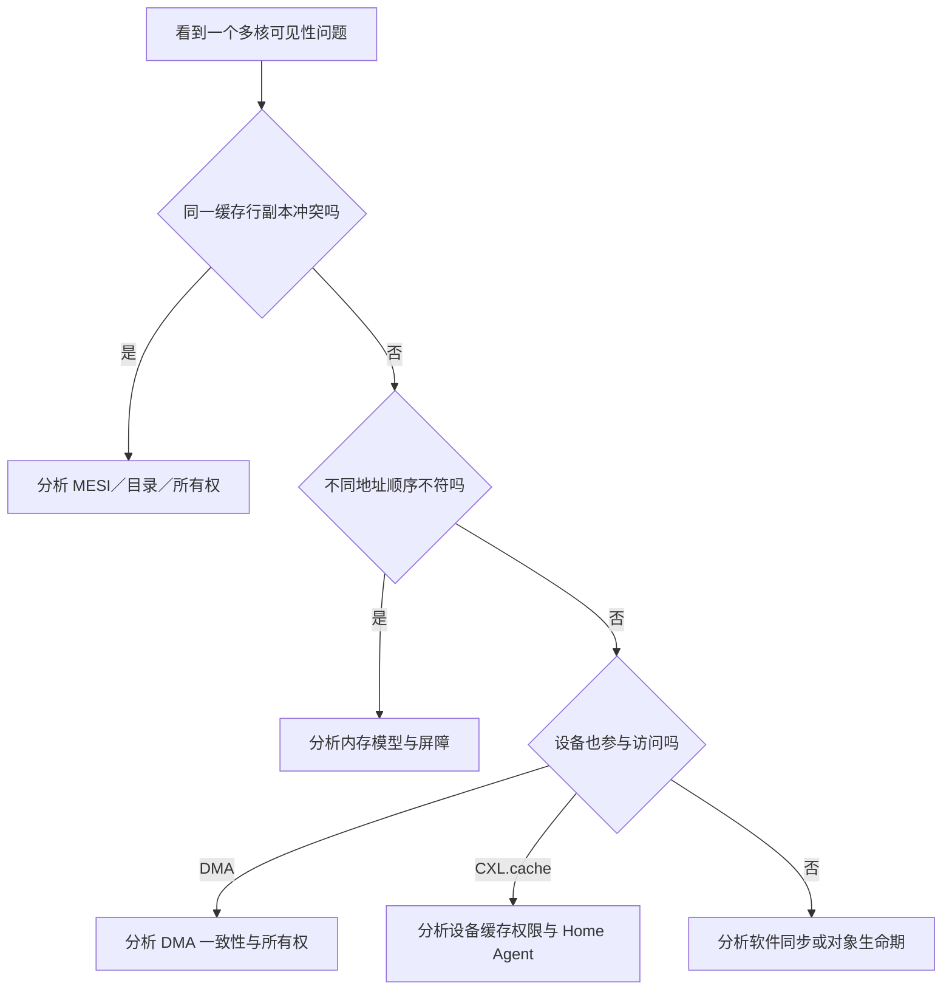

# 第10章\_缓存一致性协议边界与学习核对

## 10.1\_核心结论

1. MESI/MOESI/MESIF 管理缓存行副本、最新数据责任和读写权限。
2. Snooping/Directory 解决一致性消息怎样定位其他副本。
3. Inclusive/Exclusive 等策略描述缓存层级之间的内容关系，不等于一致性状态。
4. ACE/CHI/CXL.cache 等互连协议负责在更大的系统范围传输一致性事务。
5. 缓存一致性不等于内存顺序，更不等于 C/C++ 对象的业务不变量。
6. CPU 一致性域扩大到 DMA 或 CXL 设备后，软件仍须遵守相应 API、命令和生命期协议。

## 10.2\_学习核对

- 能否解释为什么 M 状态下主存可能不是最新数据？
- 能否区分缓存行状态与 Snooping/Directory 消息投递？
- 能否说明 MESI 为什么不能替代 acquire/release 或内存屏障？
- 能否解释伪共享为什么没有数据竞争也可能很慢？
- 能否区分 LLC 包含策略、写策略和一致性协议？
- 能否说明 ccNUMA 为什么既一致又不等距？
- 能否区分 CXL.io、CXL.cache 与 CXL.mem？

## 10.3\_参考资料

- [Arm：Memory ordering](https://developer.arm.com/documentation/102336/latest/)
- [Arm：AMBA AXI and ACE Protocol Specification](https://developer.arm.com/documentation/ihi0022/latest/)
- [Arm：Introducing AMBA CHI](https://developer.arm.com/documentation/102407/latest/)
- [Linux：Memory Barriers](https://docs.kernel.org/core-api/wrappers/memory-barriers.html)
- [Linux：NUMA](https://docs.kernel.org/mm/numa.html)
- [CXL Consortium：CXL Specification](https://computeexpresslink.org/cxl-specification/)

上一篇：[CXL.cache 与设备一致性](P09_CXL.cache_与设备一致性.md)。
