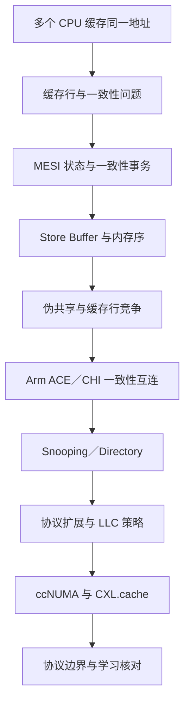

# 第1章\_缓存一致性专题大纲

## 1.1\_专题定位

本专题解释多核处理器如何在多个私有缓存之间维护同一缓存行的一致视图，并进一步区分缓存一致性、内存顺序和 DMA 一致性。重点是建立硬件运行模型，不在这里重复 Linux DMA API 或同步原语用法。

## 1.2\_建议阅读顺序

1. [缓存一致性问题与缓存行](P01_缓存一致性问题与缓存行.md)：先区分一致性、内存序和对象语义。
2. [MESI 状态机与一致性事务](P02_MESI_状态机与一致性事务.md)：跟踪读、共享、取得写权限和回写过程。
3. [Store Buffer、内存序与伪共享](P03_Store_Buffer_内存序与伪共享.md)：理解 MESI 为什么不能替代内存屏障，以及共享缓存行为何会形成热点。
4. [Arm ACE、CHI 与一致性域](P04_ARM_ACE_CHI_与一致性域.md)：区分架构语义、具体一致性协议和片上互连。
5. [Snooping 与 Directory 一致性](P05_Snooping_与_Directory_一致性.md)：理解广播观察和目录定向查找怎样定位缓存副本。
6. [MESIF、MOESI 与协议扩展](P06_MESIF_MOESI_与协议扩展.md)：理解 Forward、Owned 和瞬态状态解决的问题。
7. [LLC 包含策略与缓存写策略](P07_LLC_包含策略与缓存写策略.md)：区分 Inclusive、Exclusive、写回、写直达和写分配。
8. [ccNUMA 与多 Socket 一致性](P08_ccNUMA_与多_Socket_一致性.md)：解释一致但不等距的多节点系统。
9. [CXL.cache 与设备一致性](P09_CXL.cache_与设备一致性.md)：将一致性参与者从 CPU 扩展到设备缓存。
10. [协议边界与学习核对](P10_协议边界与学习核对.md)：集中复盘 CPU 一致性、DMA 一致性和扩展协议边界。

## 1.3\_专题边界

本专题已经覆盖 Snooping 与 Directory、MESIF/MOESI、Inclusive/Exclusive LLC、NUMA 一致性域和 CXL.cache。Linux DMA 映射接口、RCU 和锁的调用方式仍保留在各自专题，通过链接关联，避免把硬件协议与 Linux API 再次混写。
