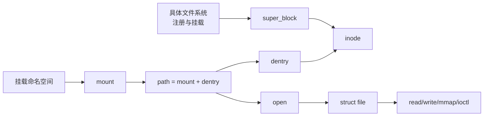

# 第1章\_VFS\_子系统大纲

## 1.1\_专题定位

VFS 是 Linux 对文件系统、路径、打开文件和 I/O 操作的统一内核抽象。它不是字符设备的辅助层，也不等于一组 `file_operations`：本专题要独立解释文件系统怎样注册和挂载、路径怎样解析、对象怎样缓存和共享、文件怎样打开、I/O 怎样分派，以及对象怎样在并发卸载下安全释放。

## 1.2\_当前阅读阶段

1. [为什么需要 VFS](P01_为什么需要_VFS.md)：从多文件系统和进程文件接口的矛盾推演统一抽象。
2. [VFS 状态与对象拓扑](P02_VFS_状态与对象拓扑.md)：先建立 superblock、mount、dentry、inode、file、fd table 的所有权和共享关系。

后续章节必须在正文实际落地后才加入本大纲，建设顺序遵循：

> 文件系统类型与挂载 → 路径查找 → 创建和打开 → fd 与 file 生命周期 → buffered/direct I/O → 页缓存与回写 → mmap → 权限和通知 → 卸载与回收 → 具体文件系统和特殊文件接入。

## 1.3\_与相邻专题的边界

- 字符设备专题完整解释 `inode->i_rdev -> chrdev_open() -> cdev -> file->f_op` 交叉链，入口见[字符设备专题](../../driver_model/character_device/大纲.md)。
- 页缓存的内存管理基础归内存管理专题；VFS 仍需解释 address_space、文件 I/O 和回写的子系统契约。
- 块层负责 bio、request 和块设备调度；VFS 解释文件 I/O 在何处交给文件系统和块层。
- 权限、安全模块和 fsnotify 分别有自身机制；VFS 解释它们插入路径和文件操作的边界。

整体职责与交叉规则见 [Linux I/O 与驱动子系统建设路线](../../../atlas/roadmaps/linux_io_driver_subsystems.md)。

## 1.4\_完成标准

完整专题最终必须让读者能够追踪：

1. 一个文件系统类型怎样产生一次挂载和 `super_block`；
2. 路径怎样跨 dentry、mount 和符号链接找到 inode；
3. inode、dentry 和 file 为什么不是同一个对象，各自怎样缓存和释放；
4. fd 怎样指向 file，`dup/fork/close` 共享什么；
5. `read/write/mmap/fsync` 怎样进入文件系统、页缓存和块层；
6. 并发重命名、删除、卸载时哪些引用、锁和序列状态保证对象有效；
7. 字符设备、管道、socket 和 procfs 等非普通磁盘文件怎样接入统一接口。
