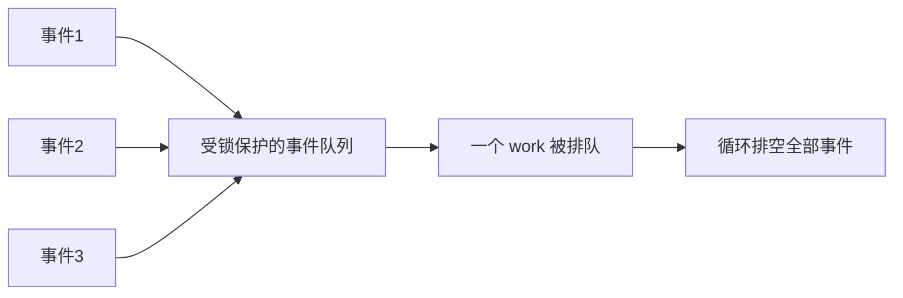

# 第1章\_工作队列

## 1.1\_工作队列的定位

工作队列把一个函数安排到 kworker 进程上下文执行。它常用来把 hardirq/softirq 中不能睡眠的后续处理移到可调度上下文，也用于普通内核路径的异步并行、延迟执行和后台维护。


工作队列不是“线程化中断”的唯一实现，也不是所有中断后逻辑的强制归宿。线程化 IRQ、tasklet/softirq、irq_work、timer 和专用 kthread 各有不同上下文与时延语义。

## 1.2\_cmwq\_的三层结构

Concurrency Managed Workqueue（cmwq）把用户可见的 workqueue 与底层 worker pool 分离：

| 层次 | 作用 |
| --- | --- |
| `work_struct` | 一次可排队执行的工作实例 |
| workqueue | 定义属性、并发限制和 flush 域 |
| worker pool / kworker | 实际排队和执行工作；由内核动态管理 worker |

bound workqueue 使用每 CPU worker pool 并保持 CPU 关联；带 `WQ_UNBOUND` 的队列使用 unbound pool，由调度器和 workqueue 的 pod/affinity 规则选择 CPU。默认 `system_wq` 不是 `WQ_UNBOUND` 队列；需要 unbound 语义时应显式选择对应系统队列或自行分配。

## 1.3\_定义与投递

```c
struct my_device {
    struct work_struct work;
    struct workqueue_struct *wq;
    atomic_t stopping;
};

static void my_workfn(struct work_struct *work)
{
    struct my_device *m = container_of(work, struct my_device, work);

    if (atomic_read(&m->stopping))
        return;

    /* 进程上下文，可以调用允许在该 worker 上睡眠的接口。 */
    handle_event(m);
}

INIT_WORK(&m->work, my_workfn);

if (!queue_work(m->wq, &m->work))
    /* work 已处于 pending 状态，本次没有新增排队实例 */;
```

`queue_work()` 的布尔返回值表示本次是否成功把 work 置为 pending 并加入队列，不表示工作已经执行完成。一个 `work_struct` 不是任意长度的事件计数器；多个事件可能合并到一次执行，若每个事件都不能丢失，应另建受保护队列或计数。

在保证 work 和 workqueue 仍然存活的前提下，`queue_work()` 可以从原子上下文调用；等待、flush 和同步取消接口通常会睡眠，只能在允许调度的上下文使用。

## 1.4\_共享系统队列与专用队列

```c
schedule_work(&m->work);                 /* system_wq */
queue_work(m->wq, &m->work);             /* 指定队列 */
```

共享系统队列适合短小、不会长期阻塞、不会造成特殊依赖的工作。下列场景考虑专用 workqueue：

- 需要独立 flush/销毁域；
- 需要 `WQ_MEM_RECLAIM` 保证内存回收前进性；
- 需要 ordered、unbound、freezable 或高优先级属性；
- 工作可能长期阻塞并影响共享系统队列上的无关用户；
- 需要明确限制同一队列的最大活动工作数。

```c
m->wq = alloc_workqueue("mydev",
                        WQ_UNBOUND | WQ_MEM_RECLAIM,
                        0);
if (!m->wq)
    return -ENOMEM;
```

`max_active` 的准确含义会受 bound/unbound 和 workqueue 属性影响；不要把它简单当成固定线程数。

## 1.5\_常用属性

| 属性 | 语义重点 | 常见误区 |
| --- | --- | --- |
| `WQ_UNBOUND` | work 不绑定提交 CPU 的 per-CPU pool | 不等于每次都换 CPU，也不保证低延迟 |
| `WQ_HIGHPRI` | 使用高优先级 worker pool | 不是实时保证 |
| `WQ_CPU_INTENSIVE` | 运行时不计入普通并发管理限制 | 不是让计算自动变快 |
| `WQ_FREEZABLE` | 系统冻结阶段参与 freeze | 不等于自动处理设备 suspend |
| `WQ_MEM_RECLAIM` | 提供 rescuer，保证回收依赖下的前进性 | 只有真正位于 reclaim 依赖链时才需要 |
| `WQ_ORDERED` | 队列上的工作按顺序、单活动执行 | 不等于跨其他队列全局有序 |

## 1.6\_delayed\_work

`delayed_work` 先由 timer 等待延迟，到期后再把内含的 `work_struct` 放入 workqueue：

```c
INIT_DELAYED_WORK(&m->poll_work, poll_workfn);
queue_delayed_work(m->wq, &m->poll_work,
                   msecs_to_jiffies(100));
```

`mod_delayed_work()` 用于把尚未到期或已排队的 delayed work 调整到新的到期时间，也可以用于周期重新安排。周期任务的回调必须先检查 stopping 状态，避免 remove 已开始后再次把自己排队。

```c
static void poll_workfn(struct work_struct *work)
{
    struct my_device *m = container_of(to_delayed_work(work),
                                       struct my_device, poll_work);

    if (READ_ONCE(m->stopping))
        return;

    poll_device(m);
    mod_delayed_work(m->wq, &m->poll_work,
                     msecs_to_jiffies(100));
}
```

## 1.7\_flush\_cancel\_与\_destroy

| 接口 | 目的 | 关键区别 |
| --- | --- | --- |
| `flush_work(work)` | 等待指定 work 的目标执行代际完成 | 不阻止其他路径稍后重新排队 |
| `flush_workqueue(wq)` | 等待该 workqueue 在 flush 边界覆盖的工作完成 | 不关闭生产者，也不是永久排空 |
| `cancel_work_sync(work)` | 取消 pending 实例；若正在运行则等待退出 | 返回后仍要阻止其他路径重新 queue |
| `cancel_delayed_work_sync(dwork)` | 同步取消 timer/pending/running delayed work | 周期回调必须遵守 stopping 协议 |
| `destroy_workqueue(wq)` | 销毁专用队列并处理其在途工作 | 调用前必须保证不会再有新提交 |

同步取消与 flush 可能睡眠，也可能等待工作函数退出。工作函数对自己调用 `flush_work()` 或 `cancel_work_sync()` 会自等待死锁；在同一受限队列中相互 flush 也可能形成依赖环，应让 lockdep 和 workqueue 警告参与验证。

## 1.8\_remove\_的正确顺序


```c
static void my_remove(struct platform_device *pdev)
{
    struct my_device *m = platform_get_drvdata(pdev);

    WRITE_ONCE(m->stopping, true);
    disable_irq(m->irq);
    synchronize_irq(m->irq);

    cancel_delayed_work_sync(&m->poll_work);
    cancel_work_sync(&m->work);
    destroy_workqueue(m->wq);
}
```

实际顺序取决于生产者：timer、IRQ、文件操作、notifier 和其他 work 都可能重新提交。核心不变量是先封住所有新提交，再等待旧工作退出，最后释放对象。

不要把 devres 当作同步协议。可以用 `devm_add_action_or_reset()` 托管专用队列销毁，但 action 的注册顺序必须保证执行时所有生产者已经停止；普通驱动也不应假定存在适用于任意内核版本的通用 `devm_work_autocancel()`。

## 1.9\_工作函数中的锁与睡眠

work function 位于进程上下文，通常可以睡眠，但仍要检查：

- 是否持有自旋锁、关闭中断或禁抢占；
- 是否运行在 reclaim 依赖链，睡眠对象会不会反向依赖本 workqueue；
- 是否持有 remove 路径等待工作退出时需要的 mutex；
- 长时间阻塞是否会拖住 ordered 或受限并发队列。

常见死锁：remove 持有 mutex 后调用 `cancel_work_sync()`，而 work function 正在等待同一 mutex。同步取消之前通常应释放工作退出所需的锁，或重新设计停止状态机。

## 1.10\_事件合并与状态设计

work 的 pending 位会合并重复提交。可靠设计常使用“队列保存事件，work 负责排空”的模式：



这样即使多次 `queue_work()` 只成功一次，事件本身仍保存在业务队列里，不会因 pending 合并而丢失。

## 1.11\_常见错误

| 错误 | 后果 |
| --- | --- |
| 把 `system_wq` 说成 unbound | 错误推导 CPU 亲和和并发行为 |
| 把 work 当事件计数器 | 重复提交合并后丢失业务事件 |
| remove 只 cancel，不阻止生产者 | cancel 返回后 work 又被排队 |
| 工作自 flush 或同步取消自己 | 自等待死锁 |
| 持 mutex 调用 cancel_sync，work 也要该 mutex | remove 与 work 死锁 |
| delayed work 回调无条件重排自己 | 卸载阶段永远取消不完 |
| 为每个小工作随意建 unbound/highpri 队列 | 调度隔离和资源开销恶化 |
| 依赖 devres 自动保证停止顺序 | 资源回收时仍可能有 work 访问对象 |

## 1.12\_核对表

- work 是一次状态处理，还是不能丢失的多个事件？
- 共享 system workqueue 是否足够，为什么需要专用属性？
- 投递路径在什么上下文，work 和 workqueue 生命周期是否仍有效？
- remove 如何阻止 IRQ、timer、用户入口和其他 work 再次提交？
- cancel/flush 是否与工作函数形成锁依赖环？
- delayed work 是否在 stopping 后停止自重排？
- work 所在对象是否直到同步取消完成后才释放？

执行上下文的前置知识参见[中断下半部机制与驱动中的选择](../irq/中断机制简介/P07_中断下半部机制与驱动中的选择.md)。
