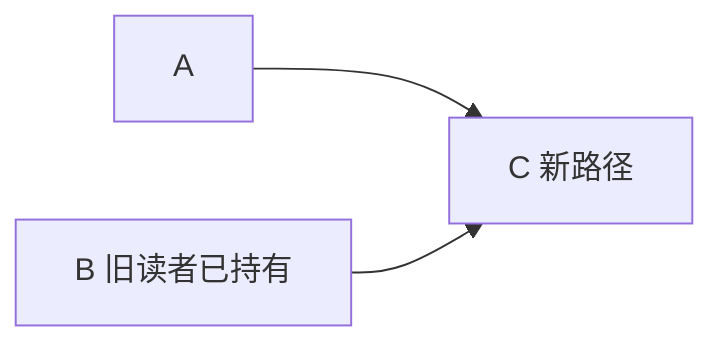
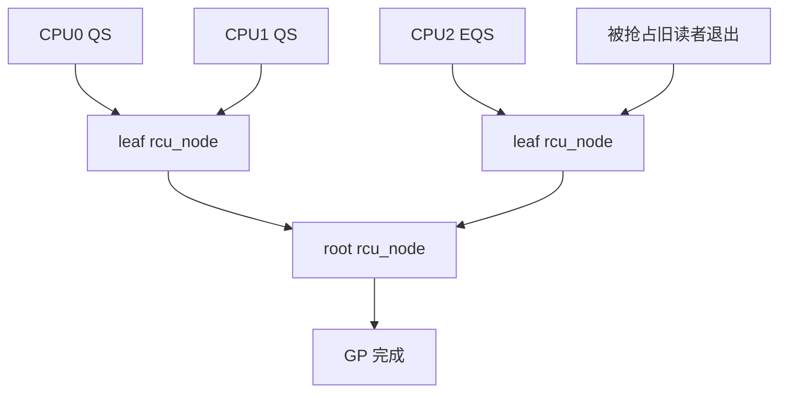

# 第4章\_并发保护与RCU机制\_多核下的读写博弈

## 4.1\_本章要回答的问题

哈希表的数组定位通常很快，真正困难的是多 CPU 同时遍历、插入和删除 hlist 时，如何同时保证：

1. 读侧不因共享锁热点失去多核扩展性。
2. 读者取得指针后，对象已完成初始化。
3. 并发删除不会破坏旧读者的遍历路径。
4. 从表中删除的节点不会在旧读者退出前释放。
5. 写者之间仍然保持结构不变量。

RCU 没有一个专用硬件单元完成这些事。它是内核软件对 CPU 缓存一致性、内存顺序、原子指针读写、调度器和每 CPU 状态的组合设计。

## 4.2\_读写锁为什么可能在多核上形成热点

读写锁即使允许多个读者同时进入，其读侧也可能需要对共享锁状态执行原子读—改—写。多 CPU 频繁写同一缓存行时，该行的可写所有权在 CPU 之间反复传递。

这个问题应准确理解为：

- 缓存一致性使所有 CPU 对同一缓存行的写入保持一致。
- 原子操作需要获得该行的可写权限，因而可能产生 cache-line bouncing。
- 数据不一定每次都回写到 DRAM；主要开销是缓存行所有权和一致性消息。
- 具体延迟不能不加测量地写成固定周期或“性能一定下降多少”。

RCU 的读侧优势是避免了“每次查找都写入同一个全局读者计数或锁字”，而不是保证没有 cache miss、没有一致性流量或“零总线交互”。

## 4.3\_RCU\_读侧到底修改了什么

`rcu_read_lock()` 不能概括成空宏。Linux 6.12.20 中：

- `CONFIG_PREEMPT_RCU=y` 时，它通过 `__rcu_read_lock()` 增加 `current->rcu_read_lock_nesting`。
- 这是当前任务 `task_struct` 中的嵌套深度，不是普通栈局部变量。
- 如果任务在读侧内被抢占，`rcu_note_context_switch()` 将它挂入 `rcu_node->blkd_tasks`，使 GP 继续等待这个任务读者。
- 非 PREEMPT_RCU 路径中，`__rcu_read_lock()` 通过 `preempt_disable()` 使读侧不跨过上下文切换。

源码入口：[`rcupdate.h`](../../../../../research/source_reading/linux/include/linux/rcupdate.h) 和 [`tree_plugin.h`](../../../../../research/source_reading/linux/kernel/rcu/tree_plugin.h)。

## 4.4\_读者写对象字段时会怎样

RCU 读侧不是硬件“只读模式”。如果读者执行 store，CPU 会正常按缓存一致性协议获取缓存行的可写权，其他 CPU 的共享副本可被失效。

但硬件只保证底层缓存一致性，不保证 C 对象的业务不变量。例如两个读者同时执行：

```c
node->packets++;
```

仍然会发生丢失更新，除非该字段使用 atomic/per-CPU 计数或锁。RCU 保护节点的可访问生命期，不自动把节点内的所有写操作变成原子操作。

## 4.5\_哈希节点的发布顺序

写者发布新 hlist 节点前，必须先完成 key、value 和链接字段初始化。RCU 链表宏通过发布—取得契约使读者不会只看到新指针，却看到未初始化的节点内容。

```c
struct bucket_entry {
	int key;
	int value;
	struct hlist_node node;
	struct rcu_head rcu;
};

new->key = key;
new->value = value;
hlist_add_head_rcu(&new->node, &bucket->head);
```

缓存一致性不能单独保证读者按源码顺序观察“对象初始化”和“链表指针发布”这两个不同地址的写入，所以必须由 RCU 发布接口建立必要顺序。

## 4.6\_并发删除时为什么不能斩断旧路径

考虑链表：

```text
A -> B -> C
```

旧读者可能已取得 B，但还没读取 `B->next`。写者将 B 从新版本链表中删除后，新读者将沿 `A -> C` 遍历；旧读者仍需要沿 `B -> C` 继续。



因此，RCU 删除宏必须在取消发布的同时保留旧读者所需的前向结构连续性。如果删除后立即清空 B 的后继指针，旧读者就会中断遍历或访问无效地址。

## 4.7\_hlist\_del\_rcu()不等于可以\_kfree()

RCU 删除路径必须分成：

```text
在写侧锁下取消节点发布
        ↓
新读者不再从 bucket 找到节点
        ↓
旧读者可能仍持有节点
        ↓
等待一个覆盖旧读者的 GP
        ↓
释放节点与读者可达的子资源
```

```c
spin_lock(&bucket->lock);
hlist_del_rcu(&entry->node);
spin_unlock(&bucket->lock);

kfree_rcu(entry, rcu);
```

`hlist_del_rcu()` 不负责写者互斥，也不负责等待 GP。这三个责任必须分开审查。

## 4.8\_Tree\_RCU\_如何判定宽限期

Tree RCU 不给每个哈希节点建立读者计数。它等待的是执行轨迹：

- 非可抢占读侧所在 CPU 经过 QS/EQS。
- PREEMPT_RCU 中在读侧内被抢占的任务退出临界区。
- idle/user/CPU offline 等状态通过 dynticks/context tracking 被观测。
- `rcu_data` 每 CPU 状态向 `rcu_node` 树逐层聚合。



`rcu_gp_kthread()` 管理 GP，`rcu_gp_init()` 初始化新 GP，`rcu_report_qs_rnp()` 逐层报告，`rcu_gp_fqs_loop()` 在必要时重新检查 EQS 或促进 CPU 经过可观测 QS。

## 4.9\_回调如何等到对应的宽限期

`call_rcu()`/`kfree_rcu()` 注册的回调不是放在一个普通 FIFO 中盲等。`rcu_segcblist` 将它们按 GP 阶段分成 DONE、WAIT、NEXT_READY 和 NEXT 等逻辑段。GP 推进时，回调逐段前移，最后由 `rcu_core()` 中的 `rcu_do_batch()` 执行。

这套机制使大量节点删除可以批量共享宽限期，而不是每删一个节点就独占一次全系统等待。

## 4.10\_一个完整的\_hlist\_RCU\_模型

```c
struct table_entry {
	int key;
	int value;
	struct hlist_node node;
	struct rcu_head rcu;
};

struct table_bucket {
	struct hlist_head head;
	spinlock_t lock;
};

static struct table_entry *lookup(struct table_bucket *bucket, int key)
{
	struct table_entry *entry;

	rcu_read_lock();
	hlist_for_each_entry_rcu(entry, &bucket->head, node) {
		if (entry->key == key) {
			/* 仅能在当前 RCU 读侧内直接使用 entry */
			rcu_read_unlock();
			return entry; /* 实际接口不应如此返回裸指针 */
		}
	}
	rcu_read_unlock();
	return NULL;
}
```

上述示例故意显示了一个常见边界：查找函数不能在退出 RCU 后返回没有独立引用的裸指针。真正接口应选择：

- 在 RCU 临界区内完成数据复制或业务判断。
- 在 RCU 内用 `kref_get_unless_zero()`/`refcount_inc_not_zero()` 安全取得长期引用。
- 由调用者持有 RCU 读侧，并用接口合同明确指针只在临界区内有效。

为避免误用，更好的最小查找示例是返回值副本：

```c
static bool lookup_value(struct table_bucket *bucket, int key, int *value)
{
	struct table_entry *entry;
	bool found = false;

	rcu_read_lock();
	hlist_for_each_entry_rcu(entry, &bucket->head, node) {
		if (entry->key == key) {
			*value = READ_ONCE(entry->value);
			found = true;
			break;
		}
	}
	rcu_read_unlock();
	return found;
}
```

## 4.11\_本章结论

1. RCU 是软件算法，没有专用 RCU 硬件。
2. 缓存一致性保证底层缓存行一致，不保证多地址发布顺序和 C 对象不变量。
3. RCU 读侧优势来自避免每次查找都写入全局共享锁状态，不是“零指令”或“零一致性流量”。
4. RCU hlist 删除必须同时保证新读者不再取得节点、旧读者遍历路径仍连续、节点在 GP 后才回收。
5. Tree RCU 通过 CPU/QS/EQS、被抢占任务、`rcu_node` 树和分段回调列表推进回收。

进一步阅读：

- [RCU 的硬件基础与内存模型](../../../synchronization/rcu/P02_RCU_的硬件基础与内存模型.md)。
- [RCU 种类与内核配置](../../../synchronization/rcu/P03_RCU_种类与内核配置.md)。
- [Tree RCU 读侧与静止状态](../../../synchronization/rcu/P04_Tree_RCU_读侧与静止状态.md)。
- [Tree RCU 宽限期与回调机制](../../../synchronization/rcu/P05_Tree_RCU_宽限期与回调机制.md)。
