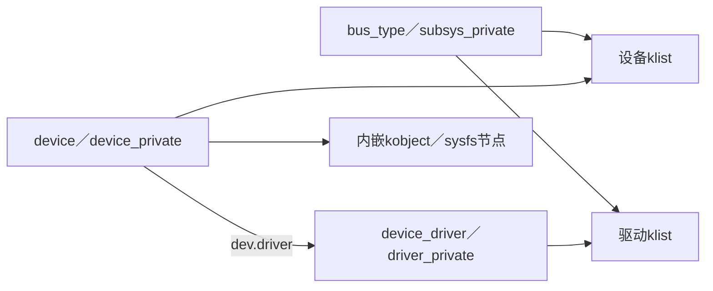

# 第4章\_Driver\_Core状态拓扑

Linux 6.12.20 将公开结构与私有运行状态分开：`device::p` 指向 `device_private`，`device_driver::p` 指向 `driver_private`，`bus_type::p` 指向 `subsys_private`。私有结构中的 klist、kset、knode 和锁承载集合与并发，不能把公开结构字段列表误当成完整状态机。

核心源码：`drivers/base/base.h`、`core.c`、`bus.c`、`driver.c`、`dd.c` 与 `include/linux/device.h`。

下一篇：[kobject、kset 与 sysfs 对象树](P05_kobject_kset与sysfs对象树.md)。
