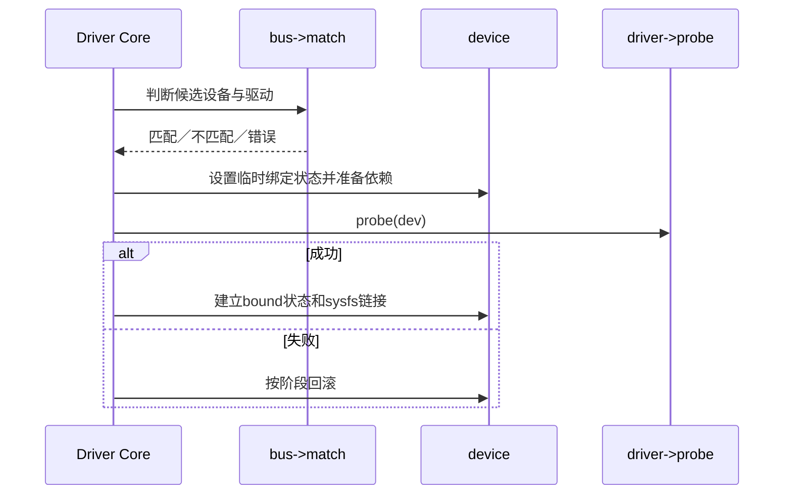

# 第8章\_匹配绑定与\_probe状态机

设备先到走 `device_attach()`，驱动先到走 `driver_attach()`；二者最终进入 `driver_match_device()` 与 `driver_probe_device()`。匹配成功只表示候选关系，`really_probe()` 成功后才建立 `dev->driver`、sysfs 双向链接并调用 `driver_bound()`。

源码见 `drivers/base/dd.c::device_attach/driver_attach/driver_probe_device/really_probe/driver_bound`。

下一篇：[deferred probe、解绑与 remove](P09_deferred_probe解绑与remove.md)。
