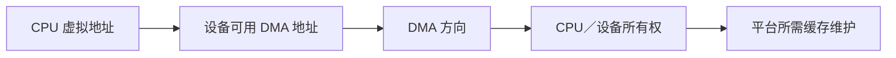
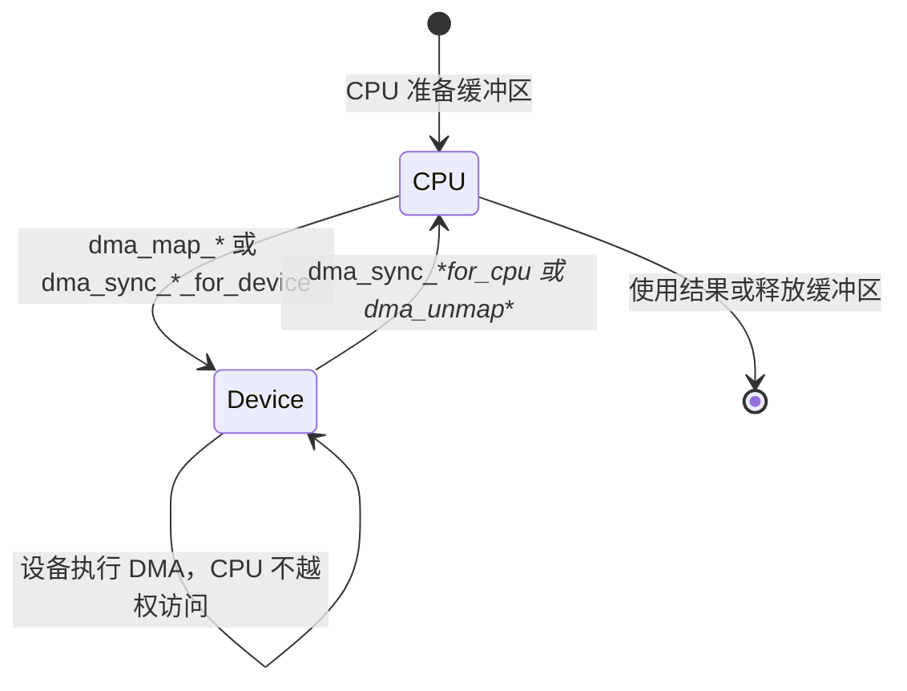
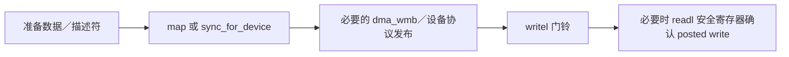
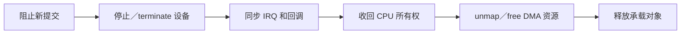

# 第1章\_DMA\_映射同步与门铃顺序

## 1.1\_DMA\_API\_同时解决四个问题

设备发起 DMA 时，驱动不能把 CPU 虚拟地址直接写给硬件。DMA API 同时表达：



| 问题 | DMA API 的职责 |
| --- | --- |
| 设备地址 | 处理物理地址、总线偏移、IOMMU 映射和设备 DMA mask |
| 方向 | 表明设备读、写或双向访问缓冲区 |
| 所有权 | 规定 CPU 和设备在什么阶段可以访问 streaming 映射 |
| 缓存维护 | 在非一致性平台执行所需 clean/invalidate 等架构操作 |

DMA 是否经过或嗅探 CPU cache 取决于平台。驱动不猜微架构，也不手写 cache flush，而是遵守 DMA API 契约。

## 1.2\_先设置设备寻址能力

```c
ret = dma_set_mask_and_coherent(dev, DMA_BIT_MASK(36));
if (ret)
    return dev_err_probe(dev, ret, "DMA mask unsupported\n");
```

streaming 和 coherent mask 可以不同；设备若对两类地址宽度要求不同，应分别使用相应接口。mask 设置失败不能继续提交可能被截断的 DMA 地址。

## 1.3\_两类主要映射模型

| 模型 | 典型接口 | 生命周期 | CPU/设备交接 |
| --- | --- | --- | --- |
| 一致性分配 | `dma_alloc_coherent()` / `dmam_alloc_coherent()` | 通常较长，返回 CPU 地址和 DMA 地址 | 不需要 `dma_sync_*()`，仍需要内存顺序 |
| streaming 映射 | `dma_map_single/page/sg()` | 一次或一段 DMA 会话 | map/sync/unmap 明确转换所有权 |

一致性分配不等于“所有访问全序”，streaming 也不等于“一定每次真正 flush cache”。API 描述语义，平台选择实现。

## 1.4\_一致性分配

```c
struct my_ring {
    struct hw_desc *cpu;
    dma_addr_t dma;
    size_t bytes;
};

ring->cpu = dmam_alloc_coherent(dev, ring->bytes,
                                &ring->dma, GFP_KERNEL);
if (!ring->cpu)
    return -ENOMEM;
```

CPU 和设备不需要显式 sync 就能观察该分配区，但多个字段的发布仍需要顺序：

```c
desc->addr = cpu_to_le64(buf_dma);
desc->len = cpu_to_le32(len);

/* 所有描述符字段先于“归设备所有”标志。 */
dma_wmb();
WRITE_ONCE(desc->flags, cpu_to_le32(DESC_OWN));
```

设备完成后，若它先写数据、最后写完成标志，CPU 观察完成标志后通常需要按协议使用 `dma_rmb()` 再消费此前字段。具体位置由描述符协议决定，不是给每个 DMA 缓冲机械添加屏障。

## 1.5\_streaming\_映射的所有权状态机



### 1.5.1\_一次映射一次传输

```c
dma_addr_t dma;

prepare_tx(buf, len);
dma = dma_map_single(dev, buf, len, DMA_TO_DEVICE);
if (dma_mapping_error(dev, dma))
    return -EIO;

program_device(dma, len);
writel(START, regs + COMMAND);

wait_for_device_completion();
dma_unmap_single(dev, dma, len, DMA_TO_DEVICE);
```

从成功 map 到 unmap，设备拥有 streaming 映射；CPU 不应访问该缓冲区，除非先按 API 执行 `dma_sync_*_for_cpu()` 收回所有权。

### 1.5.2\_保留映射并循环复用

```c
/* 设备完成后，CPU 取得所有权。 */
dma_sync_single_for_cpu(dev, dma, len, DMA_FROM_DEVICE);
consume_rx(buf, len);

/* 下一轮交还设备。 */
prepare_rx_metadata(buf);
dma_sync_single_for_device(dev, dma, len, DMA_FROM_DEVICE);
ring_doorbell();
```

sync 不结束映射，只在 CPU 与设备之间转换所有权。最终不再使用时仍调用匹配的 unmap。

## 1.6\_方向参数

方向从设备视角命名：

| 方向 | 数据主要流向 | 典型场景 |
| --- | --- | --- |
| `DMA_TO_DEVICE` | CPU → 设备读取 | 发送缓冲、只读命令表 |
| `DMA_FROM_DEVICE` | 设备写入 → CPU | 接收缓冲、采集结果 |
| `DMA_BIDIRECTIONAL` | 双向 | 设备和 CPU 都会写，只有确实需要时使用 |
| `DMA_NONE` | 调试占位 | 不能用于真实 DMA 映射 |

map、sync 和 unmap 的方向必须一致。方向影响缓存维护；填错可能造成数据损坏，而不只是性能下降。

## 1.7\_scatterlist

```c
int mapped;

mapped = dma_map_sg(dev, sgl, nents, DMA_TO_DEVICE);
if (!mapped)
    return -EIO;

/* 用 mapped 个 DMA 段编程硬件，遍历时使用 for_each_sg 等 DMA 语义。 */

dma_unmap_sg(dev, sgl, nents, DMA_TO_DEVICE);
```

必须区分：

- `nents` 是传给 `dma_map_sg()` 的原始 SG 项数；
- 返回的 `mapped` 是合并后供设备编程的 DMA 段数；
- unmap 和 sync 接口按 DMA API 要求使用原始 `nents`，不能误传 `mapped`；
- 硬件描述符使用每个映射段的 `sg_dma_address()` 和 `sg_dma_len()`。

## 1.8\_DMA\_数据发布与\_MMIO\_门铃

“缓存所有权”“普通内存顺序”“MMIO 写”和“posted write 完成”是四件事：



不能建立一条脱离上下文的“所有门铃前必须 `wmb()`”规则：

- 一致性描述符用所有权位发布时，常由 `dma_wmb()` 排序字段和所有权位；
- streaming 缓冲先完成 map/sync 所有权交接；
- `writel()` 与 `writel_relaxed()` 对普通内存的排序语义不同，选择 relaxed 时必须明确由什么补足；
- `writel()` 返回不一定表示 posted write 已到设备，需要完成确认时读取同一设备的安全寄存器或使用设备规定方法。

详细语义参见 [MMIO 访问顺序](../mmio/P01_MMIO_访问顺序与屏障.md)。

## 1.9\_IOMMU\_与一致性不是一回事

| 机制 | 主要职责 |
| --- | --- |
| IOMMU/SMMU | 把设备 DMA 地址翻译到内存并实施隔离、权限和域管理 |
| ATS | 允许设备缓存或请求地址翻译，减少翻译开销 |
| 一致性互联/架构映射 | 决定 CPU cache 与设备访问怎样保持一致 |

启用 IOMMU 不自动使 DMA cache coherent；硬件 coherent 也不取消 DMA 地址映射和方向契约。驱动始终通过 DMA API，不能把 CPU 物理地址直接交给设备。

## 1.10\_DMAengine\_边界

DMAengine 管理 DMA 控制器通道、描述符和提交回调，但客户端缓冲区的映射责任取决于具体 API 和子系统约定。不能笼统说“用了 DMAengine 就自动 map”，也不能无条件重复映射框架已经接管的缓冲区。

使用前核对对应 DMAengine client 文档：谁建立映射、回调表示哪一级完成、terminate 是否同步、描述符和缓冲区何时可以释放。

## 1.11\_停止与释放



`dma_unmap_*()` 只能在设备不再访问映射后调用。unmap 之后 DMA 地址失效，绝不能再把它写入门铃启动设备。

devm/dmam 只托管最终资源释放，不会替驱动停止 DMA、同步中断、转换所有权或阻止新提交。remove 仍要先完成停机协议。

## 1.12\_常见错误

| 错误 | 后果 |
| --- | --- |
| 把 CPU 虚拟/物理地址直接给设备 | IOMMU、总线偏移或 mask 下地址错误 |
| 忽略 `dma_mapping_error()` | 用无效 DMA 地址启动设备 |
| 设备拥有 streaming 缓冲时 CPU 继续访问 | 数据竞争和缓存不一致 |
| unmap 后才写门铃 | 设备访问失效映射 |
| map/unmap/sync 方向不一致 | 错误缓存维护与数据损坏 |
| SG 用 mapped 数调用 unmap | 映射释放错误 |
| 把 coherent 理解成全序 | 描述符字段和所有权位观察顺序错误 |
| 把 `wmb()` 当 cache flush | 未完成 DMA 所有权转换 |
| 认为 IOMMU 等于 cache coherent | 混淆地址翻译与数据一致性 |
| 只依赖 dmam 自动释放 | 设备仍 DMA 时资源被回收 |

## 1.13\_核对表

- DMA mask 是否在分配和映射前正确设置？
- 缓冲区使用一致性分配还是 streaming 映射，原因是什么？
- 方向是否从设备视角正确填写并在所有 API 中保持一致？
- streaming 缓冲当前由 CPU 还是设备拥有？
- map 和 SG 返回值是否检查，原始 nents 与 mapped 段数是否区分？
- 门铃前的数据发布顺序由哪个 DMA/MMIO 原语建立？
- remove 是否先停止设备和回调，再 unmap/free？
