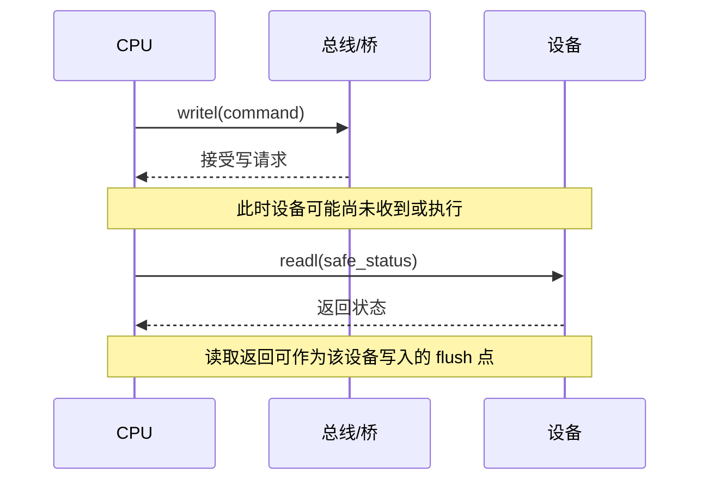

# 第1章\_MMIO\_访问顺序与屏障

## 1.1\_先区分三种顺序问题

驱动里的“顺序”至少有三层，不能用一个 `wmb()` 笼统解释：


| 问题 | 典型对象 | 常用工具 |
| --- | --- | --- |
| 防止编译器合并或删除一次访问 | 普通共享变量 | `READ_ONCE()`、`WRITE_ONCE()` |
| 多个 CPU 之间建立 happens-before | 普通内存 | `smp_load_acquire()`、`smp_store_release()`、`smp_mb()` 等 |
| 约束普通内存和 MMIO 的观察顺序 | 设备寄存器、DMA 描述符 | `readl()`、`writel()`、`*_relaxed()` 与架构规定的屏障 |
| 确认 posted write 已到达设备 | 设备寄存器 | 读取同一设备的安全寄存器，或使用设备规定的确认方法 |

`smp_*()` 只承诺 SMP CPU 之间的内存顺序，不能自动替代设备 I/O 访问器。反过来，MMIO 访问器也不是保护软件临界区的锁。

## 1.2\_为什么必须使用访问器

MMIO 地址应通过 `ioremap()` 等接口获得，并使用 `readb/readw/readl/readq`、`writeb/writew/writel/writeq` 或其架构支持的变体访问。不要把 `__iomem` 指针当普通内存指针直接解引用，因为：

- 不同体系结构的设备端序和访问指令不同；
- 编译器无法仅凭普通指针理解设备访问的副作用；
- 某些平台需要在访问器中加入架构相关的顺序约束；
- `sparse` 可利用 `__iomem` 检查地址空间误用。

## 1.3\_普通访问器与\_relaxed\_访问器

`readl()/writel()` 相比 `readl_relaxed()/writel_relaxed()`，通常提供更强的“普通内存与 MMIO 之间”的架构顺序保证。这里不能简化成“前者全序、后者完全无序”：准确语义由体系结构的 I/O accessor 实现和内核文档共同规定。

| 接口 | 可以依赖的方向 | 不能据此推导 |
| --- | --- | --- |
| `readl()/writel()` | Linux 对该体系结构规定的 MMIO 访问及相关内存顺序 | 写操作已经到达设备；任意两个不同设备之间全局有序 |
| `*_relaxed()` | 正确宽度、地址空间和端序的设备访问 | 与普通内存之间具有非 relaxed 版本的全部顺序 |
| `readl()/writel()` 连续访问同一外设 | 通常用于按设备协议读写寄存器 | 可以忽略设备手册的寄存器顺序和完成条件 |

只有在驱动已经通过设备协议或额外屏障建立所需顺序时，才应为了性能选择 `*_relaxed()`。

## 1.4\_posted\_write\_与完成确认

许多总线允许 MMIO 写成为 posted write：CPU 完成 `writel()` 只表示写请求已被体系结构或总线接受，不一定表示设备已经执行该写操作。因此，“访问有序”和“写已完成”是两件事。



需要确认写完成时，常见办法是随后读取同一设备上一个不会产生副作用的寄存器。究竟读哪个寄存器必须由设备手册决定；不能随意读取 clear-on-read、FIFO 或会触发动作的寄存器。

## 1.5\_典型模式

### 1.5.1\_同一设备的配置与启动

```c
/* 寄存器顺序由设备协议规定；非 relaxed 访问器表达常规 MMIO 顺序。 */
writel(cfg0, regs + REG_CFG0);
writel(cfg1, regs + REG_CFG1);
writel(CTRL_GO, regs + REG_CTRL);
```

不能一看到连续寄存器写就机械插入 `wmb()`。先判断访问器本身的架构语义、设备协议是否要求额外屏障，以及最后是否需要读取寄存器来确认 posted write 完成。

### 1.5.2\_DMA\_描述符与门铃

```c
/* 填充设备即将读取的描述符。 */
desc->addr = dma_addr;
desc->len = len;

/* 保证描述符先于门铃对设备可见；实际接口按 DMA API 和设备要求选择。 */
dma_wmb();
writel(new_tail, regs + REG_DOORBELL);
```

DMA 映射或同步负责缓冲区所有权与缓存维护，屏障负责先后次序，门铃负责提交工作。三者不能相互替代。完整规则参见 [DMA 映射同步与门铃顺序](../dma/P01_DMA_映射同步与门铃顺序.md)。

### 1.5.3\_设备完成后消费\_DMA\_结果

如果设备用一致性内存中的状态位发布完成，驱动应按设备协议使用 `dma_rmb()` 等原语，保证先观察完成标志，再读取设备此前写入的数据。非一致性 streaming DMA 还必须在 CPU 重新取得所有权时调用相应的 `dma_sync_*_for_cpu()`。

## 1.6\_锁与\_MMIO\_写顺序

锁可以串行化 CPU 上的软件路径，却不天然保证某个 CPU 的 posted MMIO write 在另一个 CPU 发出后续写之前已经离开写缓冲。涉及“持锁写 MMIO，解锁后由另一 CPU 接着写同一设备”的架构相关场景时，需要核对 `mmiowb()` 语义以及该架构的锁实现，不能把 `spin_unlock()` 当成通用设备 flush。

## 1.7\_常见错误

| 错误模型 | 修正 |
| --- | --- |
| `writel()` 返回就代表设备已执行 | 必要时读取安全寄存器或采用设备规定的完成确认 |
| `*_relaxed()` 等于“没有任何语义的裸访问” | 它仍是合法 MMIO 访问器，只是削弱了部分顺序保证 |
| 所有门铃前都无条件使用 `wmb()` | 按 DMA API、体系结构和设备协议选择 `dma_wmb()`、`wmb()` 或访问器组合 |
| `wmb()` 会刷新 CPU cache | 屏障约束顺序；缓存维护和 DMA 所有权转换由 DMA API 负责 |
| `rmb()` 能让 streaming DMA 缓冲自动可见 | 非一致性 DMA 仍需正确的 `dma_sync_*_for_cpu()` |
| `smp_wmb()` 可以代替 MMIO 访问器 | `smp_*()` 面向 CPU 间普通内存顺序，不提供设备寄存器访问语义 |
| 为性能把所有中断路径都改成 relaxed | 是否 relaxed 取决于所需顺序，而不是调用上下文 |

## 1.8\_核对表

- MMIO 地址是否保持 `__iomem` 类型并使用正确宽度的访问器？
- 顺序关系发生在 CPU—CPU、CPU—内存还是 CPU—设备之间？
- 需要的是“有序”还是“确认 posted write 已完成”？
- 寄存器是否具有 read-to-clear、FIFO 或其他读取副作用？
- DMA 缓冲是否按映射类型和方向完成所有权转换？
- 使用 `*_relaxed()` 时，缺少的顺序由哪里补足？
- 跨 CPU 持锁访问同一设备时，是否需要核对 `mmiowb()`？

MMIO 顺序不提供临界区互斥；共享软件状态的保护应转入[锁机制专题](../../synchronization/locks/大纲.md)。
