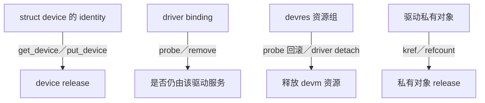
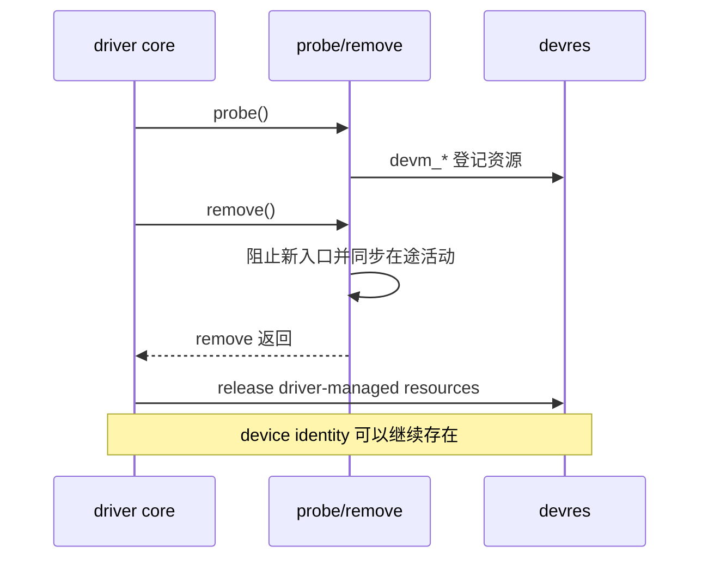
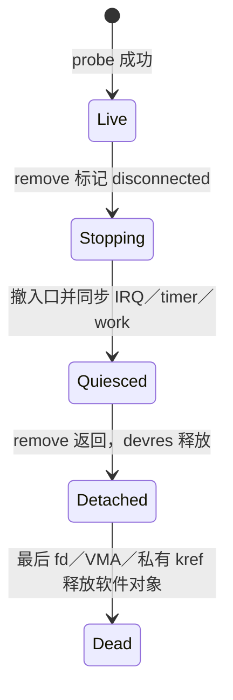

# 第1章\_kobject\_device\_devres\_kref\_生命周期集成

## 1.1\_必须分开的四条生命线



这四条生命线彼此相关，但不能画成同一条：

- device 引用保证 `struct device` 及其 identity 仍然存在；
- driver binding 表示当前驱动是否仍绑定并可以服务设备；
- devres 管理某次驱动绑定期间取得的资源，通常在 probe 失败或 detach 时释放；
- 驱动私有对象可能有比 binding 更长或更短的独立引用生命周期。

## 1.2\_kobject\_与\_device\_引用

`struct device` 内嵌 `struct kobject`，设备模型借此获得引用计数、父子关系、sysfs identity 和最终 release 路径。取得设备长期引用使用：

```c
struct device *held = get_device(dev);
if (!held)
    return -ENODEV;

/* 使用 held 对应的 device identity。 */

put_device(held);
```

最后一个 device 引用释放后，driver core 通过设备类型规定的 release 回调处理承载 `struct device` 的对象。注册 device 时必须提供有效 release 路径；不能在 `device_unregister()` 后直接 `kfree()` 一个仍可能被引用的动态 device。

但 `get_device()` 只保活 device 对象，不保证：

- 驱动仍然绑定；
- IRQ、时钟、DMA 缓冲或 MMIO 映射仍存在；
- 驱动私有 `drvdata` 仍可使用；
- 设备仍然在线或接受新 I/O。

## 1.3\_probe\_remove\_与\_release

| 阶段 | 含义 | 不是 |
| --- | --- | --- |
| `probe()` | 建立一次 driver binding，创建服务状态和资源 | 创建设备 identity 的通用入口 |
| `remove()` | 停止该驱动服务，撤掉入口并同步在途活动 | `struct device` 最后引用回调 |
| device `release()` | device 引用归零后的最终承载对象析构 | 驱动解绑回调 |

总线上的 device 往往在驱动 probe 之前已经存在，remove 之后也可能继续存在并匹配另一个驱动。因此不能把 remove 和 device release 合并理解。

## 1.4\_devres\_何时释放

`devm_*()` 把资源登记到 device 的 devres 列表，但资源通常属于“本次驱动绑定”：

- probe 中途失败时，driver core 回滚已登记资源；
- driver detach 时，在 remove 回调完成后的 core 清理阶段释放剩余 devres；
- 某些资源也可通过对应的 `devm_*_release()` 或 devres group 提前释放。

所以“devres 等到 device kref 归零才释放”是错误的。持有 `get_device()` 引用不会自动延长 devm 资源的有效期。



## 1.5\_为什么异步路径不能只\_get\_device

假设 work 保存了 `struct device *` 并取得 device 引用。解绑仍可以发生，remove 返回后 devres 被释放；work 虽然能安全解引用 device 本体，却可能访问已经释放的寄存器映射、IRQ、时钟或驱动私有数据。

正确做法通常是 remove 主动关闭异步系统：

1. 标记 stopping，阻止 open/ioctl/IRQ/timer 等入口产生新工作；
2. 注销或同步所有生产者；
3. `cancel_work_sync()`、`del_timer_sync()`、`synchronize_irq()` 等等待旧活动退出；
4. remove 返回后才允许 driver core 释放 devres；
5. 最终根据私有对象和 device 的引用分别执行析构。

仅当异步对象被设计成可以脱离 driver binding 独立存活时，才为它建立独立 kref，并确保它不再依赖已释放的 devres。

## 1.6\_驱动私有对象与\_kref

```c
struct my_context {
    struct kref ref;
    struct mutex lock;
    bool disconnected;
};

static void my_context_release(struct kref *ref)
{
    struct my_context *ctx = container_of(ref, struct my_context, ref);

    kfree(ctx);
}
```

`kref` 用于管理私有对象引用，并在最后一个引用释放时调用 release。基本规则：

- 发布一个可被异步取得的引用之前，发布者自己必须持有有效引用；
- `kref_get()` 不能从零复活对象；
- 无锁地“如果非零就获取”使用适合的 `kref_get_unless_zero()`/refcount 模式，并由更高层协议保证地址本身仍有效；
- release 回调只做最终析构，不得让对象再次对外可见。

device kref 与私有对象 kref 是两套计数。私有对象可以持有一个 device 引用，但仍要单独解决 driver binding 结束后不访问 devres 的问题。

## 1.7\_文件描述符和\_mmap\_带来的长生命周期

字符设备 remove 时，用户可能仍持有已打开的 `struct file` 或 VMA：

- 先撤掉设备节点和新 open 入口；
- 把私有对象标记 disconnected，使旧 fd 后续操作返回 `-ENODEV`；
- 停止硬件与所有 devm 资源依赖；
- 用私有 kref 让纯软件会话对象活到最后一个 `release()`/VMA close；
- 不允许旧会话继续访问已在 detach 阶段释放的 MMIO、DMA 或 IRQ 资源。

不能简单在 remove 中无限等待用户关闭 fd 或解除 mmap；这会让 unbind/热拔出永久阻塞。应把“硬件资源随 binding 结束”和“软件会话对象随最后引用结束”拆开。

## 1.8\_devres\_与手工资源的混用

同一资源只能由一个所有者释放：

| 获取方式 | 正常释放责任 |
| --- | --- |
| `devm_kzalloc()` | devres 自动释放，除非显式 `devm_kfree()` 提前释放 |
| `kzalloc()` | 驱动在所有引用结束后 `kfree()` |
| `devm_request_irq()` | detach 时自动释放；remove 仍须先停止设备并同步 handler 依赖 |
| `devm_ioremap_resource()` | detach 后映射失效；异步路径必须提前退出 |
| `dmam_alloc_coherent()` | driver-managed DMA 资源；不能靠 device 引用延长 |

不要对 devm 资源再次调用非 devm free，也不要把需要跨 detach 存活的对象放进 devres。

## 1.9\_完整停机状态机



这个模型允许 device identity、driver binding、硬件资源和用户会话在不同时间结束，而不会互相误当成同一个“free 点”。

## 1.10\_常见错误

| 错误 | 后果 |
| --- | --- |
| 认为 remove 返回等于 device 引用归零 | 混淆 binding 与 identity |
| 认为 devres 等到 device release 才释放 | 异步路径在 detach 后访问已释放资源 |
| 给 work `get_device()` 就认为 drvdata 安全 | device 活着但驱动和资源已解绑 |
| remove 只 flush 一次却不封住新生产者 | flush 后又产生异步访问 |
| 在 remove 中等待用户永远 close | unbind/热拔出永久阻塞 |
| devm 分配又手工调用普通 free | double free |
| kref 为零后再次 get | 对象复活和 UAF |

## 1.11\_核对表

- 当前讨论的是 device identity、driver binding、devres 还是私有对象？
- 引用究竟保活哪一个结构，是否同时错误依赖 devm 资源？
- remove 怎样阻止新入口并同步 IRQ、timer、work 和 DMA？
- devres 在什么时点释放，是否还有异步路径会访问？
- 打开的 fd/VMA 如何在硬件断开后安全降级？
- 私有对象最后一个引用在哪里释放，是否可能从零复活？

基础引用计数继续阅读 [kref 专题](../kref/P01_kref_要解决什么问题.md)，DMA 所有权参见 [DMA 专题](../../io_model/dma/大纲.md)。
