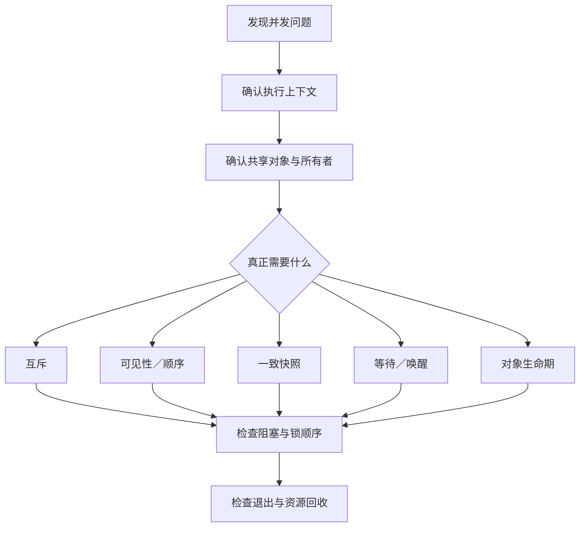

# 第1章\_Linux\_驱动并发与竞争专题大纲

## 1.1\_专题定位

本专题从驱动开发中的真实并发问题出发，依次建立执行上下文、内存顺序、互斥、读多写少、等待唤醒、异步执行和对象生命期模型。正文已经形成 27 篇，不再按尚未落地的“未来章节”编排。

RCU 已收拢为独立专题。本目录的第 5、18、19 章只负责将 RCU 放入并发机制坐标并衔接前后内容，硬件基础、通知机制、宽限期和 API 统一进入 [RCU 专题](../rcu/大纲.md)。

## 1.2\_第一阶段\_建立并发问题地图

这一阶段先回答“并发从哪里来、为什么单核正确的代码到了 SMP 会失效”，暂时不急着背 API。

1. [从单核轮询到中断驱动](P01_并发脉络与概念缓冲/P01_从单核轮询到中断驱动.md)
2. [从单核并发到多核 SMP](P01_并发脉络与概念缓冲/P02_从单核并发到多核_SMP.md)
3. [等待与唤醒：从忙等到事件驱动](P01_并发脉络与概念缓冲/P03_等待与唤醒_从忙等到事件驱动.md)
4. [锁家族的出现：自旋与互斥的分工](P01_并发脉络与概念缓冲/P04_锁家族的出现_自旋与互斥的分工.md)
5. [读多写少路线：seqcount/seqlock 与 RCU](P01_并发脉络与概念缓冲/P05_读多写少路线_seqcountseqlock_与_RCU.md)
6. [CPU 到设备的顺序与一致性](P01_并发脉络与概念缓冲/P06_CPU_to_设备的顺序与一致性.md)
7. [生命周期与有序停机](P01_并发脉络与概念缓冲/P07_生命周期与有序停机.md)
8. [概念到模块的映射图](P01_并发脉络与概念缓冲/P08_概念到模块的映射图.md)

## 1.3\_第二阶段\_建立跨机制语义

这一阶段不以某个 API 为中心，而是先掌握会同时影响多个机制的共同契约。

9. [CPU 到 CPU 可见性与发布—获取语义](P02_可见性与顺序/P09_CPU_to_CPU_可见性与顺序_READWRITE_ONCE_与发布-获取语义.md)
10. [CPU 到设备 I/O 顺序与确认点](P02_可见性与顺序/P10_CPU_to_设备_IO_顺序_relaxed_mbrmbwmb与_确认点.md)
11. [等待—唤醒写法：锁内判断与醒后重检](P02_可见性与顺序/P11_等待_唤醒写法_电平边沿与_锁内判断_醒后重检.md)
12. [短临界区与长操作：数据面和控制面分离](P02_可见性与顺序/P12_短临界区_vs_长操作_数据面与控制面分离.md)
13. [对象保活与有序收尾](P02_可见性与顺序/P13_对象保活与有序收尾(契约层).md)

## 1.4\_第三阶段\_进入同步子模块

### 1.4.1\_内存顺序与互斥

14. [READ/WRITE_ONCE 与 SMP 内存顺序原语](P03_子模块详解/P14_READWRITE_ONCE_与_smp_(内存可见性与顺序原语).md)
15. [I/O 顺序：readl/writel、relaxed 与屏障](P03_子模块详解/P15_IO_顺序_readlwritel_与_relaxed_+_mbrmbwmb.md)
16. [自旋锁：不可睡侧](P03_子模块详解/P16_自旋锁(不可睡侧).md)
17. [互斥与读写信号量：可睡侧](P03_子模块详解/P17_互斥与读写信号量(可睡侧).md)

### 1.4.2\_读多写少

18. [seqcount/seqlock：读重试快照机制](P03_子模块详解/P18_seqcount_seqlock(读重试快照机制).md)
19. [RCU：并发专题中的衔接章](P03_子模块详解/P19_RCU(读无锁_写延迟回收).md)

第 19 章之后应进入[独立 RCU 专题](../rcu/大纲.md)，按“问题 → 硬件 → 通知机制 → 宽限期 → API”的顺序完整学习，再返回第 20 章。

### 1.4.3\_事件等待与异步执行

20. [等待队列](P03_子模块详解/P20_等待队列(waitqueue).md)
21. [完成量](P03_子模块详解/P21_完成量(completion).md)
22. [中断、软中断、线程化中断与工作队列](P03_子模块详解/P22_中断_软中断_线程化中断_工作队列(执行路径).md)
23. [工作队列](P03_子模块详解/P23_工作队列.md)
24. [timer 与 hrtimer](P03_子模块详解/P24_timer_hrtimer(时间回调与同步取消).md)

### 1.4.4\_接口并发与生命期

25. [文件操作并发](P03_子模块详解/P25_文件操作并发.md)
26. [DMA 与缓存一致性](P03_子模块详解/P26_DMA与缓存一致性(mapunmapsync_门铃顺序).md)
27. [生命周期与引用](P03_子模块详解/P27_生命周期与引用(kobjectdevice_devres_kref_getput).md)

## 1.5\_贯穿全专题的检查问题

阅读每篇正文时，都应回答：

1. 并发参与者是谁，运行在进程、硬中断、软中断还是工作线程上下文？
2. 共享状态由谁拥有，谁能修改，谁负责回收？
3. 需要的是互斥、可见性、顺序、快照、等待通知还是对象保活？
4. 临界区能否主动阻塞，锁顺序和上下文限制是什么？
5. 停止新入口、等待在途执行和释放资源的顺序是否完整？

## 1.6\_与其他入口的关系

- [readme.md](readme.md) 保留专题分篇说明和模块化写作约定。
- 本文是与当前文件树同步的可点击阅读地图。
- [Linux 驱动学习路线](../../../../atlas/tracks/linux_driver_track.md)负责跨领域编排，不在 `knowledge` 中复制正文。
