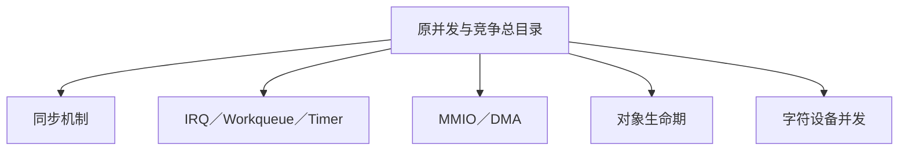

# 第1章\_并发与竞争专题迁移地图

## 1.1\_目录状态

原目录曾同时存放同步原语、中断、工作队列、定时器、MMIO、DMA、文件操作并发和对象生命期，导致知识按课程顺序而不是本质归档。权威正文现已迁往各自专题；本文仅为旧链接和出版路线提供过渡地图，不再维护机制正文。

## 1.2\_新位置

- [Linux 同步机制总纲](../大纲.md)
  - [内存顺序](../../memory_ordering/大纲.md)
  - [锁](../locks/大纲.md)
  - [序列计数器](../sequence_counters/大纲.md)
  - [等待队列与完成量](../../waiting_notification/大纲.md)
  - [RCU](../rcu/大纲.md)
- [中断专题](../../../kernel_subsystems/irq/中断机制简介/大纲.md)
- [工作队列专题](../../../kernel_subsystems/workqueue/大纲.md)
- [时间管理专题](../../time_management/定时器简介/大纲.md)
- [MMIO 顺序](../../io_model/mmio/大纲.md)
- [DMA 一致性](../../io_model/dma/大纲.md)
- [对象生命周期集成](../../object_lifetime/integration/大纲.md)
- [字符设备文件操作并发](../../../driver_model/character_device/concurrency/大纲.md)

## 1.3\_阅读入口

新读者应直接从 [Linux 同步机制总纲](../大纲.md) 或 Atlas 学习路线进入，不再按原 P01～P27 顺序阅读。
