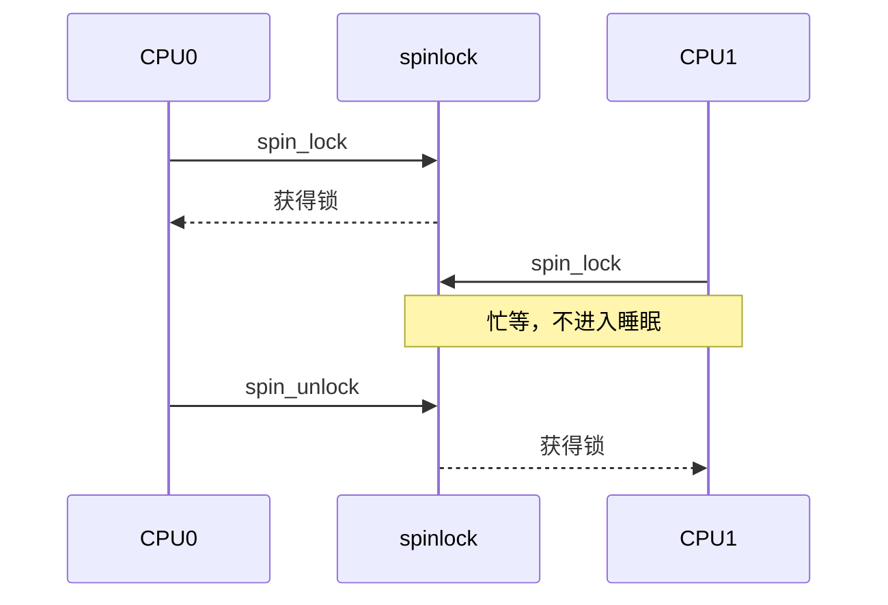
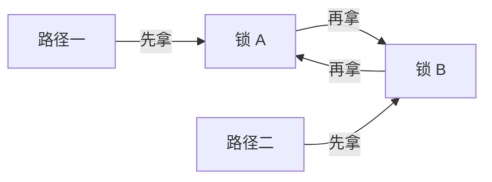

# 第1章\_自旋锁

## 1.1\_自旋锁解决什么问题

自旋锁保护短小、不可睡眠的临界区。一个 CPU 持锁时，其他竞争同一把锁的 CPU 忙等；没有竞争这把锁的 CPU 继续正常执行。因此它是“跨 CPU 互斥”，不是“暂停所有 CPU”。



持有自旋锁期间不得调用可能睡眠的接口，也应避免长循环、慢速总线访问和不可控的外部等待。

## 1.2\_先判断竞争来自哪里

| 共享双方 | 最低要求 |
| --- | --- |
| 两个进程上下文，临界区可睡 | 通常优先 mutex，不必用自旋锁 |
| 进程上下文与 softirq | 进程侧需要 `spin_lock_bh()`；softirq 侧使用匹配的锁 |
| 进程上下文与同一设备硬中断 | 进程侧通常用 `spin_lock_irqsave()`；中断侧锁同一对象 |
| 两个 CPU 上的原子上下文 | 普通或 raw 自旋锁，具体取决于 PREEMPT_RT 和子系统规则 |
| 仅当前 CPU 的每 CPU 数据 | 优先考虑 `local_lock`、禁抢占或子系统专用接口 |

仅仅“在中断处理函数里”不意味着必须关闭本地中断；关键是持锁路径会不会被同一 CPU 上另一个也要拿这把锁的中断上下文打断。

## 1.3\_基本接口

```c
spinlock_t lock;

spin_lock_init(&lock);

spin_lock(&lock);
update_shared_state();
spin_unlock(&lock);
```

成功获取锁提供 acquire 语义，释放锁提供 release 语义，使使用同一把锁的临界区按锁序观察数据。它们不能被描述成每个操作各自等价于完整 `smp_mb()`。

锁只保护所有参与者一致遵守的状态。若某条访问路径绕过锁，锁不会自动使它安全。

## 1.4\_中断与软中断变体

### 1.4.1\_硬中断共享

```c
unsigned long flags;

spin_lock_irqsave(&m->lock, flags);
update_state(m);
spin_unlock_irqrestore(&m->lock, flags);
```

`irqsave` 保存并关闭当前 CPU 的本地硬中断，再取得全局锁；`irqrestore` 恢复进入前状态。它不关闭其他 CPU 的中断。

如果确定进入时本地中断一定开启并且调用层次固定，可以使用 `spin_lock_irq()`，但通用嵌套代码更适合 `irqsave/irqrestore`。

### 1.4.2\_softirq\_共享

```c
spin_lock_bh(&m->lock);
update_state(m);
spin_unlock_bh(&m->lock);
```

`_bh` 在当前 CPU 禁止 softirq/bottom-half 执行，避免进程上下文持锁时被本地 softirq 打断并自旋死锁。它不等于关闭硬中断。

## 1.5\_锁顺序与死锁



所有路径必须遵守统一锁序。中断共享还要检查“进程持锁时被中断，中断再次取同锁”的自死锁。建议：

- 给锁定义明确保护对象和嵌套顺序；
- 缩小临界区，但不要把必须原子的状态更新错误拆开；
- 使用 lockdep 检查锁依赖；
- 不在持锁期间调用回调未知的外部代码。

## 1.6\_spinlock\_与\_raw\_spinlock

| 维度 | `spinlock_t` | `raw_spinlock_t` |
| --- | --- | --- |
| 普通非 RT 内核 | 真正自旋、不可睡 | 真正自旋、不可睡 |
| PREEMPT_RT | 通常转换为可抢占的 RT 锁语义，不再等价于关闭抢占 | 保持严格自旋、关闭抢占的原子语义 |
| 主要使用者 | 普通内核和驱动共享状态 | 调度器、时钟、IRQ core 等最低层代码 |
| 选择原则 | 默认选择 | 只有上下文和子系统规则明确要求时使用 |

不要为了“更快”把普通驱动锁改成 raw。raw 锁会扩大不可抢占区并损害实时延迟；它是语义工具，不是性能等级。

PREEMPT_RT 会把多数硬中断线程化，线程化 handler 可以使用适合其上下文的普通同步原语；真正 hardirq/NMI 和明确的 raw 上下文仍必须遵守不可睡规则。不能简单写成“所有 ISR 和底半部一律 raw”。

## 1.7\_UP\_构建中的退化

`CONFIG_SMP=n` 时不存在另一个 CPU 竞争同一锁，很多自旋锁硬件操作会被消除。但为了防止当前任务被抢占后由另一执行流访问同一状态，锁宏仍可能体现为抢占控制；`_irqsave`、`_bh` 变体仍分别承担本地中断或 softirq 约束。

所以“UP 自旋锁完全无作用”和“UP 自旋锁总是关闭抢占”都过于绝对，具体行为还取决于抢占配置和接口变体。

## 1.8\_读写自旋锁

`rwlock_t` 允许多个读者自旋持锁、写者独占，仍属于不可睡锁。它不自动适合所有读多写少场景：缓存行竞争、写者饥饿和临界区长度可能使普通 spinlock、RCU 或 seqcount 更合适。

```c
read_lock(&m->lock);
snapshot = m->state;
read_unlock(&m->lock);

write_lock(&m->lock);
m->state = new_state;
write_unlock(&m->lock);
```

需要睡眠的读写临界区使用 `rw_semaphore`；需要旧对象延迟回收时考虑 RCU；只需一致数值快照且可重试时考虑 seqcount。

## 1.9\_MMIO\_与锁的边界

锁可以串行化驱动的软件访问路径，但不保证 posted MMIO write 已到达设备，也不代替 DMA 所有权转换。跨 CPU 持锁写同一设备时还可能涉及 `mmiowb()` 的架构语义。参见 [MMIO 访问顺序](../../io_model/mmio/P01_MMIO_访问顺序与屏障.md)。

## 1.10\_常见错误

| 错误 | 后果 |
| --- | --- |
| 持锁调用 `msleep()`、阻塞 I/O、mutex 等 | 原子上下文睡眠或死锁 |
| 进程侧用 `spin_lock()`，同锁也在本地 IRQ 使用 | 被中断后自死锁 |
| `irqsave` 的 flags 跨函数、跨 CPU 或错误配对 | 中断状态恢复错误 |
| 把 acquire/release 称为完整全屏障 | 错误推导跨锁顺序 |
| 临界区内轮询设备完成 | 长时间阻塞其他竞争者 |
| 普通驱动无依据使用 raw 锁 | 扩大不可抢占延迟 |
| 只给写者加锁，读者裸读复合状态 | 数据竞争与不一致快照 |

## 1.11\_选择核对表

- 临界区是否绝对不会睡眠，且足够短？
- 竞争路径来自进程、softirq、hardirq、NMI 还是其他 CPU？
- 是否需要 `_bh` 或 `_irqsave` 防止本地递归竞争？
- 所有参与者是否锁同一对象并遵守统一锁序？
- PREEMPT_RT 下该上下文允许哪类锁？子系统是否明确要求 raw？
- 是否真正需要读写锁，还是 mutex、RCU、seqcount 更合适？

下一篇：[互斥锁与读写信号量](P02_互斥锁与读写信号量.md)。
