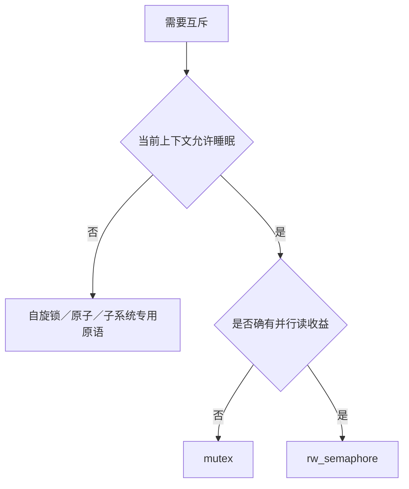

# 第2章\_互斥锁与读写信号量

## 2.1\_可睡眠锁的适用范围

mutex 和 rw_semaphore 在竞争时允许任务睡眠，把 CPU 让给其他工作，适用于进程上下文中的较长临界区。它们不能在 hardirq、softirq、NMI、禁抢占区或持有自旋锁时获取。



## 2.2\_mutex\_基本规则

```c
struct my_device {
    struct mutex lock;
    int state;
};

mutex_init(&m->lock);

mutex_lock(&m->lock);
ret = update_state(m);
mutex_unlock(&m->lock);
```

mutex 有所有者语义：由取得锁的任务释放，不能把它当跨上下文事件通知。递归获取同一 mutex 会死锁；内核 mutex 不是递归锁。

获取提供 acquire 语义，释放提供 release 语义。锁内共享字段不需要再机械添加 ONCE 或屏障。

## 2.3\_等待变体与返回值

| 接口 | 等待行为 | 返回值 |
| --- | --- | --- |
| `mutex_lock()` | 不响应普通信号，直到取得锁 | 无 |
| `mutex_lock_interruptible()` | 可被信号打断 | 0 成功，负错误码失败 |
| `mutex_lock_killable()` | 可被致命信号打断 | 0 成功，负错误码失败 |
| `mutex_trylock()` | 不睡眠，立即尝试 | 非零成功，0 失败 |

```c
ret = mutex_lock_interruptible(&m->lock);
if (ret)
    return ret;             /* 未持锁，不能 unlock */

ret = do_work(m);
mutex_unlock(&m->lock);
return ret;
```

可中断接口失败时没有取得锁。所有异常路径都必须只在确实持锁时解锁。

## 2.4\_锁外执行慢操作

能睡眠不代表可以无限延长临界区。固件加载、用户拷贝、设备长轮询和回调外部代码可能阻塞很久，应先判断哪些状态必须原子更新：

1. 锁内验证状态并记录“操作进行中”；
2. 锁外执行慢操作；
3. 锁内提交结果并清理状态；
4. 必要时唤醒等待者。

拆锁时必须引入明确的中间状态或引用保护，否则对象可能在锁外操作期间被 remove 路径释放。

## 2.5\_读写信号量

`struct rw_semaphore` 允许多个读者同时持锁，写者独占，并在竞争时睡眠：

```c
down_read(&m->sem);
snapshot = m->state;
up_read(&m->sem);

down_write(&m->sem);
m->state = new_state;
up_write(&m->sem);
```

| 接口 | 语义 |
| --- | --- |
| `down_read()/up_read()` | 可睡眠读锁 |
| `down_write()/up_write()` | 可睡眠写锁 |
| `down_read_interruptible()` | 可被信号打断的读锁 |
| `down_write_killable()` | 可被致命信号打断的写锁 |
| `down_read_trylock()/down_write_trylock()` | 非阻塞尝试 |
| `downgrade_write()` | 原子地把写锁降为读锁 |

rwsem 的读并发只有在读临界区足够长、读者较多且写竞争较低时才可能获益。短临界区使用 mutex 往往更简单，缓存和调度开销也可能更低。

## 2.6\_为什么通常不能升级读锁

两个任务都持有读锁并等待升级为写锁时，会互相等待对方释放读锁。因此 rwsem 提供安全的写降读 `downgrade_write()`，但没有通用“读锁原地升级写锁”接口。

需要升级时通常应：

1. 在读锁下读取版本或状态；
2. 释放读锁；
3. 获取写锁；
4. 重新验证状态；
5. 再执行修改。

释放与重新获取之间存在竞争窗口，重新验证不可省略。

## 2.7\_mutex\_rwsem\_与\_semaphore

| 原语 | 核心语义 | 首选场景 |
| --- | --- | --- |
| mutex | 单一任务拥有排他临界区 | 普通可睡互斥 |
| rw_semaphore | 多读单写的可睡临界区 | 确有并行读收益 |
| semaphore | 可用资源额度计数 | 资源池或并发额度 |
| completion | 工作已经完成 | 跨上下文完成通知 |

二值 semaphore 虽可形成互斥，但新代码应优先使用 mutex，因为所有者、调试和语义更清晰。

## 2.8\_生命周期与停机

锁只能保护对象仍然存在时的并发访问，不能单独证明对象不会被释放。`remove()` 路径通常需要：


文件描述符、工作队列、IRQ 和异步回调可能在锁外持有对象，需要 kref、RCU、设备核心引用或明确的 drain 协议配合。

## 2.9\_常见错误

| 错误 | 后果 |
| --- | --- |
| 在中断或自旋锁内获取 mutex/rwsem | 原子上下文睡眠 |
| 忽略 interruptible/killable 返回值 | 未持锁却访问或解锁 |
| 同一任务递归获取 mutex | 自死锁 |
| 读锁下修改共享不变量 | 其他读者并发观察不一致状态 |
| 释放读锁后直接按旧判断写入 | 升级窗口中的 TOCTOU 竞态 |
| 为“读多”机械使用 rwsem | 更高开销且写延迟恶化 |
| 锁外慢操作不保活对象 | remove 并发导致 UAF |

## 2.10\_核对表

- 当前上下文是否允许睡眠？
- 临界区需要排他，还是确有多读并行收益？
- 可中断获取失败时是否立即返回且不解锁？
- 是否存在固定锁序和 lockdep 可验证的嵌套？
- 拆分慢操作后，状态和对象生命周期如何保持？
- remove/错误路径是否先阻止新用户，再等待旧用户退出？

下一篇：[seqcount/seqlock](../sequence_counters/P01_seqcount_seqlock_读重试快照机制.md)。
