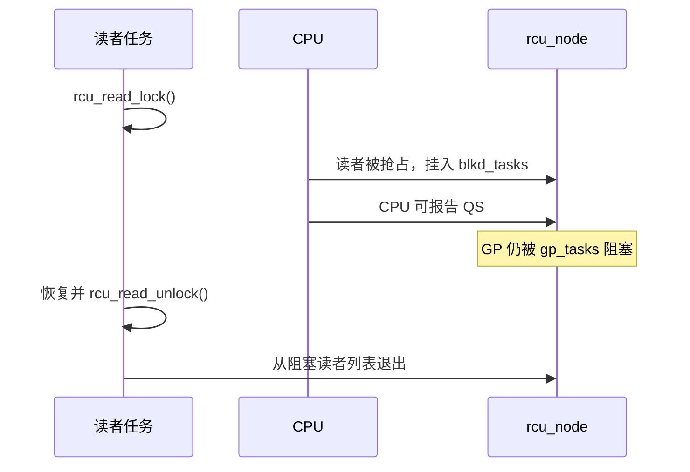

# 第4章\_Tree\_RCU\_读侧与静止状态

## 4.1\_读侧的真实代价取决于配置

`rcu_read_lock()` 是公共封装，内部调用 `__rcu_read_lock()`。Linux 6.12.20 存在两条重要路径：

| 配置 | 进入读侧 | 退出读侧 |
| --- | --- | --- |
| `CONFIG_PREEMPT_RCU=y` | 增加 `current->rcu_read_lock_nesting` | 减少 nesting；最外层退出时处理 deferred QS/被抢占读者等特殊状态 |
| 非 PREEMPT_RCU | `preempt_disable()` | `preempt_enable()`，严格 GP 配置下还可触发额外处理 |

因此，“`rcu_read_lock()` 是空宏”不是通用结论。正确结论是：快速路径尽量不修改全局共享计数器，且将昂贵记账推迟到抢占、最外层退出或 GP 推进等慢路径。

## 4.2\_静止状态的含义

对某一普通 Tree RCU 宽限期而言，静止状态（Quiescent State，QS）是一个可以证明“当前 CPU 不再执行该 GP 开始前的非可抢占读侧临界区”的观测点。

常见观测包括：

- 经过上下文切换。
- 进入或经过用户态。
- 进入 idle/EQS，且没有仍在执行的 IRQ/NMI 嵌套。
- CPU 下线路径完成相应报告。

QS 不是“某个读者计数变为 0”的同义词。非可抢占路径可以主要根据 CPU 的调度/EQS 轨迹判断，可抢占 RCU 则还必须独立跟踪被抢占的任务读者。

## 4.3\_扩展静止状态\_EQS

CPU 长时间处于 idle 或用户态时，可能不运行内核 RCU 读侧。Tree RCU 通过 context tracking/dynticks 计数判断 CPU 是否：

- 已进入 EQS。
- 自 GP 快照以来曾经穿越 EQS。
- 当前是否有 IRQ/NMI 使 CPU 重新处于 RCU watching 状态。

`rcu_watching_snap_save()` 保存某 CPU 的 watching 快照，`rcu_watching_snap_recheck()` 后续检查它是否已经进入或经过 dynticks idle。如果是，可以代替该 CPU 报告 QS。

## 4.4\_可抢占读者为什么要挂到树上

PREEMPT_RCU 中，任务可在 RCU 读侧临界区内被抢占。被抢占后，CPU 可以继续运行其他任务甚至经过 QS，但原任务仍然保留旧 RCU 指针。

`rcu_note_context_switch()` 因此执行两件事：

1. 将临界区内被抢占的任务排入对应 `rcu_node->blkd_tasks`。
2. 允许 CPU 本身报告 QS，但用 `gp_tasks` 等指针阻止 GP 越过这些旧任务读者。

## 4.5\_调度时钟中断的作用

`rcu_sched_clock_irq()` 在调度时钟中断中：

- 更新当前 CPU 的 GP tick 统计。
- 检查 GP 是否正在紧急等待该 CPU 的 QS。
- 必要时设置 `need_resched` 促进上下文切换。
- 检查当前是否在用户态或从 idle 进入中断，并进行 QS 记录。
- 在存在 RCU 工作时触发 `rcu_core()`。

它是促进器和观测点，不是 RCU 正确性的唯一来源。NO_HZ_FULL CPU 可以长时间没有调度 tick，Tree RCU 仍需要通过 dynticks 快照、force-QS 扫描和远程重调度请求等路径推进 GP。

## 4.6\_读侧为什么不能随意阻塞

非 PREEMPT_RCU 依赖禁止抢占使读侧不跨过上下文切换。PREEMPT_RCU 虽可跟踪“被抢占”的读者，但主动睡眠会把读侧生命期与任意等待链耦合，可导致 GP 长时间被阻塞，并产生锁依赖问题。

工程规则仍是：普通 RCU 读侧保持短小、不主动阻塞；必须跨阻塞时用 SRCU 或在 RCU 中安全获取独立引用。

## 4.7\_源码入口

- [`rcupdate.h`](../../../../research/source_reading/linux/include/linux/rcupdate.h)：读侧公共封装和非 PREEMPT_RCU 实现。
- [`tree_plugin.h`](../../../../research/source_reading/linux/kernel/rcu/tree_plugin.h)：PREEMPT_RCU nesting、context switch 与 blocked readers。
- [`tree.c`](../../../../research/source_reading/linux/kernel/rcu/tree.c)：dynticks/EQS 快照、`rcu_sched_clock_irq()` 和 force-QS。

上一篇：[RCU 种类与内核配置](P03_RCU_种类与内核配置.md)。

下一篇：[Tree RCU 宽限期与回调机制](P05_Tree_RCU_宽限期与回调机制.md)。
