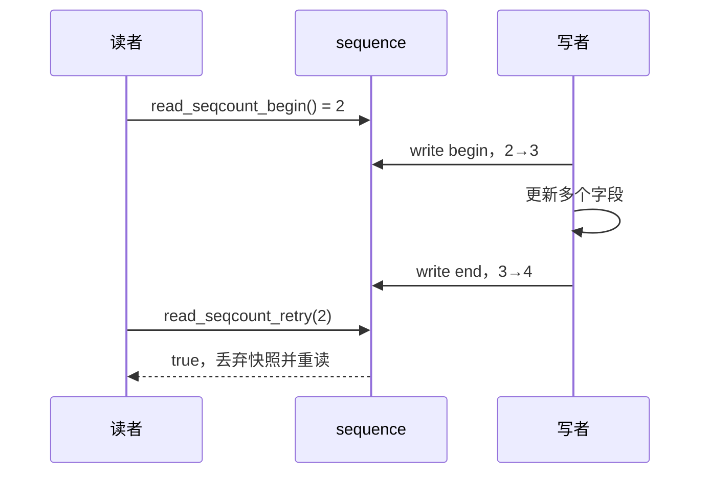
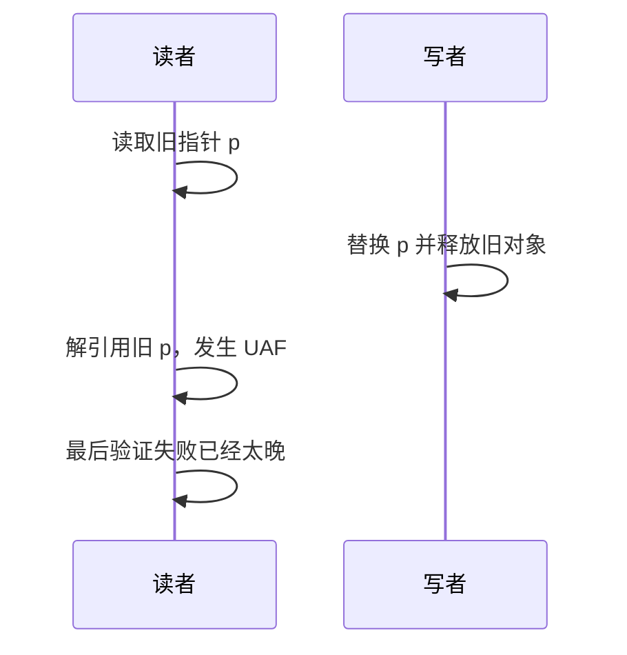

# 第1章\_seqcount\_seqlock\_读重试快照机制

## 1.1\_问题模型

有些共享状态由几个标量字段组成，读者只要求取得某一次完整更新之前或之后的快照，不要求阻止写者。seqcount 让读者先读版本、复制数据、再验证版本；写入期间或版本发生变化就重试。



序号为偶数表示当前没有写者处在更新窗口，奇数表示写入进行中。读者前后看到相同偶数值时，才接受本次快照。

## 1.2\_seqcount\_不是什么

- 它不提供写者互斥；所有写者必须由外部机制严格串行化。
- 它不阻止读者看到中间值；读者可能先读到混合状态，只是在使用前必须验证并丢弃失败结果。
- 它不保护指针指向对象的生命周期；读者可能在验证前解引用已失效地址。
- 它不保证读者一定快速成功；写入频繁时读者可能多次重试。
- 它不是通用事务，也不适合带不可撤销副作用的读操作。

因此读窗口内只能复制可以安全暂存的数据，不能在验证成功前执行 I/O、释放对象、推进队列或产生其他不可回滚副作用。

## 1.3\_基本读写模式

```c
struct clock_snapshot {
    seqcount_t seq;
    spinlock_t writer_lock;
    u64 base_ns;
    u32 mult;
};

static void update_clock(struct clock_snapshot *c, u64 ns, u32 mult)
{
    spin_lock(&c->writer_lock);       /* 串行化写者并禁止写窗口被抢占 */
    write_seqcount_begin(&c->seq);
    c->base_ns = ns;
    c->mult = mult;
    write_seqcount_end(&c->seq);
    spin_unlock(&c->writer_lock);
}

static void read_clock(struct clock_snapshot *c, u64 *ns, u32 *mult)
{
    unsigned int start;

    do {
        start = read_seqcount_begin(&c->seq);
        *ns = c->base_ns;
        *mult = c->mult;
    } while (read_seqcount_retry(&c->seq, start));
}
```

应使用官方接口，不要手写序号加一和屏障。接口内部的准确屏障实现会随体系结构和 seqcount 变体变化，不能固定背成“两次 `smp_wmb()` 加两次 `smp_rmb()`”。

## 1.4\_写者为什么不能在奇数状态下睡眠

写者进入 `write_seqcount_begin()` 后，读者会等待奇数序号结束或不断重试。如果写者被高优先级读者抢占，而读者持续等待写者把序号恢复为偶数，就可能形成实时 livelock。

因此写侧必须：

1. 严格串行化多个写者；
2. 在整个奇数窗口内不可被抢占；
3. 若读者可在 hardirq/softirq 运行，还要防止相应中断上下文打断写者并开始读取；
4. 保持写窗口短小，不调用睡眠函数。

使用 spinlock 串行化写者通常天然满足不可抢占要求。若外部用 mutex 串行写者，还必须在 seqcount 写窗口周围显式处理抢占；不要因为 mutex 能串行化就忽略这一点。

## 1.5\_关联锁的\_seqcount\_类型

现代内核提供带关联锁信息的 seqcount 类型，例如 `seqcount_spinlock_t`、`seqcount_mutex_t` 等。关联锁主要用于 lockdep 验证和在需要时满足写侧不可抢占条件；它不替调用者自动获取外部锁。

```c
seqcount_spinlock_t seq;
spinlock_t lock;

spin_lock_init(&lock);
seqcount_spinlock_init(&seq, &lock);
```

具体初始化宏和可用变体应以当前内核 `include/linux/seqlock.h` 为准。

## 1.6\_seqlock

`seqlock_t` 把 seqcount 与写侧 spinlock 封装在一起，适合写者使用自旋锁串行化的传统场景：

```c
seqlock_t lock;

seqlock_init(&lock);

write_seqlock(&lock);
state.a = new_a;
state.b = new_b;
write_sequnlock(&lock);

do {
    seq = read_seqbegin(&lock);
    a = state.a;
    b = state.b;
} while (read_seqretry(&lock, seq));
```

`seqlock_t` 解决写写互斥和序号窗口，但仍不保护指针生命周期，也不允许写侧睡眠。

## 1.7\_指针为什么危险

假设写者先替换指针并释放旧对象，读者可能在 seqcount 窗口中取得旧地址并立刻解引用。即使最后 `read_seqcount_retry()` 返回 true，UAF 已经发生，重试无法撤销。



需要替换并回收对象时使用 RCU、引用计数或锁保护生命周期。seqcount 可以与这些机制组合，但不能替代它们。

## 1.8\_适用与不适用场景

| 场景 | 结论 |
| --- | --- |
| 时间基准、统计组合、坐标或参数快照 | 适合，字段可安全复制且写少 |
| 指针链表、树、可释放对象 | 不单独使用 seqcount |
| 写入很频繁、读窗口很长 | 读者可能饥饿，应换锁或重新设计 |
| 读操作有 I/O 或不可回滚副作用 | 不适合重试模型 |
| 读者需要阻止写者 | 使用 rwlock/rwsem 等 |
| 新旧对象可并存并延迟回收 | 使用 RCU |

## 1.9\_与\_RCU\_和读写锁的边界

| 机制 | 读者策略 | 写者策略 | 生命周期 |
| --- | --- | --- | --- |
| seqcount/seqlock | 复制后验证，失败重试 | 原地更新，写者串行 | 不提供对象保活 |
| rwlock/rwsem | 持读锁阻止写者 | 写锁独占 | 锁覆盖期间保活 |
| RCU | 允许读取旧版本 | 发布新版本、延迟回收 | GP 保护旧引用临时生命期 |

RCU 的硬件基础、CPU/任务状态通知和宽限期统一参见 [RCU 专题](../rcu/大纲.md)。

## 1.10\_常见错误

| 错误 | 后果 |
| --- | --- |
| 多写者直接调用 begin/end | 序号窗口互相嵌套，读者可能接受坏快照 |
| 写窗口被抢占或睡眠 | 读者长时间自旋或实时 livelock |
| 读者验证前执行副作用 | 重试无法撤销已经发生的操作 |
| 用 seqcount 保护可释放指针 | 验证前已经 UAF |
| 手写 `sequence++` 和固定屏障 | 破坏架构及内核版本语义 |
| 认为读者永远无等待 | 遇到奇数序号和频繁写入仍会重试/自旋 |

## 1.11\_核对表

- 所有写者由什么机制串行化？
- 写窗口是否保证不可抢占并且不会睡眠？
- 读者所在 IRQ/softirq 上下文能否打断写者？
- 读窗口是否只复制安全标量，验证成功后才使用？
- 是否存在指针和对象回收，需要 RCU 或引用计数？
- 最坏写入频率下，读者重试是否可接受？
