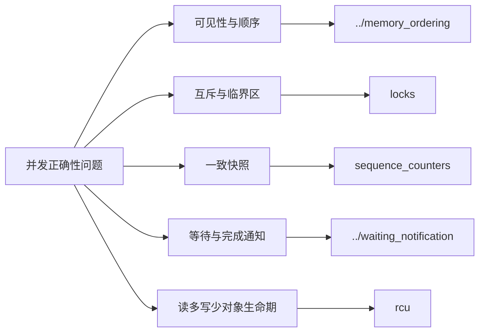

# 第1章\_Linux\_同步机制大纲

## 1.1\_按问题选择机制

## 1.2\_专题入口

1. [内存顺序](../memory_ordering/大纲.md)
2. [锁](locks/大纲.md)
3. [序列计数器](sequence_counters/大纲.md)
4. [等待队列与完成量](../waiting_notification/大纲.md)
5. [RCU](rcu/大纲.md)

中断、工作队列、定时器、MMIO、DMA 和对象生命周期属于其他知识本质，由 Atlas 负责串成学习路线。
